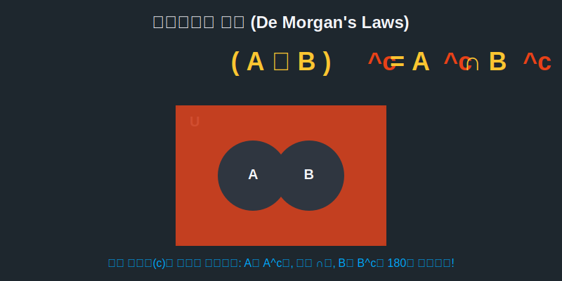

# 07. 일곱 번째 수업: 집합의 신출귀몰 (Diverse Applications)

지금까지 우리는 데이터를 담는 바구니(집합)와 그 바구니들을 합치고 빼고 뒤집는 기초 연산들을 배웠습니다.
이 마지막 수업에서는 집합 연산들이 마치 마술처럼 서로 얽히며 만들어내는 가장 아름답고 무시무시한 논리의 꽃, **'드모르간의 법칙(De Morgan's Laws)'**을 살펴보고 파이썬에서 그것이 어떻게 동작하는지 훔쳐봅니다.

---

## 학습 목표
* 괄호 밖의 여집합($^c$) 핑거 스냅이 안에 있는 모든 기호들을 마법처럼 거꾸로 뒤집는 **드모르간의 법칙**을 이해합니다.
* 벤다이어그램의 색칠 공부를 통해 드모르간의 증명을 직관적으로 깨닫습니다.
* 수억 개의 데이터베이스 논리식(SQL)을 압축 최적화하는 프로그래밍 기법과 연결해 봅니다.

## 1. 모든 것을 뒤집는 핑거스냅: 드모르간의 법칙

어떤 복잡한 논리 식에서 "이게 아닌 것(NOT, 여집합)"이라고 선언하는 순간, 안에 들어있던 모든 관계는 $180^\circ$ 완벽하게 뒤집어집니다. 영국의 위대한 수학자 오거스터스 드모르간은 이 우주 법칙을 딱 두 줄의 수식으로 정리했습니다.

> **법칙 1:** $(A \cup B)^c = A^c \cap B^c$
> "A와 B의 합집합이 아닌 것($NOT$)" = "A도 아니고, B도 아닌 것들의 교집합"

> **법칙 2:** $(A \cap B)^c = A^c \cup B^c$
> "A와 B의 교집합이 아닌 것($NOT$)" = "A가 아니거나, 또는 B가 아닌 것"

외우기 어렵나요? 
괄호 바깥에 붙어 있는 반전 마법사 $C$(여집합)가 괄호 안으로 뿅~ 하고 침투하는 순간, 안에 있던 $A$와 $B$ 에게 여집합 모자($^c$)를 각각 뒤집어 씌우고, 멀쩡히 하늘을 보던 **U 컵(합집합 $\cup$) 마저도 땅을 보는 모자(교집합 $\cap$)로 확 뒤집어버립니다!**

마치 타노스가 손가락을 튕기면 모든 생명체 패턴이 정확히 절반의 안티물질로 역전되는 것 같은 통쾌한 규칙입니다.

<div align="center">
  
</div>

<div align="center">
  
</div>

## 2. 드모르간이 파이썬 코드를 만날 때

"둘 다 치킨을 좋아하는 사람($A \cap B$) 말고 전부 다 불러와!" 라고 데이터베이스에 명령을 내릴 때, 컴퓨터는 이 드모르간의 법칙을 사용해 코드를 알아서 재조립합니다.

"아, 치킨 안 좋아하는 사람($A^c$) 이거나($\cup$), 치킨 안 좋아하는 사람($B^c$)을 전부 다 가져오라는 뜻이구나!"

```python
# 파이썬으로 증명해보는 타노스 핑거스냅 (드모르간의 법칙)

# 임의의 학생 동아리 데이터 
U_all = {"철수", "영희", "민수", "수진", "지훈"}   # 전체 학생 (Universal set)
A_math = {"철수", "영희", "민수"}               # 수학반
B_sci = {"영희", "민수", "수진"}                # 과학반

# 1. 왼쪽: (A U B) 의 여집합 (합집합이 '아닌' 애들)
union_AB = A_math | B_sci # 합집합
# 전체(U)에서 빼버리면 여집합 완성!
left_side = U_all - union_AB 
print(f"1. (A U B)의 c : {left_side}")
# 출력: {'지훈'} (둘 다 안 하는 지훈이 유일)

# 2. 오른쪽: A의 여집합 ∩ B의 여집합 (A도 아니고, B도 '동시에' 아닌 애들)
not_A = U_all - A_math
not_B = U_all - B_sci
# 두 잉여 집합들의 교집합(&)을 교차 필터링
right_side = not_A & not_B 
print(f"2. A의 c ∩ B의 c : {right_side}")
# 출력: {'지훈'} (소름 돋게 결과가 똑같음!)
```

파이썬의 실행 결과는 왼쪽 수식과 오른쪽 수식이 완벽히 똑같은 논리적 집합을 가져온다는 것을 0.001초 만에 논리 증명(Proof) 해냅니다! 

## 학습 정리
1. **드모르간의 법칙 (De Morgan's Laws)**: 여집합 기호($^c$)가 괄호 집합 안으로 분배되어 들어갈 때, 모든 원소들을 부정물($NOT$)로 뒤집고 부호($\cup$ 과 $\cap$) 마저도 완전히 거꾸로 돌려버리는 반전 법칙.
2. **논리 최적화**: 개발자들은 너무 길고 복잡한 $NOT$ 조건의 코드를 마주했을 때, 어릴 적 수학 시간에 배운 드모르간 공식을 떠올리며 코드를 절반의 길이로 기적처럼 튜닝해 낸다.
3. 이로써 우리는 수학의 가장 훌륭한 분류법인 **'집합'** 편을 마쳤습니다. 다음 모듈에서는 피타고라스가 발견한 무리수의 혼돈 세계로 진입하겠습니다!
