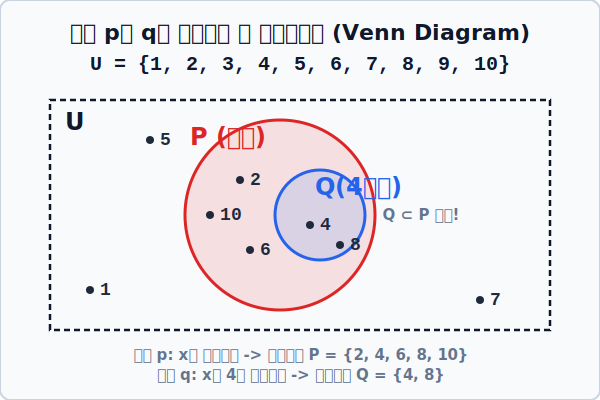

# 01. 카멜레온 문장: 조건과 진리집합

## 1. 학습 목표 (Learning Objectives)
* 변수 $x$에 어떤 숫자가 대입되느냐에 따라 참(True)이 되기도 하고 거짓(False)이 되기도 하는 카멜레온 같은 문장인 **'조건(Condition)'**을 학습합니다.
* 그 조건을 '참'으로 만들어 발동시키는 타겟 명단의 모임, **'진리집합(Truth Set)'**과 벤 다이어그램의 포함 관계를 시각적으로 이해합니다.

## 2. 변신하는 문장, '조건'
지난 챕터에서 명제를 배울 때, "$x + 2 = 5$" 라는 문장은 아직 $x$의 스파이 정체가 안 밝혀졌기 때문에 함부로 참/거짓을 정할 수 없는 '명제 탈락' 문장이라고 했습니다.

하지만 이 문장은 $x$의 정체에 따라 운명이 변합니다.
* 만약 $x$에 **3**을 넣으면? $3 + 2 = 5$ 이므로 **'참(True)'**
* 만약 $x$에 **100**을 넣으면? $100 + 2 = 5$ 이므로 **'거짓(False)'**

이렇게 어떤 미지수 문자($x$)의 값에 맞추어 카멜레온처럼 참과 거짓의 색깔이 휙휙 계속 바뀌는 스위치 문장이나 식을 우리는 보통 $p, q$ 로 표시하며 **'조건(Condition)'** 이라고 부릅니다. 
우리가 그동안 열심히 풀었던 **'방정식'이나 '부등식'들이 사실 모조리 다 이 '조건'의 일종**입니다!

## 3. 조건의 스위치를 켜라! '진리집합'
어떤 까다로운 우주 공간(전체집합 $U$)이 있습니다. 우리가 그 공간에 $p$ 라는 '조건 스위치'를 발동시켰습니다.
> **전체집합 $U$ (우주 범위)** = {$1, 2, 3, 4, 5, 6, 7, 8, 9, 10$} (10 이하 자연수)
> **조건 스위치 $p$** = "$x$는 짝수이다"

이 스우치를 누르면 10명의 우주인 중, 저 $p$ 조건을 **'참(True)'**으로 완벽하게 만족하는 사람들만 선별되어 통과합니다. 바로 $2, 4, 6, 8, 10$ 입니다!
이렇게 어떤 조건을 '참'이 되게 해주는 원소들만 기가 막히게 추려내서 모아놓은 엘리트 집단을, 논리학에서는 **'진리집합(Truth Set)'**이라고 부르며 대문자 $P$ 로 표기합니다.
* 진리집합 $P = \{2, 4, 6, 8, 10\}$

## 4. 벤 다이어그램 (Venn Diagram) 포함 관계 시각화
조건끼리 엮였을 때 엘리트 집단(진리집합) 사이즈가 어떻게 겹치고 포함되는지 한눈에 파악하기 위해 논리학자 존 벤은 **'벤 다이어그램'**을 고안했습니다.

새로운 빡센 조건 스위치 $q$를 하나 더 가져와 보겠습니다.
> **조건 스위치 $q$** = "$x$는 4의 배수이다"
이 조건 $q$를 통과하는 혹독한 진리집합 요원은 $Q = \{4, 8\}$ 두 명뿐입니다.

이 상황을 벤 다이어그램 SVG 렌더링으로 그려보면 아래와 같이 완벽한 포함 관계가 나타납니다!

  

진리집합 $Q$의 멤버들(4, 8)은 모두 진리집합 $P$의 멤버 안에 안전하게 100% 쏙 파고들어 포함되어 있습니다.
이럴 때 기호로 **$Q \subset P$** (Q는 P의 부분집합이다) 라고 아름답게 표시할 수 있습니다!

## 5. 학습 정리 (Summary)
1. **조건 (Condition, $p, q$)**: 그 자체로는 참/거짓 판단이 안 되지만, 미지수 $x$에 어떤 값이 장전되느냐에 따라 참 혹은 거짓으로 결과가 바뀌는 문장입니다.
2. **진리집합 (Truth Set, $P, Q$)**: 전체 후보자 중에서 저 조건들을 '참(True)'으로 합격시켜주는 원소들만 핀셋으로 뽑아 모아둔 엘리트 집단을 의미하며, 벤 다이어그램으로 포함관계를 증명할 수 있습니다.
