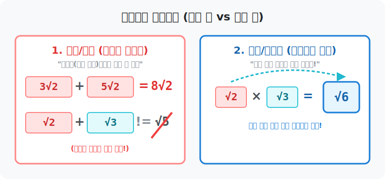




# 01. 첫 번째 수업: 무리수의 사칙연산 (Four Operations)

유리수의 식탁 테이블 위에 무시무시한 괴물, 무리수($\sqrt{2}$, $\sqrt{3}$)가 처음으로 합류했습니다. 이들을 더하고 빼고 곱하고 나누려면 특별한 생존 법칙이 필요합니다. 대형 참사가 일어나기 전에 파이썬 코더들이 알아야 할 무리수 연산의 필수 룰을 익혀봅시다.

---

## 1. 덧셈과 뺄셈: 종류가 다르면 영원한 평행선

무리수의 덧셈과 뺄셈 규칙은 대수학(Algebra)의 문자 $x$, $y$ 를 더하는 논리와 정확히 $100\%$ 똑같습니다.
**"문양(루트 안의 알맹이)이 완벽히 똑같은 녀석들끼리만 더하거나 뺄 수 있다!"**

* **$3\sqrt{2} + 5\sqrt{2}$** 
  : "루트2"라는 사과가 $3$개 있고 $5$개 있으니, 총 $8$개! $\rightarrow$ **$8\sqrt{2}$**
* **$4\sqrt{5} - \sqrt{5}$** 
  : "루트5"가 $4$개 있었는데 $1$개를 먹었으니 $3$개 남음 $\rightarrow$ **$3\sqrt{5}$**

그렇다면 폭발(에러)하는 수식은 어떤 것일까요?
**$\sqrt{2} + \sqrt{3} = ?$**
이 둘은 수학적으로 종족 자체가 완전히 다릅니다. 사과에 오렌지를 더한다고 해서 사파이어가 되지 않듯, 이 식은 **더 이상 계산을 압축할 수 없으므로 그냥 둔 채로 통째로 들고 다녀야 합니다.** 절대 $\sqrt{5}$ 라고 적으면 안 됩니다!

<div align="center">
  
</div>

## 2. 곱셈과 나눗셈: 영토 파괴의 자유 (합방)

덧셈/뺄셈이 보수적이었다면, 곱셈과 나눗셈 앞에서는 루트의 벽들이 모조리 허물어집니다. 
루트 안의 식구들끼리는 종류가 달라도 곱하고 나누는 순간 곧장 하나로 뭉쳐 버릴 수 있습니다.

* **$\sqrt{2} \times \sqrt{3} = \sqrt{2 \times 3} = \sqrt{6}$**
* **$\sqrt{10} \div \sqrt{2} = \sqrt{\frac{10}{2}} = \sqrt{5}$**
* **$2\sqrt{3} \times 4\sqrt{5} = (2 \times 4)\sqrt{3 \times 5} = 8\sqrt{15}$** (루트 바깥 놈은 바깥 놈끼리, 안쪽은 안쪽끼리 곱한다!)

## 3. 탈출의 마법 (근호 밖으로 빼내기)

곱셈의 자유가 주어지면 재미있는 마술이 하나 생깁니다. 루트 안에 들어있는 거대한 덩어리 숫자 중, 일부를 "완전제곱수(예: $4$, $9$, $16$, $25$)" 로 분해해 낼 수 있다면, 그 조각은 루트라는 감옥을 깨고 바깥으로 탈출시킬 수 있습니다!

**$\sqrt{18}$ 의 탈출 쇼**
1. 먼저 소인수분해로 쪼갭니다: $\sqrt{9 \times 2}$
2. 지붕을 분리합니다: $\sqrt{9} \times \sqrt{2}$
3. $\sqrt{9}$ 는 완벽한 양수 $3$ 으로 부활하므로 탈출 성공!
4. 최종 결론: **$3\sqrt{2}$**

프로그래머들은 큰 무리수를 다룰 때, 가장 용량이 적은 단순한 루트 형태로 변수를 최적화(탈출) 시키는 버릇을 가져야 메모리를 효율적으로 쓸 수 있습니다.

## 4. 파이썬과 무리수 객체의 연산

파이썬의 수학 모듈 `sympy` (Symbolic Python)를 쓰면 이 무시무시한 무리수의 결합과 분리 법칙을 수학자처럼 직관적으로 다룰 수 있습니다. `float` 소수점으로 망가뜨리지 않고 루트 기호를 살려 둔 상태에서 연산해 볼까요?

```python
# [Python] SymPy 를 활용한 상징적(Symbolic) 무리수 연산
import sympy as sp

# 루트 2, 루트 3, 루트 18 이라는 상징적(기호) 무리수 객체 생성
sqrt_2 = sp.sqrt(2)
sqrt_3 = sp.sqrt(3)
sqrt_18 = sp.sqrt(18)

print("--- [무리수 연산 센터] ---")

# 1. 덧셈 (동류항이 아닌 경우 압축 안됨)
add_diff = sqrt_2 + sqrt_3
print(f"1. √2 + √3  =  {add_diff} (그대로 출력됨! 사과와 오렌지)")

# 2. 덧셈 (동류항인 경우 합쳐짐)
# sqrt_18 은 내부적으로 3*sqrt(2) 로 탈출되어 자동 최적화가 됩니다.
add_same = sqrt_2 + sqrt_18
print(f"2. √2 + √18 =  {add_same}")

# 3. 곱셈 (벽 허물기)
mul_diff = sqrt_2 * sqrt_3
print(f"3. √2 * √3  =  {mul_diff}")

# 4. 나눗셈
div_val = sqrt_18 / sqrt_2
print(f"4. √18 / √2 =  {div_val}")
```

**[실행 결과]**
```text
--- [무리수 연산 센터] ---
1. √2 + √3  =  sqrt(2) + sqrt(3) (그대로 출력됨! 사과와 오렌지)
2. √2 + √18 =  4*sqrt(2)
3. √2 * √3  =  sqrt(6)
4. √18 / √2 =  3
```

컴퓨터 프로그래밍(SymPy) 결과가 우리의 수학 규칙과 $100\%$ 똑같죠? 
$\sqrt{2} + \sqrt{3}$ 은 컴퓨터도 더 이상 계산할 수 없어서 수식 그대로 출력해버리고, $\sqrt{18}$ 처럼 꺼낼 수 있는 놈은 `3 * sqrt(2)` 로 가볍게 탈출시켜 같은 놈끼리 뭉쳐(덧셈 결과가 $4\sqrt{2}$) 줍니다!

