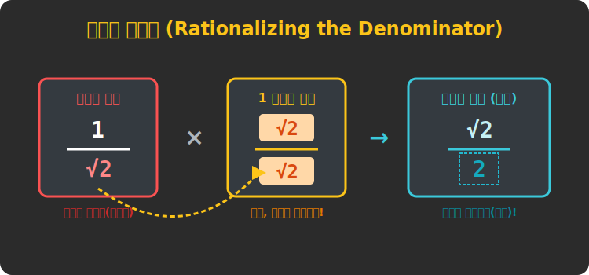




# 02. 두 번째 수업: 분모의 유리화 - 루트를 위로 넘겨라! (Rationalization)

"나누는 숫자(분모)가 무한소수면, 도대체 나눗셈을 언제 끝내라는 거지?" 

수학자들이 가장 혐오하는 것은 $\frac{1}{\sqrt{2}}$ 처럼 바닥(분모)에 진흙탕 같은 무리수가 깔려 있는 형태입니다.
우리는 건물을 지을 때 바닥 기초를 튼튼한 콘크리트(유리수)로 깔고 그 위에 지붕 장식(무리수)을 올리는 걸 선호합니다. 이를 **분모의 유리화(Rationalization)**라고 부릅니다.

---

## 1. 1을 무한소수($\approx 1.414...$)로 나눠보세요!

여러분에게 피자 $1$판이 주어졌습니다. 
그런데 이것을 **$1.41421356...$** 명에게 나누어 주라고 한다면 도대체 어떻게 칼집을 내야 할까요? 
나누는 대상(분모)이 영원히 숫자가 요동치는 무리수면, 나눗셈 계산 자체가 머리 아프고 매우 불안정해집니다.

$$
\frac{1}{\sqrt{2}}
$$
이 수식은 수학계에서 통용되는 '미완성 건축물'입니다. 건물의 주춧돌인 분모는 반드시 단단한 '유리수(정수)'여야만 나눗셈과 크기 통분이 가능해집니다.

## 2. 치료제: 숫자 '1' 둔갑술 곱하기!

분수로 된 건물의 땅바닥에 묻혀있는 지뢰($\sqrt{2}$)를 제거하려면 어떻게 할까요?
스스로 제곱($x^2$)을 하게 만들면, 마법처럼 루트가 벗겨지고 예쁜 양수로 부활합니다. ($\sqrt{2} \times \sqrt{2} = 2$)

하지만 분모에만 루트 $2$를 곱하면 분수의 총량이 깨져버립니다! 
따라서 공평하게 **위(분자)와 아래(분모)에 똑같은 $\sqrt{2}$를 동시에 곱해줍니다.**
($\frac{\sqrt{2}}{\sqrt{2}}$ 를 곱하는 것이며, 이것은 결국 값어치로는 $1$을 곱하는 것과 같기 때문에 크기의 변화는 없습니다!)

$$
\frac{1}{\sqrt{2}} = \frac{1 \times \sqrt{2}}{\sqrt{2} \times \sqrt{2}} = \frac{\sqrt{2}}{\sqrt{2^2}} = \textbf{\frac{\sqrt{2}}{2}}
$$

<div align="center">
  
</div>


결과를 뜯어볼까요? 
분모는 $2$라는 단단한 반석(유리수)이 되었습니다. 골칫거리였던 $\sqrt{2}$ (무리수)는 건물 꼭대기 지붕(분자)으로 올라가 자리 잡았습니다! 
이제 이 식은 "$\sqrt{2}$ (약 1.414) 라는 숫자를 **절반(2)으로 똑 떨어지게 나눠라!**" 라는 아주 깔끔하고 명확한 명령어로 변했습니다!

## 3. 파이썬과 유리화 자동 검증

우리의 파이썬 수학 도우미 `sympy` 는 유리화를 명령하지 않아도 내부적으로 똑똑하게 분모의 유리화를 항상 기본(Default) 옵션으로 실행해 버립니다!

```python
# [Python] 파이썬 SymPy 는 분모의 무리수를 가만두지 않는다!
import sympy as sp

# 불안정한 형태 1 / 루트(2) 를 객체로 만들고, 파이썬이 이를 어떻게 변형하는지 확인해보자!
numerator = 1
denominator = sp.sqrt(2)

unstable_fraction = numerator / denominator

print("\n[수학 엔진의 유리화 자동 처리]")
print("만들어진 객체 코드: 1 / sqrt(2)")
print("-" * 30)

# 파이썬은 변수에 값을 집어넣으려는 순간, 빛의 속도로 유리화를 진행해버립니다.
print(f"출력 결과: {unstable_fraction}")

# 분자 분모 직접 뜯어서 확인해보기
sp_fraction = sp.Rational(1, 1) * unstable_fraction # 객체 확인
num, den = sp.fraction(unstable_fraction)

print(f"-> 최종 분모(바닥): {den} (단단한 정수!)")
print(f"-> 최종 분자(지붕): {num} (무리수를 위로 던져버림!)")
```

**[실행 결과]**
```text
[수학 엔진의 유리화 자동 처리]
만들어진 객체 코드: 1 / sqrt(2)
------------------------------
출력 결과: sqrt(2)/2
-> 최종 분모(바닥): 2 (단단한 정수!)
-> 최종 분자(지붕): sqrt(2) (무리수를 위로 던져버림!)
```

파이썬의 수학 모듈 속에도 "분모에는 무조건 유리수를 깐다"는 아주 강력한 하드코딩 논리가 숨어있는 것을 확인할 수 있습니다. 인공지능이든 그래픽이든 이 유리화 원칙을 철저히 지켜야 코드가 복잡한 분수 연산을 할 때 통분 에러가 발생하지 않습니다.

