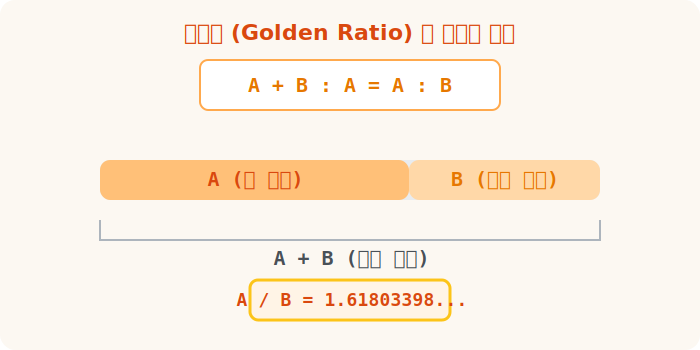
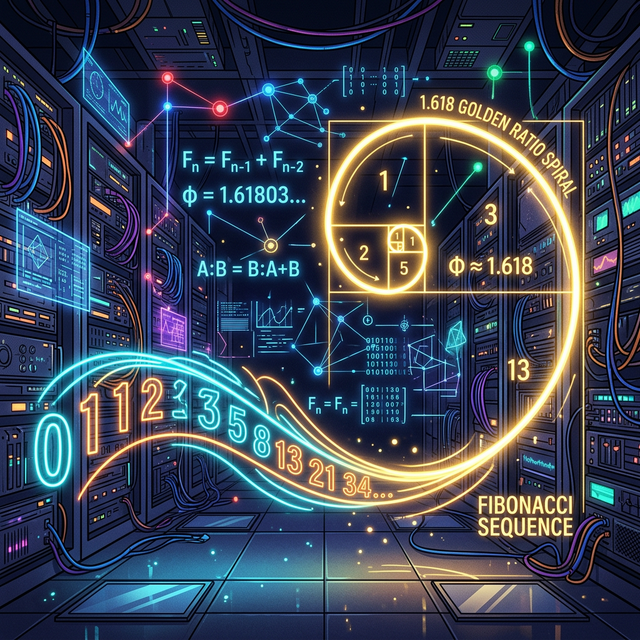




# 04. 네 번째 수업: 황금비의 수학적 비밀 (Golden Ratio)

미술 시간이나 디자인 수업을 들을 때면 항상 "이 로고는 황금비를 썼습니다!"라는 만능 치트키를 보게 됩니다.
우리의 눈과 뇌가 가장 안정적이고 아름다움을 느끼게 설계된 그 전설의 비율. 이번에는 소라와 은하를 지배하는 $\frac{1+\sqrt{5}}{2}$, 황금비의 수학적 정체를 해부해 봅시다!

---

## 1. 황금비의 정의 (가장 완벽한 분할)

황금비(Golden Ratio, $\phi$ 파이)는 철저한 수학적 정의와 방정식에서 태어났습니다.

> **"어떤 막대기를 두 부분으로 잘랐을 때, 전체 길이와 긴 부분의 길이의 비율이, 긴 부분과 짧은 부분의 길이 비율과 완전히 똑같은" 절단점!**

긴 부분을 $A$, 짧은 부분을 $B$, 막대의 전체를 $A+B$ 라고 합시다.
$$
\frac{A+B}{A} = \frac{A}{B}
$$

우리의 목표는 $A$와 $B$의 궁극적인 비율($\frac{A}{B}$)을 구하는 것입니다. 
이 비밀스러운 황금의 비율 $x = \frac{A}{B}$ 라고 두고 전개해 보면 전설의 루트 $5$ 가 튀어나옵니다.

$$ \frac{A}{A} + \frac{B}{A} = \frac{A}{B} $$
$$ 1 + \frac{1}{x} = x $$
양변에 $x$ 를 곱하면?
**$$ x^2 - x - 1 = 0 $$**

<div align="center">
  
</div>



## 2. 구원의 수, 무리수 $\sqrt{5}$ 의 등장

$x^2 - x - 1 = 0$ 이라는 이차방정식! 우리는 아직 이 방정식을 풀 공식을 배우지는 않았지만, 고등학교에서 배우는 '근의 공식'을 통해 계산해 보면 정답으로 아래와 같은 괴물이 튀어나옵니다. 길이는 양수이어야 하므로 플러스(+)만 가져옵니다!

$$ \phi = \frac{1 + \sqrt{5}}{2} $$

루트 $5$의 근삿값인 약 $2.236$ 을 앞의 식에 대입해보면, 
**황금비: 약 $1.61803398...$** 이라는 그 유명한 매직 넘버가 소환됩니다. 이 숫자는 유리수 뼈대가 아닌 무리수를 중심축으로 뻗어 나가는 신비로운 숫자입니다.

## 3. 피보나치 수열과 황금비의 충격적 만남

자연계의 식물 가지 치기나 달팽이관은 "피보나치(Fibonacci) 수열"을 따릅니다.
**$1, 1, 2, 3, 5, 8, 13, 21, 34 \dots$**
(앞의 두 숫자를 더하면 다음 숫자가 튀어나오는 무한 복사 알고리즘입니다.)

놀라운 점은 앞의 숫자와 뒤의 숫자 사이의 '비율(나눗셈)'을 끝없이 체크하다 보면, **이 비율들이 점차 아까 우리가 구했던 황금비($1.618...$) 에 완벽하게 수렴해 간다는 것입니다!!** 
오직 덧셈만 존재하는 단순한 거북이의 세계(정수의 수열)가, 영원히 뻗어나가면 어느새 우주의 곡선(무리수의 황금비)에 맞닿는 기적인 것입니다.

## 4. 파이썬으로 증명하는 황금빛 수렴

파이썬의 배열 계산과 반복문(`For loop`)을 이용해 이 위대한 수열이 언제 무리수 공간으로 넘어가는지 실험해 봅시다.

```python
# [Python] 피보나치 수열의 비율이 언제부터 소름 돋게 황금비(1.61803398)로 수렴될까?
import math

golden_ratio_exact = (1 + math.sqrt(5)) / 2
print(f"🎯 우주의 진정한 황금비 목표 타겟: {golden_ratio_exact}")
print("-" * 50)

# 피보나치 초기값 (1, 1) 로켓 발사대
a, b = 1, 1

for step in range(1, 16):
    # 뒷 숫자 / 앞 숫자 를 통해 현재의 비율을 계산
    current_ratio = b / a
    
    # 황금비율 목표와의 오차 (얼마나 접근했는가)
    error_gap = abs(golden_ratio_exact - current_ratio)
    
    print(f"Step {step:2} [피보나치 {a:4} 와 {b:4}] -> 비율: {current_ratio:.6f} (오차: {error_gap:.6f})")
    
    # 우주 시계 째깍 (다음 스텝으로 한 칸 전진: a 는 b가 되고, b 는 a+b 가 됨!)
    a, b = b, a + b
    
print("\n-> 보이십니까? 15번의 튕김 만에 피보나치 정수가 황금비(무리수)와 완벽히 동기화되어 물아일체의 경계에 접어들었습니다!!")
```

**[실행 결과]**
```text
🎯 우주의 진정한 황금비 목표 타겟: 1.618033988749895
--------------------------------------------------
Step  1 [피보나치    1 와    1] -> 비율: 1.000000 (오차: 0.618034)
Step  2 [피보나치    1 와    2] -> 비율: 2.000000 (오차: 0.381966)
Step  3 [피보나치    2 와    3] -> 비율: 1.500000 (오차: 0.118034)
Step  4 [피보나치    3 와    5] -> 비율: 1.666667 (오차: 0.048633)
Step  5 [피보나치    5 와    8] -> 비율: 1.600000 (오차: 0.018034)
...
Step 13 [피보나치  233 와  377] -> 비율: 1.618026 (오차: 0.000008)
Step 14 [피보나치  377 와  610] -> 비율: 1.618037 (오차: 0.000003)
Step 15 [피보나치  610 와  987] -> 비율: 1.618033 (오차: 0.000001)

-> 보이십니까? 15번의 튕김 만에 피보나치 정수가 황금비(무리수)와 완벽히 동기화되어 물아일체의 경계에 접어들었습니다!!
```

이 코드가 보여주는 것은 순수한 감동입니다. 
우리가 단순한 숫자($1, 1, 2, 3...$)로 노가다 덧셈을 해서 만든 비율이 우주의 절대 공식인 $\frac{1+\sqrt{5}}{2}$ 를 향해 흔들리며 다가가는 모습을 확인할 수 있습니다! 무리수는 단순한 괴짜가 아니라 우주의 비밀 그 자체였던 것이죠.

