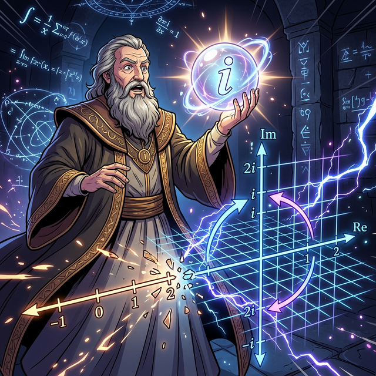

# 00. 인트로: 차원을 뛰어넘은 상상의 숫자 (Intro)

지금까지 배운 모든 숫자, 즉 유리수와 무리수를 영혼까지 끌어모아 만든 가장 거대한 수 체계를 우리는 **실수(Real Numbers)**라고 불렀습니다. 
Real. 진짜로 존재하는 숫자입니다. 길이가 2인 막대기, 몸무게 60kg처럼 눈에 보이고 손으로 만질 수 있는 수직선 위의 점들이죠.

---

## 1. 닫혀버린 실수 세계의 한계

그런데 16세기 수학의 천재이자 괴짜였던 카르다노(Cardano)는 방정식을 풀다가 엄청난 벽에 부딪힙니다.

$$ x^2 = -1 $$

"어떤 숫자를 제곱($x \times x$) 했더니 마이너스($-1$)가 나왔다."
실수의 세계에서는 양수를 제곱해도 양수, 음수를 제곱해도 짝수 번 곱해지므로 무조건 양수가 됩니다. **세상 그 어떤 진짜 숫자를 제곱해도 음수가 될 수는 없습니다.**

당시의 수학자들은 이 방정식을 보고 "해가 없다(불능)"며 쓰레기통에 던져버렸습니다.
하지만 카르다노는 쓰레기통에서 이 수식을 주워 들며 이렇게 중얼거렸습니다. 
"실제로는 없더라도... 만약 **존재한다고 상상(Imagine)**하고 계속 계산을 밀어붙여 보면 어떨까?"

## 2. 1차원 수직선의 파괴, 차원의 도약

저 미친 상상력 하나가 수학계에 어떤 후폭풍을 불러왔을까요? 
단순 좌우(1차원)로만 뻗어있던 실수의 좁은 수직선이 위아래로 찢어지며 폭발했습니다. 숫자들은 1차원 선을 벗어나 **2차원의 넓적한 평면(Complex Plane)**으로 날아오르기 시작했고, 곱셈은 크기가 커지는 게 아니라 **'회전(Rotation)'**을 의미하게 되었습니다.

  

## 3. 우주를 설계하는 가짜 숫자들

우습게도 이 "상상 속의 가짜 숫자" 기법을 도입하자, 꽉 막혀있던 수학의 모든 미해결 난제들이 마법처럼 모조리 풀려나갔습니다. 

나아가 오늘날, 전자가 움직이는 파동을 다루는 반도체 양자역학, 비행기 레이더의 신호 처리, 게임 엔진의 3D 캐릭터 회전(쿼터니언) 등 최첨단 현대 공학은 이 '가짜 숫자'들이 없으면 단 1줄의 공식도 적을 수 없습니다.

상상력이 만들어낸 인류 역사상 가장 위대한 발명품, **허수(Imaginary Number)** 와 **복소수(Complex Numbers)** 의 2차원 공간으로 진입합니다!
