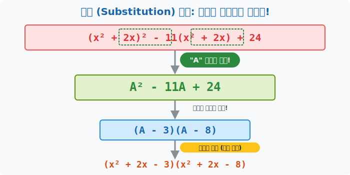

# 01. 첫 번째 수업: 치환, 긴 변수를 하나로 숨기는 은폐술 (Substitution)

해커들이 악성코드를 다룰 때, 반복적으로 등장하는 무친 듯이 긴 문자열 해시값이 있으면 눈이 너무 피곤해지고 머리가 복잡해집니다. 그래서 프로그래머들은 그 긴 코드 덩어리를 "변수 $A$" 란 이름으로 치환(Replace/Hide) 해서 숨겨놓고 아주 단순하게 뇌(Brain) 메모리상에서 요리합니다. 이 기법을 수학에서는 **치환 (Substitution)** 이라고 부릅니다.

---

## 1. 눈알이 터질 것 같은 다항식의 기만

당신 모니터에 아래와 같은 끔찍한 수식이 떴다고 칩시다. 
$$ (x^2 + 2x)^2 - 11(x^2 + 2x) + 24 $$

저걸 보고 괄호 제곱 폭탄을 다시 분배법칙으로 다 펴버려서 가장 긴 다항식으로 만들어서 인수분해를 해볼까요? 절대 멍청한 짓입니다. 4차식($x^4$)이 튀어나오면서 식은 $3$배로 길어지고 멘탈은 붕괴될 것입니다. 
하지만 프로그래밍 눈썰미를 켜보세요. 이 식 안에 **완벽하게 똑같이 생긴 쌍둥이 짐덩어리 조각**이 눈에 거슬리지 않나요?

* 앞에: $(x^2 + 2x)$
* 중간에: $(x^2 + 2x)$

네! 앞뒤로 똑같이 지저분하게 매달린 **$(x^2 + 2x)$** 라는 반복 스크립트 덩어리가 전체를 어렵게 보이도록 기만하고 있을 뿐입니다!

## 2. A 란 스티커로 은폐시켜라

이 똑같은 쌍둥이 덩어리 위에 아주 예쁘고 굵은 대문자 **$A$** 라는 스티커를 찰싹 붙여서 안 보이게 시야 밖으로 은폐해 버립시다. 
> 치환 선언: **"이제부터 $(x^2 + 2x)$ 는 아주 작고 귀여운 글자 $A$ 야!"**

그렇게 되면 위의 저 끔찍했던 수식 코드는 갑자기 초등학생도 풀 수 있는 이렇게 귀여운 모양으로 폭풍 다이어트 변신을 합니다.
$$ A^2 - 11A + 24 $$

오! 우리가 1부에서 달달 외우고 밥 먹듯이 풀었던 가장 만만한 평범한 십자가 $2$차 인수분해가 아니단 말입니까?

1. 끝자리 $24$ (곱해서 24: $-3 \times -8$)
2. 중간자리 $-11$ (더해서 -11: $-3 + -8$)
3. **분해 결과:** $(A - 3)(A - 8)$

정말 1초 만에 깔끔하게 인수분해가 끝나버렸습니다! 
이것이 **보이는 복잡함을 덮어버리고 핵심 논리 뼈대만 뽑아서 가상 메모리에서 처리하는 치환(Substitution) 해킹**의 미친 위력이자 아름다움입니다. 

## 3. 포장 스티커를 떼고 현실로 복구 (Return)

인수분해 가상 포장이 $(A - 3)(A - 8)$ 로 성공적으로 전부 다 끝났습니다.
이제 우리는 코드를 종료하기 전, 아까 붙여 두었던 가짜 은폐 대문자 $A$ 스티커를 찍! 하고 떼어내서 버리고, **원래의 지저분했던 본래 모습 (리턴 밸류) 을 다시 제자리에 원상복구시켜 쑤셔 넣어줘야 합니다.**

방금 전 분해된 식 $(A - 3)(A - 8)$ 에서 $A$ 자리에 원래의 $(x^2 + 2x)$ 를 고스란히 돌려치기해서 엎어버립시다. 

$$ (x^2 + 2x - 3)(x^2 + 2x - 8) $$

어어? 원상복구를 시켰더니 안의 괄호 안에서 또다시 각각 $3$개짜리 항과 완전한 평범한 형태의 아주 친숙한 2차 다항식이 2마리가 생겼네요? 저 안의 괄호 2개는 또 한 번 평범한 십자가 쪼개기로 잘게 분해가 가능합니다. (연쇄 분해 폭발!)

* 왼쪽 괄호: $(x^2 + 2x - 3) \quad \rightarrow \quad (x+3)(x-1)$
* 오른쪽 괄호: $(x^2 + 2x - 8) \quad \rightarrow \quad (x+4)(x-2)$

> **[최종 렌더링 결과]**
> 원래의 어마무시한 수식은 사실: **$(x+3)(x-1)(x+4)(x-2)$** 라는 $4$개의 꼬마 블록 상자가 일렬로 옹기종기 손잡고 팽창해 있던 빈 껍데기 풍선이었습니다!

이처럼 아무리 식의 덩어리가 $4$차 $5$차로 크고 역겹다고 절망하지 마세요. 그 속에 공통으로 똬리를 튼 부품 덩어리를 찾아내 예쁜 **$A$** 포장지로 숨겨버리고 처리하는 이 스킬은, 당신을 초급 프로그래머에서 중급 백엔드 개발자 수준의 논리력으로 점프시켜 줄 것입니다.
