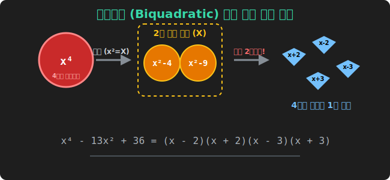
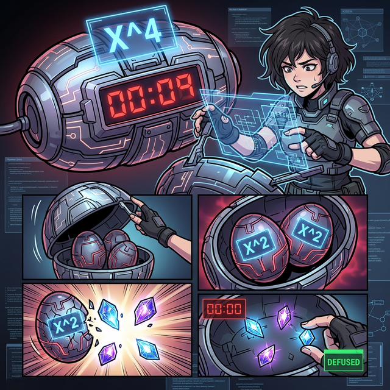

# 03. 세 번째 수업: 복이차식, $x^2$ 을 조종하는 이중 트릭 (Biquadratic Equations)

적의 덩치가 아무리 크고 무서워도, 그 속의 진짜 패턴만 꿰뚫어 볼 수 있다면 1초 만에 약점을 찌를 수 있습니다.
최고차항이 **$x^4$ (4제곱)** 으로 시작하는, 이름부터 겁나는 "4차 방정식" 이 나타날 때가 있습니다. 하지만 이 안에도 아주 어설프게 변장한 2차 다항식의 껍데기가 숨어있는 경우가 많습니다.

이를 우리는 '제곱(2차)이 복(Double) 으로 겹쳐져 있다'고 하여 **복이차식 (Biquadratic Equation)** 이라 부릅니다.

---

## 1. 징그러운 $4$차식의 연막

수식: $x^4 - 13x^2 + 36$

어, 1강에서 배운 **치환(Substitution)** 스킬이 찌릿하고 떠오르지 않습니까?
이 식은 언뜻 보면 무시무시한 4차 방정식 괴물 같지만, $x^4$ 은 사실 $(x^2)^2$ 로 생각할 수 있습니다. 
즉, 이 식의 모든 멤버가 홀수 차수($x^3, x^1$) 는 전혀 없이 오직 짝수 뼈대인 **$x^2$ 의 덩어리만으로 이루어져 있다는 것**을 눈치채야 합니다.

바로 앞주머니에서 치환 포장지 대문자 $\mathbf{X}$ 스티커를 꺼내 발라버립시다.
> **치환 발동: $x^2 = X$**

그러면 저 4차식 사기꾼 괴물 코드는 바로 눈앞에서 펑! 하고 다이어트를 합니다.
$$ X^2 - 13X + 36 $$

어처구니없게도 이 녀석의 진짜 본질은 우리가 눈 감고도 푸는 기초적인 십자가 2차 인수분해였습니다.
끝자리 $36$ (곱해서 $\rightarrow -4 \times -9$), 중간 $-13$ (더해서 $\rightarrow -4 + -9$).
* **1차 괄호 결합:** $(X - 4)(X - 9)$

## 2. 껍데기를 벗기면 다시 터지는 2차 폭발

이제 인수분해가 끝났으니, 가짜 스티커 $X$ 를 떼어내고 원래 본캐인 자기 자신 $x^2$ 을 그 자리에 넣어 압축을 돌려주면 됩니다.
$$ \mathbf{(x^2 - 4)(x^2 - 9)} $$

끝인 줄 알았죠? 해커의 눈으로 이 2개의 괄호를 다시 스캐닝해 보십시오.
어디서 많이 보지 않았나요?!
* 왼쪽 괄호 $(x^2 - 4)$ $\rightarrow$ 엇! 이건 $\mathbf{x^2 - 2^2}$ 이다! **"합차 공식 (데칼코마니)!"**
* 오른쪽 괄호 $(x^2 - 9)$ $\rightarrow$ 엇! 이것도 $\mathbf{x^2 - 3^2}$ 이다! **"합차 공식 2연타!"**

이 두 놈은 자기 안에 숨겨둔 합차 공식의 자폭 스위치 때문에 연쇄 반응을 일으키며 한 번 더 형체가 찢어집니다.
* 왼쪽 붕괴: $(x+2)(x-2)$
* 오른쪽 붕괴: $(x+3)(x-3)$

> **최종 렌더링 결과 결합:** 
> **$x^4 - 13x^2 + 36 = \mathbf{(x+2)(x-2)(x+3)(x-3)}$**

거대한 4차 몬스터가 4명의 조그마한 1차 꼬마 요정 패키지로 산산조각 났습니다!

## 3. 합차 공식을 강제로 욱여넣는 극한 변형 (고오급 스킬)

간혹 $x^4 + x^2 + 1$ 처럼 치환을 걸어서 $X^2 + X + 1$ 로 만들었는데, 십자가 분해가 절대 안 되는 먹통 악성코드가 있습니다. 
이럴 때는 해커가 인공적으로 가운데 숫자를 살짝 조작($+x^2$ 을 강제로 더해주고 뒤에서 다시 $-x^2$ 으로 빼주는 트릭) 하여 **앞부분을 강제 "완전제곱식" 으로 묶은 뒤, 전체 수식을 커다란 대문자 "합차공식 (A^2 - B^2)" 뼈대로 강제 변형**시켜 버리는 미친 꼼수를 씁니다.

1. 식의 변형: $x^4 + 2x^2 + 1 - x^2$ 
2. 앞쪽 부분 압축: $\mathbf{(x^2 + 1)^2} - x^2$
3. 합차 붕괴 시작: $(x^2 + 1 \mathbf{- x})(x^2 + 1 \mathbf{+ x})$
4. 예쁜 순서: $(x^2 - x + 1)(x^2 + x + 1)$

이러한 **조작과 변형을 통한 강제 인수분해 패턴 생성** 능력은, 단순하게 외운 공식에 숫자를 대입하는 수준을 넘어서서 수식 덩어리를 고무줄처럼 자유자재로 늘리고 자르는 "수학적 근력" 을 극대화해 줍니다. 
다음 챕터에서는 문자가 $x, y, z$ 등 미친 듯이 여러 종류가 한 번에 섞여 나오는 최고 난도의 긴 수식 덩어리를 "내림차순 정렬" 필터 하나로 잠재우는 법을 배웁니다.
