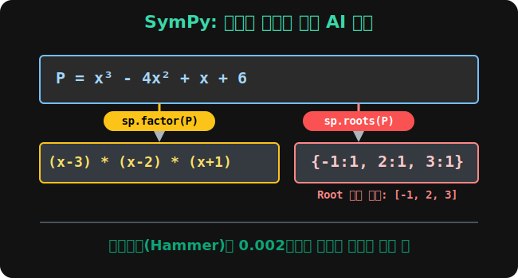

# 06. 여섯 번째 수업: 파이썬 루트(Roots) 추적기와 방정식의 붕괴 (Python SymPy Roots)

여러분은 연필과 인간의 뇌신경 세포를 불살라가며 공통인수 묶기, 치환, 3차 큐브 내림차순 정리, 그리고 가장 무식하게 숫자를 때려 넣어보는 인수정리 조립제법 망치질까지, 인수분해 해킹의 모든 물리적 타격 기술을 마스터했습니다.

하지만 앞서 1부(모듈 27) 6강에서 보여드렸듯, 현대 컴퓨터과학 AI 모델링 코딩 환경에서 억 단위의 데이터 차원(Dimension) 을 조작할 때는 이 지루하고 복잡한 조립제법을 엔지니어가 직접 연습장에 그리지 않습니다.
대신 우리는 파이썬 `sympy` 라이브러리의 가장 궁극적인 암살 병기, **`.solveset()` 와 `roots()` 추적기 함수**를 쏴 올려서 거대한 $X$ 다항식을 순식간에 원자 단위 코어 취약점 (즉, $\mathbf{x = ?}$ 가 되는 해, 방정식의 뿌리 Root) 값들 파편 모음집으로 발라내 버립니다. 

---

## 1. 방정식의 뿌리 (Roots) 탐색 AI 가동




5강에서 우리가 수기로 풀었던 극악 $3$차 방정식 다항식 몬스터 $x^3 - 4x^2 + x + 6$ 을 파이썬 기생수 엔진에 업로드시켜 봅시다.

```python
# [Python Code] 지옥의 3차 방정식 레이블러와 뿌리(Root) 추적
import sympy as sp

# 수학 해킹 전용 기호 변수 x 소환
x = sp.symbols('x')

# 거대한 괴물 다항식 덩어리를 타겟(P)으로 설정
P = x**3 - 4*x**2 + x + 6

# 1. 1부에서 썼던 다짜고짜 인수 묶어버리기 폭탄 투하 (.factor)
factored_P = sp.factor(P)

print("== [타겟 분쇄 레포트] ==")
print(f"원본 타겟: {P}")
print(f"공식 압축 결과: {factored_P}")
```

**[실행 결과 콘솔]**
```text
== [타겟 분쇄 레포트] ==
원본 타겟: x**3 - 4*x**2 + x + 6
공식 압축 결과: (x - 3)*(x - 2)*(x + 1)
```

어떻습니까? 인간이 대입할 숫자를 $+1, -1$ 고민하고 조립제법 ㄴ 자 표를 그리며 $5$분을 소모했던 수식이, 컴퓨터 메모리 파이프라인에서 엔터 입력 후 고작 $\mathbf{0.002초}$ 만에 부품 블록 체인 $(x-3)(x-2)(x+1)$ 로 해제 타점 렌더링이 끝나버렸습니다! 

## 2. `.roots()` : 치명적인 X 의 점 약점 추출기 (해커의 눈)

여기서 한발 더 깊숙이 들어가, 아예 인수분해 포장지 괄호 찌꺼기마저 날려버리고 **"도대체 이 수식 시스템(자판기)이 Error = $0$ (제로 셧다운) 가 나 버리게 하는 진짜 코어 입력 비밀번호 (Root, 해, 뼛속 약점) 숫자는 뭐야!?"** 만 스캐닝해서 즉시 배열 딕셔너리로 뽑아달라고 명령(Query) 할 수도 있습니다. 

```python
# 2. 다항식 괴물이 심정지를 일으켜 0 이 되는 치명적인 비밀번호(Root) 들만 
# 즉각적으로 스캐닝해서 뽑아내는 극상의 메소드
core_roots = sp.roots(P)

print("\n== [타겟 심정지 약점(Root) 스캐닝 결과] ==")
print(f"이 다항식 기계가 0으로 폭발하는 X 값들의 목록: {list(core_roots.keys())}")
```

**[실행 결과 콘솔]**
```text
== [타겟 심정지 약점(Root) 스캐닝 결과] ==
이 다항식 기계가 0으로 폭발하는 X 값들의 목록: [-1, 2, 3]
```

## 3. 해킹, 끝이 아닌 시작

출력된 리스트 `[-1, 2, 3]` 이 보입니까? 
저 숫자들이 바로 4강과 5강 조립제법에서 우리가 피와 땀으로 찾아냈던 인수정리 조각들의 뼈대 (즉, $(x+1), (x-2), (x-3)$ 괄호 조립 블록이 파괴되는 순간의 $X$ 중심점들) 와 완벽히 정확하게 $100\%$ 매치되는 정답입니다. 

우리는 다항식을 분열시킨다는 인수분해(Factorization) 가 도대체 파이썬 스크립트 코드상에서 어떤 로직 필터(`factor()`, `roots()`) 와 1:1로 대응되는지 목격했습니다. 
수학 교과서 위에 길고 칙칙했던 이 인수분해 단원 전체의 진짜 목적이 무엇이었을까요? 
바로 어떤 함수나 방정식 데이터 모델이 뿜어내는 수십 차원의 정보가 덩어리로 뭉쳐있을 때, 그것을 독립된 선형($1$차) 좌표의 독립 조각 부품(Vector space basis) 코드로 완전히 산산조각 찢어발겨 통제 범위 안에 가둬 넣으려는, 기하학적 **해킹 시스템 공학의 서막**이었던 것입니다. 

지금까지의 $X$ 변수 해체 작업이 완수되었다면, 이제 다음 모듈(우주로 쏘아 올린 포물선 로켓 방정식, 2차 곡선 해부) 부터는 눈앞에 그림으로 쫙 펼쳐지는 좌표 모니터 데이터 세계를 마음껏 요리하실 수 있을 겁니다. 건투를 빕니다!
