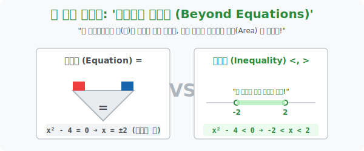

# 1. 점(Point) 에서 구역(Area) 으로: '이차부등식의 탄생'

## [도입부] 학습 목표 (Learning Objectives)
- 수학의 양팔 저울이 완벽히 평형을 이루는 '방정식($=$)' 의 강박에서 벗어나, 어느 한쪽이 무겁거나 가벼운 우주의 기울어짐을 표현하는 **'부등식($<, >$)'** 의 근본 생태계를 이해합니다.
- 이차방정식의 두 근( $\alpha, \beta$ ) 이 정답의 끝이 아니라, 무한한 숫자들을 가두는 '울타리(경계선)' 로 작동하며 정답을 '구역(Range)' 으로 확장시키는 메커니즘을 파악합니다.
- 파이썬(Python)의 조건 필터링(`Boolean Indexing`) 을 이용하여, 수백만 개의 트래픽 데이터 중에서 허용된 안전 구역(부등식 범위) 내의 데이터만 살아남게 추출하는 빅데이터 해킹 스킬을 배웁니다.

---

## 1. 완벽한 저울 vs 기울어진 저울

이차방정식 $x^2 - 4 = 0$ 은 양팔 저울이 완벽하게 $0$의 균형을 맞춘 상태입니다. 이 까다로운 조건을 만족시키는 숫자는 우주에서 오직 딱 2개, $x = 2$ 와 $x = -2$ 뿐입니다. 바늘 구멍 같은 '점(Point)' 의 세계입니다.

하지만 현실의 문제는 딱 떨어지지 않습니다.
> "엔진의 내부 압력($x^2 - 4$) 이 폭발 임계점($0$) 보다 **작아야만($<$)** 우주선이 안전하다!"
> 즉, **$x^2 - 4 < 0$**

이것이 이차부등식입니다. 저울이 $0$보다 가벼운 상태로 완전히 기울어져 버렸습니다.
이 조건을 만족하는 숫자는 몇 개일까요? $x = 0$ 도 되고, $1$도 되고, $1.5$, $-1.999$ 등 무려 **무한 개**입니다.
이차부등식은 결코 '$x$는 무엇이다' 라고 정답 1개를 뱉지 않습니다. **"안전하게 살아남는 숫자들의 영토(Area)"** 를 펜스로 치듯 범위를 선언해 줍니다.
$\rightarrow$ 정답 구역: **$-2 < x < 2$**

방정식의 근이었던 $-2$와 $2$는 이제 정답이 아니라, 생존 구역과 폭발 구역을 가르는 **'마지노선(경계벽)'** 으로서 임무가 교체됩니다.



<br>

## 2. 사이 공간 vs 바깥 공간 (In & Out)

이차식 $x^2 - 4$ 를 0으로 만드는 두 경계선은 $-2$ 와 $2$ 입니다.
이 두 개의 기둥을 수직선 위에 박아놓으면, 우주는 크게 3등분 됩니다.
그리고 부등호의 방향에 따라 정답 구역이 극명하게 갈립니다.

1. **[$<$ 0 방향] 갇혀버린 감옥**: $x^2 - 4 < 0$
   - 0보다 작다며 숙이고 들어가는 모양새입니다. 경계선 두 개의 눈치를 보며 그 **'사이 공간'** 에 숨어 들어갑니다.
   - $\mathbf{-2 < x < 2}$

2. **[$>$ 0 방향] 뻗어가는 자유**: $x^2 - 4 > 0$
   - 0보다 크다며 양팔을 벌려 포효합니다. 좁은 사이 공간을 벅차고 나와 양쪽 끝단 **'바깥 공간'** 으로 무한히 뻗어 나갑니다.
   - $\mathbf{x < -2 \text{ 또는 } x > 2}$

이 단순한 '안쪽이냐, 바깥쪽이냐' 의 판별 로직(In-Out Logic) 이 게임 엔진에서의 충돌 판정 방어막 시스템의 기초입니다.

---

## 3. 💻 파이썬(Python) 부등식 스캐너 (Boolean Indexing)

빅데이터 엔지니어들은 수백만 개의 숫자가 든 배열에서 반복문(`for`) 을 쓰지 않습니다. 배열 전체에 부등식 기호($<$) 하나만 던져주면, 조건에 맞는 놈들만 쓸어 담는 파이썬 넘파이(NumPy) 배열의 위력을 확인해 봅시다.

### 🐍 파이썬 예제: 트래픽 과부하 안전 구역(Inequality) 필터링

```python
import numpy as np

print("--- 🛡️ 서버 압력 제어소: 부등식(Inequality) 방화벽 가동 ---")

# 서버에 들어온 무작위 트래픽 압력 수치들 (x 값들)
# -5부터 +5까지 무작위 숫자 10개
traffic_x_values = np.array([-4.5, -2.1, -1.0, 0.5, 1.8, 2.0, 2.3, 3.5, 4.0, 5.0])

print(f" [초기 상태] 모니터링 중인 원본 트래픽 x 값들:\n {traffic_x_values}")

# 보안 조건부등식: x^2 - 4 가 무조건 0 미만이어야 안전하다! ( x^2 - 4 < 0 )
# 파이썬은 이 부등식을 통째로 배열에 처박을 수 있습니다.

# 1. 1차 스캔: 누가 우주를 폭발시키는가? (True/False 마스크 생성)
safety_mask = (traffic_x_values**2 - 4) < 0
print("-" * 50)
print(f" 🔍 [부등식 참/거짓 판별기]:\n {safety_mask}")

# 2. 2차 스캔: True 인 녀석들(안전한 녀석들)만 구명보트에 태워라!
safe_traffic = traffic_x_values[safety_mask]

print("-" * 50)
print(f" 🟢 [생존자 명단] 안전 구역 (-2 < x < 2) 에 존재하는 트래픽 값:\n {safe_traffic}")

# 반대로 위험 구역 (x^2 - 4 >= 0) -> 바깥 공간
danger_traffic = traffic_x_values[~safety_mask] # ~ 는 반전을 의미!
print(f" 🔴 [격리자 명단] 서버 폭발 임계점을 넘은 트래픽 값:\n {danger_traffic}")

# 결과창:
# --- 🛡️ 서버 압력 제어소: 부등식(Inequality) 방화벽 가동 ---
#  [초기 상태] 모니터링 중인 원본 트래픽 x 값들:
#  [-4.5 -2.1 -1.   0.5  1.8  2.   2.3  3.5  4.   5. ]
# --------------------------------------------------
#  🔍 [부등식 참/거짓 판별기]:
#  [False False  True  True  True False False False False False]
# --------------------------------------------------
#  🟢 [생존자 명단] 안전 구역 (-2 < x < 2) 에 존재하는 트래픽 값:
#  [-1.   0.5  1.8]
#  🔴 [격리자 명단] 서버 폭발 임계점을 넘은 트래픽 값:
#  [-4.5 -2.1  2.   2.3  3.5  4.   5. ]
```

주식 차트 프로그램에서 "볼린저 밴드 중심선보다 가격이 낮은($p < center$) 종목만 골라내라" 라는 거대한 명령도 백엔드에서는 위와 같은 단순한 이차 배열의 부등식 커팅 구조로 동작합니다.

---

## [결론] 학습 정리 (Summary)

1. **경계선과 영토**: 부등식은 하나의 정답이 아니라 '조건을 만족하는 무한한 숫자들의 영토' 를 구하는 것이며, 기존에 쓰이던 방정식의 '근' 은 이 영토를 구획 짓는 철조망(경계점) 의 역할을 수행합니다.
2. **In & Out 구역 법칙**: 최고차항의 부호가 양수일 때, 식 전체가 $0$보다 작으면($<$) 경계점들의 **'사이 공간'** 을 의미하며, $0$보다 크면($>$) 경계점들의 **'바깥 양쪽 무한 공간'** 을 가리킵니다.
3. 이를 프로그래밍 언어에서는 `True/False` 의 마스킹(Masking) 배열 상태로 치환하여, 수억 명의 로그인 유저 중 밴(BAN) 당할 범죄자 유저의 파라미터를 단 1초 만에 걸러내는 데이터 색인(Indexing) 에 써먹습니다.
