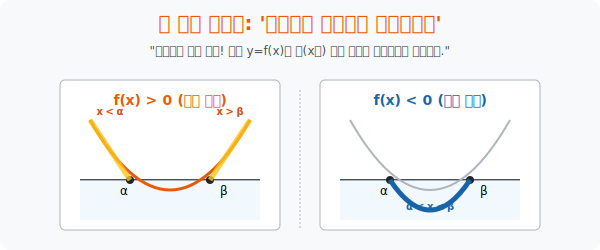

# 2. X축 수면 위로 솟아오른 자: '그래프와 부등식'

## [도입부] 학습 목표 (Learning Objectives)
- 머리 아픈 숫자 계산과 인수분해 대신, 이차함수 $y = f(x)$ 의 포물선 모양을 2D 캔버스 위에 그리고 나서 **$x$축을 수면(수위선) 삼아 잠수함 판정**을 내리는 궁극의 기하학적 해킹 뷰를 탑재합니다.
- 부등식 **$f(x) > 0$ 은 땅 위로 솟아오른 공중 구역**, **$f(x) < 0$ 은 물에 잠긴 수중 구역**으로 매핑하여 복잡한 수식을 한 장의 시각적 지도로 치환해 버립니다.
- 파이썬(Python)의 `matplotlib` 의 `fill_between` 기능을 사용해, 포물선 그래프 중 $x$축보다 위에 있는 부분만 형광펜으로 색칠해 버리는 실전 데이터 시각화 렌더링을 체험합니다.

---

## 1. 2D 그래프의 땅과 바다 (수면 해킹)

$x^2 - 3x - 4 < 0$ 이라는 부등식을 만났을 때, 수학 초보자들은 문자와 숫자 속에 파묻혀 펜을 부러뜨립니다. 고수들은 이것을 즉시 2D 시각 렌더링 프로그램으로 넘겨버립니다.
좌변 자체를 하나의 거대한 $y$축 높이, 즉 함수 **$y = x^2 - 3x - 4$ (U자형 포물선)** 로 치환해 버립니다.

자, 이제 이 포물선을 모니터에 그렸습니다.
포물선이 바닥으로 파고들다가, $x$축(고도 0의 땅바닥) 과 만나는 교점은 두 곳, $x = -1$ 과 $x = 4$ 입니다.

부등식의 질문은 이것입니다: **"저 포물선($y$) 의 높이가 $0$보다 작은($<$) 구역은 어디야?"**
> **기하학 번역: "너 그립에서 땅바닥($x$축) 보다 밑으로 수몰되어 바다에 잠긴 녀석들이 어느 $x$구간이야?"**

그래프를 눈으로 스윽 봅니다. $-1$ 과 $4$ 사이를 지나갈 때 U자의 바닥 부분이 물밑으로 깊숙이 파묻힌 것이 보입니다.
눈으로 보고 즉각 답을 도출합니다. "음, $-1$부터 $4$ 사이 공간이 물에 잠겼군."
**정답: $-1 < x < 4$**

반대로 $x^2 - 3x - 4 > 0$ 이라면요? 땅바닥 위로 높이 치솟아 하늘을 나는 우주선 구간을 찾으면 됩니다.
그래프의 양쪽 끝, 날개 부분입니다. **$x < -1$ 또는 $x > 4$**

수식(대수학) 의 징그러운 연산을, 그림(기하학) 의 직관으로 완전히 녹여버리는 이 치환 스킬이 고교 수학 그래프 해석의 심장입니다.



<br>

## 2. 그래프가 주는 면책 특권

수식에만 매달리는 사람은 판별식 $D < 0$ 인 부등식, 즉 **$x^2 + x + 1 > 0$** 같은 허수(근이 없음) 폭탄을 만나면 오류를 뿜고 쓰러집니다. (인수분해가 안 되니까요!)

하지만 스크린에 그래프를 그리는 자는 코웃음을 칩니다. 
그래프를 그려보니 $x^2 + x + 1$ 이라는 포물선은 붕 떠서 **$x$축(바닥) 이랑 닿지도 않고 하늘 높은 곳을 날고 있습니다.** (공중부양)

질문: "이 녀석이 고도 0 위($>0$) 에 있는 구간이 어디지?"
답: **"그래프 보니까 처음부터 끝까지 다 떠 있는데? 모든 $x$가 다 정답이네!" (모든 실수)**

함수 그래프의 시야를 획득하면, 인수분해가 안 되어도, 근이 없어도 우주 전체의 구성을 눈으로 내려다보며 어떤 함정이든 우회할 수 있습니다.

---

## 3. 💻 파이썬(Python) 형광펜 영역 칠하기

데이터 시각화 리포트에서 "평균 수익률($0$) 이상을 달성한 황금 구간만 노란색으로 칠해줘!" 라는 CEO 의 요구를 파이썬의 `fill_between` 함수 렌더링으로 1초 만에 수행해 봅시다. 

### 🐍 파이썬 예제: 그래프 양/음수 판별 구역 스캐너

```python
import numpy as np
import matplotlib.pyplot as plt

print("--- 🚀 2D 스캐너: 포물선 고도(Altitude) 레이더 작동 ---")

# x축 우주 생성 (-4 부터 6까지)
x = np.linspace(-4, 6, 200)

# 관측 함수: y = x^2 - 2x - 3 (인수분해 시 근은 -1 과 3)
y = x**2 - 2*x - 3

# 지평선(x축 수면)
y_ground = np.zeros_like(x)

# 1. 포물선 그리기
plt.figure(figsize=(8, 4))
plt.plot(x, y, label='y = x^2 - 2x - 3', color='black', linewidth=2)
# 지평선 그리기
plt.plot(x, y_ground, color='red', linestyle='--', label='Sea Level (y=0)')

# 2. 형광펜 매직 (부등식 모델링: y > 0 허공 구역 칠하기!)
# where 조건문에 y > 0을 넣으면 땅 위로 솟은 날개 부분만 색을 칠함
plt.fill_between(x, y, 0, where=(y > 0), color='green', alpha=0.3, label='Safe Zone (y > 0)')

# 3. 해저 구역 칠하기 (y < 0 물에 잠긴 구역)
plt.fill_between(x, y, 0, where=(y < 0), color='blue', alpha=0.3, label='Danger Zone (y < 0)')

plt.title("Inequality Geography Hacking")
plt.legend()
plt.grid(True)
print(" 🟢 [시각화 렌더링 완료] 녹색 구역이 허공(>), 파란색이 잠수 구역(<) 입니다.")
print("    - 인수분해나 수식을 몰라도 색깔 위치만으로 해의 범위를 눈으로 확인할 수 있습니다!")
# plt.show() # 실제 환경에서 팝업창 띄움

# 결과창:
# --- 🚀 2D 스캐너: 포물선 고도(Altitude) 레이더 작동 ---
#  🟢 [시각화 렌더링 완료] 녹색 구역이 허공(>), 파란색이 잠수 구역(<) 입니다.
#     - 인수분해나 수식을 몰라도 색깔 위치만으로 해의 범위를 눈으로 확인할 수 있습니다!
```

이 시각화 기법은 나사(NASA) 에서 우주선의 행성 중력권 이탈 시뮬레이션을 돌리거나, 주식 트레이더들이 볼린저 밴드 이탈(돌파) 구간을 렌더링할 때 핵심 백엔드 구획 로직으로 사용됩니다.

---

## [결론] 학습 정리 (Summary)

1. **대수의 기하학 모핑**: 부등식의 나열된 1차원적인 숫자의 식을 좌변 전체 덩어리 $y=f(x)$ 로 둔갑시켜, 우리 눈앞에 2차원 평면 곡선 그래프로 렌더링해 버립니다.
2. **수면(x축) 판정법**: $f(x) > 0$ 이냐 $< 0$ 이냐의 머리 아픈 질문을 단순하게 "그림이 $x$축 땅바닥 위로 날아다니냐? 아니면 물 밑으로 잠수 치고 있냐?" 로 번역하여 시력 1.0만 넘으면 해를 구할 수 있게 합니다.
3. 이 그래프 판정 뷰(View) 를 확보하게 되면, 앞으로 3차방정식, 4차방정식 나아가 괴랄한 사인, 코사인 삼각부등식이 주어지더라도 전혀 두려워할 것 없이 그저 선을 긋고 색칠 공부로 박살 낼 수 있습니다.
