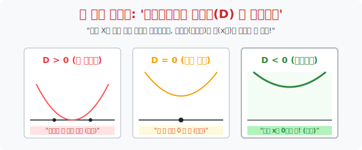

# 3. 땅에 닿지 않는 영원한 비행: '판별식과 절대부등식'

## [도입부] 학습 목표 (Learning Objectives)
- '해가 모든 실수다' 라는 특수한 부등식을 해결하기 위해, 그래프가 $x$축과 교점이 얼마나 있는지를 판별하는 **판별식($D$)** 의 관점을 도입합니다.
- 부등식 **보안 실드($f(x) > 0$)** 가 어떤 $x$값(우주쓰레기) 이 날아와도 평생 뚫리지 않으려면, 오히려 $x$축(땅) 과 한 점도 닿아선 안 되는 반대 로직($D < 0$) 을 체화합니다.
- 파이썬(Python)으로 $a, b, c$ 이차식 계수를 입력받으면 $D$의 결과에 따라 우주선이 지면(0) 과 충돌했는지 영원히 떠 있는지를 로그로 계산해 주는 절대 방어막 시스템을 구현합니다.

---

## 1. 절대부등식: "무슨 짓을 해도 이긴다"

일반적인 부등식은 $ax^2 + bx + c > 0$ 이라 할 때, 특정 구간(예: $1 < x < 5$) 에서만 성립하고 나머지 구간에서는 무너지는 한정적 조건을 갖습니다.
그런데 어떤 수식은 $x$에 $100$을 넣든, $-999$를 넣든, $0$을 넣든 간에 **무조건 성립하는 무적(God Mode) 상태**가 존재합니다.
이것을 **절대부등식(Absolute Inequality)** 이라 부릅니다. (마치 절대항등식의 부등식 버전)

> 미션: "이차함수 $y = ax^2 + bx + c$ 가 항상 $0$보다 크도록($>$ 0) 만들어라!"

이 미션을 성공시키기 위해, 우리는 앞서 배운 [치트키: 그래프] 를 소환합니다.
그래프가 "항상 0보다 크다" 라는 말은, "포물선이 왼쪽 끝부터 오른쪽 끝까지 영원히 지평선($x$축) 땅바닥에 단 한 번도 닿지 않고 **공중부양 파동**을 그리고 있다" 라는 뜻입니다.

<br>

## 2. 모순의 미학: 공중부양을 위해 뿌리(근) 를 잘라라

**포물선이 공중에 떠 있다** = **그래프가 $x$축과 만나지 않는다** = **$x$절편(근) 이 단 한 개도 존재해선 안 된다!**

기억하십니까? 근의 개수를 판독하는 레이더, **판별식(Discriminant, $D = b^2 - 4ac$)** 입니다.
* $D > 0$: 땅과 두 번 치고박고 싸움 (무인텔) $\rightarrow$ 실패! 밑파고 들감
* $D = 0$: 땅과 딱 한 번 스침 (접함) $\rightarrow$ 만약 $f(x) > 0$ 조건이라면 스친 애 0 때문에 실패!
* **$\mathbf{D < 0}$**: 땅과 아예 만나질 않고 하늘을 날고 있음 (근 없음/허근) $\rightarrow$ **대성공!**

학생들은 여기서 시험 문제에서 엄청난 함정에 빠집니다.
"항상 0보다 커야 해($>$ 0). 오케이 크다고 했으니까 판별식도 큰 거겠지? $D > 0$ 써야지!"
**땡!! (거대한 재앙)**

> **[절대 공중부양 법칙]**
> 위로 볼록하든, 아래로 볼록하든, $f(x)$가 항상 $>0$ 이기 위해서는 
> 1. 아래로 볼록한 U자 우주선이어야 하고 **($a > 0$)**
> 2. 바닥 점(해) 가 전혀 없어야 하므로 **판별식 $\mathbf{D < 0}$** 이라는 반직관적인 반대 로직을 적용해야 합니다!



---

## 3. 💻 파이썬(Python) 비행 상태 판별 시뮬레이터 

우주선의 대기권 진입 궤적 데이터를 이차함수 계수로 받아서, 이 비행체가 바다($x=0$) 에 추락($D>0$) 하는지 아슬아슬하게 수면 비행($D=0$) 하는지 무사히 공중 궤도를 유지($D<0$) 하는지를 판별하는 관제탑 AI를 만들어 봅니다.

### 🐍 파이썬 예제: 절대 방어막 판별기(Discriminant)

```python
print("--- 🛰️ 궤도 레이더: 절대부등식 방어막 테스트 작동 ---")

def test_orbital_flight(a, b, c):
    # 궤도식의 판별식 D 계산 (b^2 - 4ac)
    D = (b**2) - (4 * a * c)
    
    print(f"\n [비행 입력] 🚀 엔진 수식: f(x) = {a}x^2 + {b}x + {c}")
    print(f" [판별식 D 계산] {b}^2 - 4*{a}*{c} = {D}")
    
    if a > 0:
        if D < 0:
            print(" 🟢 [안전 확보] 판별식 D < 0. 교점이 없습니다.")
            print("    -> 무적 모드 발동! 모든 x에 대해 f(x) > 0 을 완벽히 만족하는 절대부등식 라인입니다!")
        elif D == 0:
            print(" 🟡 [경고 주의] 판별식 D = 0. 딱 한 점에서 수면(0)에 닿았습니다.")
            print("    -> 절대적 f(x) > 0 달성 실패 (특정 순간 x=0 인 예외가 발생)")
        else:
            print(" 🔴 [추락 발생] 판별식 D > 0. 수면(x축)을 뚫고 물밑으로 파고듭니다!")
            print("    -> f(x) < 0 인 침수 구간이 발생합니다. 절대부등식 탈락!")
    else:
         print(" 💀 [시스템 에러] 엔진 a < 0 이므로 위로 볼록 포물선입니다. 무조건 평생 언젠가는 밑으로 쳐박힙니다.")

# 테스트 1: 공중부양하는 완벽한 궤적 ( x^2 - x + 1 )
test_orbital_flight(a=1, b=-1, c=1)

# 테스트 2: 침수당하는 궤적 ( x^2 + 5x - 6 )
test_orbital_flight(a=1, b=5, c=-6)

# 테스트 3: 수면에 스치는 궤적 ( x^2 - 4x + 4 )
test_orbital_flight(a=1, b=-4, c=4)

# 결과창:
# --- 🛰️ 궤도 레이더: 절대부등식 방어막 테스트 작동 ---
#
#  [비행 입력] 🚀 엔진 수식: f(x) = 1x^2 + -1x + 1
#  [판별식 D 계산] -1^2 - 4*1*1 = -3
#  🟢 [안전 확보] 판별식 D < 0. 교점이 없습니다.
#     -> 무적 모드 발동! 모든 x에 대해 f(x) > 0 을 완벽히 만족하는 절대부등식 라인입니다!
#
#  [비행 입력] 🚀 엔진 수식: f(x) = 1x^2 + 5x + -6
#  [판별식 D 계산] 5^2 - 4*1*-6 = 49
#  🔴 [추락 발생] 판별식 D > 0. 수면(x축)을 뚫고 물밑으로 파고듭니다!
#     -> f(x) < 0 인 침수 구간이 발생합니다. 절대부등식 탈락!
#
#  ... (하략)
```

이 로직은 데이터 딥러닝에서 로스(Loss, 손실 함수) 값이 무조건 특정 안전 임계치 구간 이상이 되도록 매개변수 $a,b,c$ 구조망 세팅을 벤치마킹하는 '하이퍼 파라미터 튜닝 보장 조건' 으로 응용됩니다.

---

## [결론] 학습 정리 (Summary)

1. **절대부등식의 본질**: "$x$에 어떤 깽판 제어값을 넣어도 무조건 이 부등식이 0보다 커야 한다" 라는 무적 실드 로직입니다.
2. **그래프 시야로 전환**: 무적 실드가 성립하려면 함수 그래프가 땅바닥($x$축) 으로 기어들어 가는 부분이 1mm도 없어야 하므로, 필연적으로 **모든 그래프가 스크린 공중에 부양($a>0$)** 해 있어야 합니다.
3. **판별식의 뒤통수**: 그래프가 위로 떠 있다는 것은 $x$축과 교점(방정식의 해) 이 전혀 없다는 뜻이므로, 0보다 크다는 식($f(x) > 0$) 과 완전히 상반되게 **판별식 $D < 0$** 의 반전 공식을 들이대야 하는 뇌(Brain) 해킹 방어기제입니다.
