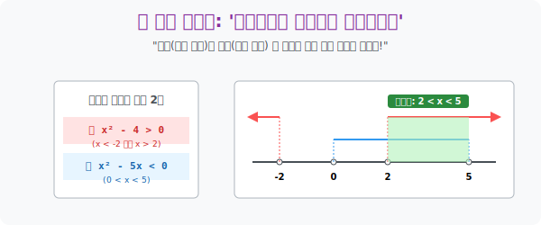

# 4. 방패와 창의 교차 구역: '연립이차부등식'

## [도입부] 학습 목표 (Learning Objectives)
- 하나만 풀어도 머리 아픈 이차부등식을 무려 두 개나 묶어 놓은 **'연립이차부등식(System of Quadratic Inequalities)'** 이 사실은 집합론의 **'교집합(Intersection)' 다중 스캐닝**일 뿐임을 직과합니다.
- 복잡한 수식을 머릿속으로 어림잣대 하려 하지 말고, 반드시 한 줄짜리 수직선($x$축 단일 맵) 위에 두 세력의 바운더리를 다른 높이의 지붕으로 쳐서 **공통으로 비가 안 새는 겹치는 구역(오버랩)** 만 안전 구역으로 따내는 레이어 필터링 기법을 배웁니다.
- 파이썬(Python)의 다중 논리곱 연산자 `& (Bitwise AND)` 과 판다스(Pandas) 필터링 시스템이 내부적으로 이 연립부등식의 스위치 체계를 그대로 복사하고 있음을 소스 레벨에서 구현해 봅니다.

---

## 1. 이중 필터링: "키 180 이상이면서 몸무게 70 이하인 사람!"

군대에서 병사를 징집하기 위한 시스템 검색을 만든다고 해봅시다. 단순 이차부등식은 조건이 단발적입니다.
"키를 기준으로 이차부등식을 돌려!" -> "통과 인원 10만 명"

거기에 연립이라는 제어망(방화벽) 레이어를 한 겹 더 추가합니다.
"방금 통과한 10만 명 중에서, 시력마저 이차부등식 타겟에 들어오는 놈만 걸러라!"
수학에서 중괄호 $\{ \}$ 로 묶인 연립방정식/연립부등식 계열은 곧 거대한 **AND 연산(교집합, Intersection)** 을 의미합니다. 둘 중 하나라도 조건을 벗어나서 에러를 뿜으면 폐기 처분합니다. 

* **식 1**: $x^2 - 4 > 0 \rightarrow (x < -2 \text{ 또는 } x > 2)$
* **식 2**: $x^2 - 5x < 0 \rightarrow (0 < x < 5)$

이것을 숫자판 위에서 머리로 하려면 반드시 펑크가 납니다. 고수들은 긴 작대기(수직선) 를 하나 그려놓고 **두 편의 높낮이를 다르게 그려** 물리적인 렌더링 작업을 취합니다.

<br>

## 2. 수직선 레이어 스태킹 기법

머리를 믿지 마십시오. 수직선을 직접 그립니다.
1. 등장하는 모든 숫자($-2, 0, 2, 5$) 라인업을 작은 것부터 순서대로 바닥에 점으로 꽂습니다.
2. **식 1**의 우산(영역) 을 1층 높이에 빨간 펜으로 그립니다. ( $<-2$, 그리고 $>2$ 지붕 오픈)
3. **식 2**의 우산(영역) 을 2층 높이에 파란 펜으로 그립니다. ( $0$ ~ $5$ 사이의 지붕 닫힘)

**[최종 해킹]**
하늘에서 레이저 비를 뿌렸을 때, 반드시 1층 지붕(빨강) 과 2층 지붕(파랑) 이 **두 겹 다 온전하게 포개져 있는 '이중 우산 구역'** 만이 우리가 찾는 교집합 생존 벙커입니다.
$-2$ 이하 구역: 식1만 통과 (탈락)
$0$ ~ $2$ 구역: 식2만 통과 (탈락)
$2$ ~ $5$ 구역: **빨강 1층 우산과 파랑 2층 우산이 모두 지나감 (생존 승인!)**

$\rightarrow$ 최종 해답: **$2 < x < 5$**



---

## 3. 💻 파이썬(Python) 다중 필터(AND 비트 논리곱) 

데이터 사이언스의 핵심 라이브러리인 '판다스(Pandas)' 로 고객 정보를 모니터링할 때, 수만 줄의 데이터에 대해 "조건 1과 조건 2를 모두 만족하는 유저" 를 필터링하는 다중 필터 문법은 이 연립부등식 시스템과 완전히 동일합니다.

### 🐍 파이썬 예제: 연립 조건 필터링 시스템 (Bitwise AND)

```python
import numpy as np

print("--- 🖥️ 서버 통합 관제실: 다중 조건 데이터베이스 필터링 ---")

# 임의의 유저 ID (x 값이라 가정: -5 부터 10까지 존재)
user_ids = np.array([-3, -1, 1, 3, 4, 6, 8, 10])

# 조건 1 (식1): ID 제곱이 4보다 커야 함 ( x^2 - 4 > 0 ) -> x < -2 or x > 2
filter_1 = (user_ids**2 - 4) > 0

# 조건 2 (식2): ID 수치 조작이 특정 밴드 내여야 함 ( x^2 - 5x < 0 ) -> 0 < x < 5
filter_2 = (user_ids**2 - 5 * user_ids) < 0

print(f" [데이터 전체] 유저 ID 목록 : {user_ids}")
print("-" * 50)
print(f" ⚠️ [레이어 1 필터 결과] 조건 1 통과 마스크:\n    {filter_1}")
print(f" ⚠️ [레이어 2 필터 결과] 조건 2 통과 마스크:\n    {filter_2}")

# 두 필터를 동시 만족하는 교집합! -> 파이썬 비트 연산자 '& (AND)' 사용
# filter_1 이 True 이고, 동시에 filter_2 도 True 인 것만 True 로 엮음
final_secure_mask = filter_1 & filter_2

print("-" * 50)
print(f" 🎯 [이중 보안 통과 마스크 (연립부등식 & 연산 적용)]:\n    {final_secure_mask}")

# 두 겹 우산을 모두 견뎌낸 초월적 유저 ID 만 추출
survived_users = user_ids[final_secure_mask]
print(f" \n 🏁 [최종 합격(해)] 데이터베이스에 살아남은 ID 값은:\n    {survived_users}")

# 결과창:
# --- 🖥️ 서버 통합 관제실: 다중 조건 데이터베이스 필터링 ---
#  [데이터 전체] 유저 ID 목록 : [-3 -1  1  3  4  6  8 10]
# --------------------------------------------------
#  ⚠️ [레이어 1 필터 결과] 조건 1 통과 마스크:
#     [ True False False  True  True  True  True  True]
#  ⚠️ [레이어 2 필터 결과] 조건 2 통과 마스크:
#     [False False  True  True  True False False False]
# --------------------------------------------------
#  🎯 [이중 보안 통과 마스크 (연립부등식 & 연산 적용)]:
#     [False False False  True  True False False False]
# 
#  🏁 [최종 합격(해)] 데이터베이스에 살아남은 ID 값은:
#     [3 4]
```

만약 필터 조건이 10개(십연립부등식) 이더라도, `filter1 & filter2 & ... & filter10` 로 연쇄시켜 한 번에 교집합을 내버리는 것이 바로 인공지능이 복잡한 이미지를 강아지로 타겟팅할 때 사용하는 `Feature Extraction AND Gate` 렌더링입니다.

---

## [결론] 학습 정리 (Summary)

1. **중괄호의 의미**: 두 이차부등식을 하나로 엮은 연립부등식의 본질은 "OR(또는)" 합집합이 아니라, 무조건 두 방화벽을 모두 살아서 통과해야만 허가를 내어주는 엄격한 **단일 교집합(AND) 시스템**입니다.
2. **수직선 레이어 매핑**: 머리를 과신하지 말고 각 해답을 독립적으로 먼저 계산한 뒤, 하나의 수직선 라인 위에 1층, 2층, 3층으로 각기 다른 높이의 지붕으로 렌더링하여 공통으로 포개어진 다크 존(Dark Zone) 을 스캔합니다.
3. 데이터베이스 시스템에서 `WHERE 조건식1 AND 조건식2` 로 쿼리를 연거푸 부르는 기술적 프로세스와 완벽히 일치하는, 2000년 전부터 계승되어 온 필터링 팩토리 구조입니다.
