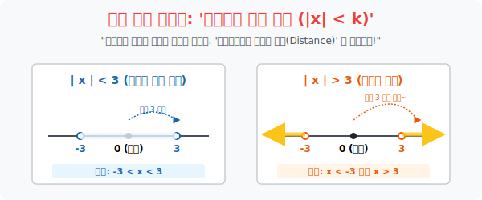

# 5. 거리 감각을 마비시키는 껍질: '절댓값과 부등식'

## [도입부] 학습 목표 (Learning Objectives)
- '절댓값 기호 $|$ $|$' 를 만나면 양수가 되어 떨어지는 장치 정도로 생각하는 1차원적 암기를 버리고, 원점으로부터 떨어진 **물리적 '거리(Distance)' 를 측정하는 레이더**로 스펙트럼을 넓힙니다.
- 절댓값이 포함된 방정식과 부등식을 풀기 위해 절대적으로 따라야 하는 **'알맹이 $+$, $-$ 구간 찢기(망치질)'** 원리를 통해 껍질을 부수고 나오는 양립의 기술을 체화합니다.
- 파이썬(Python)의 `abs()` 함수를 이용해 로봇청소기나 자율주행 차량이 "반경 5m 안에 장애물이 있는가?" 를 판별하는 **절대 사거리 감지 센서 레이더**를 코딩으로 구현해 봅니다.

---

## 1. 절댓값의 진짜 본모습: "나와 원점 사이의 거리"

절댓값 기호 $| -5 |$ 를 보고 단순히 "아하, 마이너스 빼고 $5$ 잖아!" 라고 생각하는 것은 중학교식 암기입니다. 
고급 기하학에서는 절댓값을 이렇게 읽어냅니다.
> **$| -5 |$ 의 번역: "나침반 원점(0) 에서 $-5$ 라는 놈이 서 있는 곳까지의 직선 도보 거리가 몇 미터인가?"**

자, 이 개념을 알고 부등식에 들이대 봅시다. 
**미션: $| x | < 3$ 을 풀어라!**

* 오답적 사고: "이게 뭔 소리야? $x$에 절대값 씌운 게 3보다 작다?"
* 정답적 사고: "원점으로부터 걸어서 간 도보 거리가 **3보 미만인 녀석들을 싹 다 잡아들여와!**"

그러면 거리가 3보 이내인 녀석들은 누구일까요? 
오른쪽으로 1, 2 보 간 녀석 당연히 잡힙니다. 왼쪽으로 -1, -2보 간 녀석도 잡힙니다.
하지만 3을 넘어선 4, 5, -4, -5 놈들은 타겟에서 제외됩니다.
$\rightarrow$ 즉 정답은 **$-3 < x < 3$ (원점 반경 3미터 이내의 포위망)**

반대로 **$| x | > 3$** 은 무엇일까요?
"원점에서부터 **3보보다 더 멀리 도망친 놈들만 잡아들여라!**"
$\rightarrow$ 정답은 **$x < -3 \text{ 또는 } x > 3$ (포위망 바깥의 도망자들)**



<br>

## 2. 알맹이가 두껍다면? "망치로 구간을 깨부수어라"

이제 절댓값 껍질 안에 고약하게 $| x - 2 | + 3x < 5$ 와 같이 더러운 이차/일차식 구조가 들어있는 녀석들을 만나면, 학생들은 얼음이 됩니다.
절댓값의 유일하고 완벽한 해체 마법(망치) 은 무조건 **'기준점을 중심으로 2개의 평행우주 찢어발기기'** 입니다.

> **[절댓값 껍질 부수기 2원색 마법]**
> 절댓값 안의 $x-2$ 덩어리가 자신이 $0$이 되는 찰나의 순간, 즉 $x=2$ 를 기준으로 우주를 가른다!

**우주 1 (양수 세계)**: $x$가 $2$보다 크거나 같을 때 ($x \ge 2$)
- $x$ 자체가 워낙 크니 저 알맹이 $x-2$는 원래부터 양수(+) 다!
- **껍질 폭파**: 양수이므로 절댓값 껍질은 아무 변화 없이 투명하게 증발!
- 식 변형: $(x-2) + 3x < 5 \rightarrow 4x < 7 \rightarrow x < \frac{7}{4}$
- [주의교차점] "$x \ge 2$ 세계 안에서, $x < \frac{7}{4}$ 인 놈을 찾아라!" $\rightarrow$ 겹치는 게 없음 (공집합/탈락)

**우주 2 (음수 세계)**: $x$가 $2$보다 작을 때 ($x < 2$)
- $x$ 가 작으니 저 알맹이 $x-2$는 무조건 음수(-) 다!
- **껍질 폭파**: 절댓값 껍질을 까면서, 양수로 만들려 빚쟁이 기호 **마이너스($-$)** 를 강제로 덕지덕지 달고 나옴!
- 식 변형: $-(x-2) + 3x < 5 \rightarrow -x + 2 + 3x < 5 \rightarrow 2x < 3 \rightarrow x < 1.5$
- [주의교차점] "$x < 2$ 세계 안에서, $x < 1.5$ 인 놈을 찾아라!" $\rightarrow$ 겹침! **(정답: $x < 1.5$)**

구간을 찢고, 각각의 세계에서 나온 대답을 합쳐 최종 답안을 제출하는 이 분기문 로직이, 컴퓨터 프로그래밍 `If-Else` 제어 로직의 원류입니다.

---

## 3. 💻 파이썬(Python) 절대 사거리 반경 센서 (`abs()`)

로봇 청소기나 적군 타겟팅 미사일은, "현재 위치($my\_pos$) 와 목표물 위치($target\_pos$) 의 차이가 마이너스든 플러스든 알 바 없고, **오직 그 사이의 절대 거리 간격 차이**가 5m 이내인가?" 만을 판별합니다.

### 🐍 파이썬 예제: 자율주행 차량 충돌 반경(Radar) 레이더 감지

```python
print("--- 📡 자율주행 라이더(LiDAR) 센서: 절대 반경 경고 시스템 ---")

# 내 자동차(로봇) 의 1차원 직선에서의 우주 좌표
my_position = 10.0

# 감지된 주변 차량 4대의 좌표들
detected_cars = [3.0, 7.5, 12.0, 18.0]

# 안전 유지 반경(절대 사거리): 이 이하로 좁혀지면 에어백 경고 발생! ( |x - 10| < 3 )
safe_distance = 3.0

print(f" [시스템 초기화] 내 차량 좌표: {my_position} | 경고 반경: < {safe_distance}m")
print("-" * 50)

for car_pos in detected_cars:
    # 충돌 검사 로직: 과연 상대차의 위치가 내 기준에서 양의 방향에 있든 음의 방향에 있든,
    # '두 점 사이의 순수한 도보 거리(Distance)' 가 안전 반경보다 작은가?
    
    # 파이썬 표준 내장 함수 abs(값) = 절댓값
    current_distance = abs(car_pos - my_position)
    
    print(f" 🔎 [레이더 파동 점검] 타겟 차량 점 좌표: {car_pos}")
    print(f"    - 현재 측정된 절댓값 거리: | {car_pos} - {my_position} | = {current_distance:.1f}m")
    
    # 충돌 부등식 확인 ( |x - 10| < 3 )
    if current_distance < safe_distance:
        print(f"    🚨 [긴급 경보] 타겟 차량이 안전 반경({safe_distance}m) 이내로 들어왔습니다! (충돌 위험)")
    else:
        print(f"    ✅ [안전] 거리가 ({safe_distance}m) 이상으로 충분히 멀리 떨어져 있습니다.")
    print("")

# 결과창:
# --- 📡 자율주행 라이더(LiDAR) 센서: 절대 반경 경고 시스템 ---
#  [시스템 초기화] 내 차량 좌표: 10.0 | 경고 반경: < 3.0m
# --------------------------------------------------
#  🔎 [레이더 파동 점검] 타겟 차량 점 좌표: 3.0
#     - 현재 측정된 절댓값 거리: | 3.0 - 10.0 | = 7.0m
#     ✅ [안전] 거리가 (3.0m) 이상으로 충분히 멀리 떨어져 있습니다.
# 
#  🔎 [레이더 파동 점검] 타겟 차량 점 좌표: 7.5
#     - 현재 측정된 절댓값 거리: | 7.5 - 10.0 | = 2.5m
#     🚨 [긴급 경보] 타겟 차량이 안전 반경(3.0m) 이내로 들어왔습니다! (충돌 위험)
# 
#  🔎 [레이더 파동 점검] 타겟 차량 점 좌표: 12.0
#     - 현재 측정된 절댓값 거리: | 12.0 - 10.0 | = 2.0m
#     🚨 [긴급 경보] 타겟 차량이 안전 반경(3.0m) 이내로 들어왔습니다! (충돌 위험)
# 
# ... (하략)
```

인공지능의 로봇 공학이나 거리 계측 벡터 엔진에서 단순히 좌표의 차이($Target - Me$) 를 쓰지 않고 무조건 절댓값으로 감싼 절대 오차 비용 함수 (`Mean Absolute Error`) 를 도출하는 이유가 바로 이 음수 왜곡을 방어하기 위함입니다.

---

## [결론] 학습 정리 (Summary)

1. **거리(Distance) 기반 해석**: 절댓값 부등식 $| x | < k$ 를 단순히 공식으로 외울 것이 아니라, "원점 0 에서부터 $k$ 거리만큼 바깥으로 줄자를 쳤을 때, 그 **울타리 안쪽에 갇힌 구역**" 이라는 직관적 뷰를 가져야 합니다.
2. **평행 우주 분할 연산**: 복잡한 절댓값 부등식은 알맹이가 양수가 되는 $(x \ge a)$ 구간 세계와 음수가 되는 $(x < a)$ 구간 세계로 지구 쪼개듯 쪼갠 뒤, '각각의 세계관 안' 에서 교집합 정답을 찾아 맨 마지막에 OR 연산(또는) 으로 합쳐주는 무식한 노동 작업이 진리입니다.
3. 파이썬의 `abs()` 나 딥러닝 텐서(Tensor) 의 오차 측정 모듈은 방향($\pm$) 이라는 쓸데없는 데이터를 말소시키고, 순수하게 차이(순수한 거리 위반량) 만을 측정하여 이 부등식 로직을 머신 러닝의 가중치 조절 제동 장치로 사용합니다.
