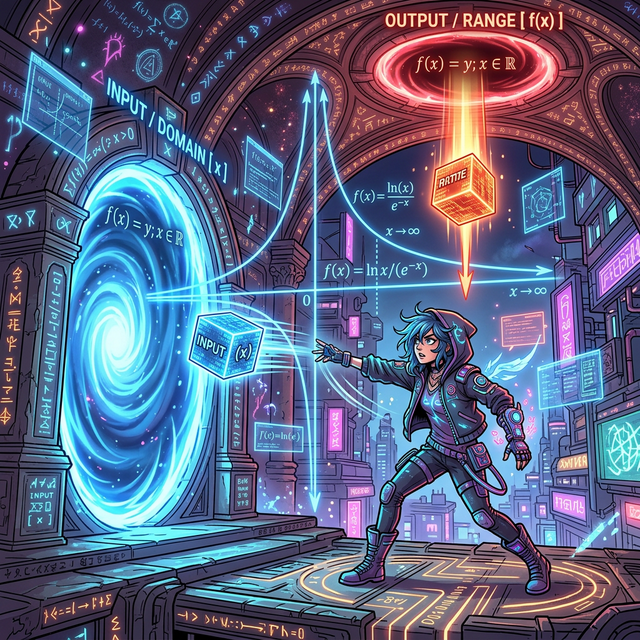

# 00. 인트로: 금기를 코딩하다 (Intro)

함수 1부 과정에서 만났던 $1$차 함수(직선)와 $2$차 함수(포물선)는 아주 모범생이었습니다. 어떤 숫자($x$)를 들이밀어도 척척 곱셈 계산을 해내며 매끄러운 바닥 곡선을 길게 그려주었죠.
이처럼 오로지 "$+,-,\times$" 다항식만으로 부드럽게 돌아가는 기계들을 **다항 함수(Polynomial Functions)** 라고 부릅니다.

하지만 컴퓨터 프로그래밍의 실전 현장에서는 이 다항 함수처럼 예의 바르고 착한 계산식만 나타나지 않습니다. 
때로는 서버의 계산량을 반으로 동강 내버리는 나눗셈 엔진(분수) 이나, 데이터 크기를 강제로 압축해버리는 압축 엔진(루트 $\sqrt{}$) 이 덕지덕지 수식에 달라붙게 됩니다.

---

## 1. 다항의 울타리를 벗어난 마법의 포탈

이 함수 기계들은 수학 언어에서 가장 끔찍하고 무서운 존재들입니다. 

* **"분모에 0 따위를 집어넣다니! 미쳤어? 시스템 셧다운!" (유리함수)** 
* **"루트 속살 안에 마이너스 불순물을 처넣다니! 허수 바이러스 에러! 강제 프로그램 종료!" (무리함수)**
* **"눈송이 1개가 1초 만에 1조 개로 증식폭발한다고? 변수가 제곱 기둥 하늘로 올라타버렸다!" (지수함수)**

  

방금 말한 저 미친듯한 속성의 함수 3대장이 바로 함수 모듈 마지막의 보스, **유리 함수(Rational), 무리 함수(Irrational), 그리고 지수/로그 함수(Exponential/Log)** 자판기들입니다.

## 2. 금지된 코드를 피해서 살아남아라

이들은 너무나 위험하고 독특한 능력을 가지고 있어서, 자신들이 살아남기 위해 오리지널 다항 함수가 가지지 않았던 특별한 생존 제약 시스템들을 하나둘씩 몸뚱어리에 탑재하고 있습니다.

1. **에러 회피 점근선 (Asymptotes):** "이 선을 넘거나 터치하는 순간 서버는 폭파된다! 가까이 다가가되 절대 터치는 말라!"
2. **시작점 리미터 제동기:** "나의 엔진은 $X$값이 무조건 0이나 양수에서만 켜진다! 마이너스 쪽 영토는 없는 셈 쳐!"
3. **타임 킬러 속도 증폭기:** "직선처럼 느려 터진 가동 속도로는 성이 안 찬다. 미친 듯한 곡선 스피드로 $Y$ 축을 뚫어버려라!"

이제, 변수 $X$ 를 분모 밑구멍에 갈아 넣거나, 네모난 루트 창살 감옥에 가두어 버린 돌연변이 함수들의 기괴한 형태와 그 압도적인 성능에 대해 파헤쳐볼 시간입니다. 분수 기호 위아래 층간을 종횡무진하는 '유리 함수'부터 당장 점검해 봅시다.
