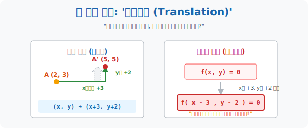

# 1. 시공간을 미끄러지다: '평행이동'

## [도입부] 학습 목표 (Learning Objectives)
- 캐릭터가 맵 위를 걸어가듯, 공간의 좌표계 위에서 점과 도형이 모양을 100% 유지한 채 그대로 미끄러지는 **'평행이동(Translation)'** 의 운동 역학을 시각화합니다.
- 점을 직관적으로 이동시킬 때(더하기) 와, 함수나 도형의 방정식 전체를 이동시킬 때(빼기) 발생하는 **'부호 반전의 청개구리 법칙'** 의 논리적 원인을 해부합니다.
- 파이썬(Python)의 화면 렌더링 라이브러리 `matplotlib` 를 활용하여, 수학 포물선 그래프 전체를 x축, y축으로 부드럽게 밀어버리는 컴퓨터 그래픽스(CG) 의 핵심 무브먼트를 코딩해 봅니다.

---

## 1. 정직한 '점'의 이동

당신은 체스판 위의 폰(Pawn) 하나를 잡고 움직입니다.
현재 위치가 $(2, 3)$ 인 '점 A' 를 오른쪽($x$축 방향) 으로 $3$칸, 위($y$축 방향) 로 $2$칸 밀어버립니다.

아주 직관적이고 정직합니다. 도착한 새로운 점 $A'$ 의 위치는 어떻게 될까요?
> $x$좌표: 원래 2 + 이동 3 = 5
> $y$좌표: 원래 3 + 이동 2 = 5
> **$A'(5, 5)$**

이것을 수학 기호로 번역하면 **점 $(x, y) \rightarrow (x+a, y+b)$** 가 됩니다.
게임 프로그래머들이 캐릭터의 좌표 위치를 모니터에 새로 그릴 때 매 프레임(60fps) 마다 이 단순한 덧셈 매트릭스 연산을 무한대로 돌리고 있는 것입니다.

<br>

## 2. 청개구리 '방정식'의 이동

그런데 좌표 하나(점) 가 아니라, **수백만 개의 점이 모여 이루어진 선이나 원 같은 '도형의 방정식'** 전체를 통째로 옮기려고 하면 수학의 신비스러운 딜레마가 터집니다.

현재 모니터에 $y = 2x$ 라는 직선이 그려져 있습니다.
이 직선 전체를 오른쪽($x$축 플러스 방향) 으로 $3$칸 옮기고 싶습니다. 
점의 이동처럼 단순하게 $y = 2(x + 3)$ 이라고 입력하면 어떻게 될까요?
놀랍게도 선은 오른쪽(+3) 이 아니라 **왼쪽(-3) 방향으로 뒷걸음질을 쳐버립니다.** 

왜 이런 미친 청개구리 짓을 하는 걸까요?
도형의 방정식 $f(x, y) = 0$ 은 하나의 '틀(Frame)' 과 같습니다. 오른쪽으로 3칸 이동한 새로운 별의 세계($x'$) 에서 바라본 원래 고향별($x$) 의 모습은 반대로 "왼쪽으로 3칸 떨어진 곳" 처럼 보이기 때문입니다. 
수학자들은 이 공간이동의 시점 차이를 막기 위해, 도형 전체를 이동시킬 때는 식에 삽입할 때 무조건 **부호를 반대로(마이너스) 침투**시키는 규칙을 박아버렸습니다.

> **직선, 포물선, 원의 방정식(도형) 을 $x$축으로 $+a$, $y$축으로 $+b$ 만큼 밀어라!**
> $\rightarrow$ 식 안의 $x$를 파내고 그 자리에 **$(x - a)$** 를 삽입! 
> $\rightarrow$ 식 안의 $y$를 파내고 그 자리에 **$(y - b)$** 를 삽입!



---

## 3. 💻 파이썬(Python) 그래프 미끄러짐 렌더링

데이터 과학이나 AI 엔지니어링에서 오차 곡선을 렌더링 할 때, 그래프를 자유자재로 평행 이동시켜 피팅(Fitting) 하는 기술은 밥줄과도 같습니다. 우리는 점 이동이 아닌 반대 부호를 삽입하는 '도형 이동' 방식으로 포물선을 밀어보겠습니다.

### 🐍 파이썬 예제: 포물선 스윕(Sweep) 이동 시뮬레이터

```python
import numpy as np
import matplotlib.pyplot as plt

print("--- 🚀 CG 렌더링: 파이썬 포물선 평행이동 엔진 가동 ---")

# x축 우주 생성 (-10 부터 10까지 촘촘하게 100개의 점)
x = np.linspace(-10, 10, 100)

# 오리지널(Original) 도형: 원점을 지나는 기본 포물선 y = x^2
y_original = x**2

# [퀘스트] 이 거대한 포물선을 오른쪽(x축) 으로 +4만큼, 위(y축)로 +3만큼 들어 올리시오!
move_x = 4
move_y = 3

# 수학의 청개구리 법칙 적용: 
# x 대신에 (x - 4) 를 집어넣고! 
# y 대신에 (y - 3) 을 넣어야 하지만, 식 정리를 위해 y = (x - 4)^2 + 3 이 됨.
y_translated = (x - move_x)**2 + move_y

print(f" [시스템] 오리지널 함수: y = x^2")
print(f" [시스템] 평행이동 좌표: x축으로 +{move_x}, y축으로 +{move_y}")
print(f" 🎯 [수학적 번역] x 자리에 (x-{move_x}), y 자리에 (y-{move_y}) 장착 완료.")
print(f" 🎯 [최종 청개구리 렌더링 함수]: y = (x - {move_x})^2 + {move_y}")

# --- (보너스) 실제 시각화 그래프 그리기 명령 ---
# 파이썬 커맨드 창에서는 글자만 보이지만, Jupyter 에서는 예쁜 선으로 나타납니다.
plt.plot(x, y_original, label="Original: y = x^2", linestyle='--', color='gray')
plt.plot(x, y_translated, label="Translated: y = (x-4)^2 + 3", color='red')
plt.title("Parabola Translation Magic")
plt.legend()
plt.grid(True)
# plt.show() # 실제 스크립트 실행 시 화면 팝업

# 결과창:
# --- 🚀 CG 렌더링: 파이썬 포물선 평행이동 엔진 가동 ---
#  [시스템] 오리지널 함수: y = x^2
#  [시스템] 평행이동 좌표: x축으로 +4, y축으로 +3
#  🎯 [수학적 번역] x 자리에 (x-4), y 자리에 (y-3) 장착 완료.
#  🎯 [최종 청개구리 렌더링 함수]: y = (x - 4)^2 + 3
```

마리오(캐릭터) 가 오른쪽으로 뛰어갈 때 화면(배경 이미지 창) 전체의 픽셀 좌표값을 마이너스로 쭉 빼주어 마치 캐릭터가 전진하는 듯한 효과를 주는 모든 2D 횡스크롤 게임의 척추가 바로 이 청개구리 평행이동 공식입니다.

---

## [결론] 학습 정리 (Summary)

1. **점의 평행이동**: $x, y$ 좌표에 이동하려는 거리 값을 그대로(정직하게) 덧셈/뺄셈하여 새로운 주소를 얻어내는 방식입니다.
2. **도형(방정식) 의 평행이동**: 관찰자의 시점계가 틀어지는 부작용을 막기 위해, 그래프 전체를 옮길 때는 원래 변수 대신 **부호를 완전히 뒤집은 가짜 변수($-a, -b$)** 를 식에 대입해야 정상적인 방향으로 도형이 밀려갑니다.
3. 이 개념은 딥러닝(AI) 의 컨볼루션(CNN) 신경망에서 필터(커널) 모형이 이미지 픽셀 전체를 스캐닝하며 미끄러져 갈 때의 행렬 연산 매커니즘과 완전히 일치합니다.
