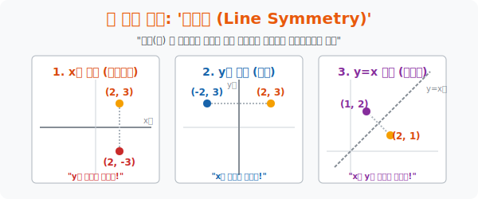

# 2. 반사경 앞의 우주: '선대칭 (Line Symmetry)'

## [도입부] 학습 목표 (Learning Objectives)
- 공간의 축($x$축, $y$축, $y=x$) 을 거울 삼아 점이나 도형을 완벽하게 반대편으로 데칼코마니처럼 찍어내는 **'선대칭(Reflection)'** 기술에 담긴 암호키(부호 반전) 를 해킹합니다.
- 거울의 위치에 따라 왜 내가 움직이는 방향이 완전히 다르게 투영되는지 직관적으로 사고하며, $x$축 대칭에는 $y$가 찌그러지고, $y=x$ 대칭에는 영혼이 뒤바뀌는 수학 패턴을 암기 없이 체화합니다.
- 파이썬(Python)의 데이터 스와핑(`Swapping`) 기법과 리스트 조건 변경망을 통해, 거꾸로 된 쌍둥이 은하 데이터를 순식간에 복제 및 뒤집어버리는 해커의 복사술을 시전 해봅니다.

---

## 1. 십자 거울방에서 살아남기

수학의 좌표 평면이라는 방 한가운데에 당신이 서 있습니다. 좌표는 $(2, 3)$ 입니다. 
이 방에는 세 개의 거대한 거울 벽이 세워져 있습니다. 당신이 거울을 바라보면, 거울 속의 쌍둥이는 거울반대편 어디에 맺히게 될까요?

**[거울 1: $x$축 거울 (바닥에 깔린 호수)]**
마치 호숫가에 서서 물에 비친 내 모습을 보는 것과 같습니다. 오른쪽 방향(x축) 은 그대로 변하지 않습니다. 하지만 하늘을 향해 있던 내 머리(y) 는 땅 속으로 깊이 처박힙니다.
> 호수 반사 ($x$축 대칭): $x$는 그대로 두고, 반대 축인 **$y$의 부호를 뒤집어라!**
> $(2, 3) \rightarrow \mathbf{(2, -3)}$

**[거울 2: $y$축 거울 (벽에 붙은 전신 거울)]**
벽을 보고 섰습니다. 키(높이, y축) 는 그대로인데, 내가 거울 쪽으로 다가간 만큼 거울 속의 나와의 거리(x축) 는 반대 방향으로 뻗어나갑니다.
> 전신거울 반사 ($y$축 대칭): $y$는 그대로 두고, 반대 축인 **$x$의 부호를 뒤집어라!**
> $(2, 3) \rightarrow \mathbf{(-2, 3)}$

**[거울 3: $y = x$ 거울 (대각선 마법 거울)]**
이 방의 바닥을 $45$도로 사선으로 가로지르는 기괴한 거울이 있습니다. 이 거울에 닿으면 하늘과 땅, 가로와 세로의 개념이 완전히 붕괴되어 차원이 바뀝니다.
> 차원 반전 ($y=x$ 대칭): 그냥 고민하지 말고, **$x$와 $y$의 자리 자체를 통째로 교환(Swap) 하라!**
> $(2, 3) \rightarrow \mathbf{(3, 2)}$
이 무자비한 치환 공식이 나중에 등장할 **역함수(Inverse Function)** 라는 악마를 만들어내는 모태가 됩니다.



<br>

## 2. 도형의 대칭: 청개구리는 퇴근했다

이전 장에서 "도형(식) 을 평행이동시킬 때, 식별자를 속이기 위해 부호를 반대로 넣는 불편한 수고($-a, -b$)" 를 겪었습니다.
하지만 대칭(Symmetry) 에서는 그런 잔머리가 통하지 않는 완전히 투명한 우주입니다. **점의 대칭이나, 도형의 대칭 식이나 100% 똑같은 법칙을 사용합니다.**

* 점 $(2, 3)$ 을 $x$축 대칭! $\rightarrow$ $y$부호 반전 $\rightarrow$ $(2, -3)$
* 도형의 식 $y = 2x+1$ 을 $x$축 대칭! $\rightarrow$ $y$부호 반전 $\rightarrow$ 식 안의 $y$ 대신 $-y$ 를 삽입! $\rightarrow$ $-y = 2x+1$ 

너무나도 정직한 이 복제술(클로닝) 덕분에 수학자들은 뇌의 과부하 없이 우주의 반대편 구조를 쉽게 그려낼 수 있었습니다.

---

## 3. 💻 파이썬(Python) 데칼코마니 렌더링 

자율 주행 AI를 학습시킬 때, 데이터 엔지니어들은 좌회전 구간 사진 데이터를 '좌우 반전($y$축 대칭)' 시켜서 가짜 우회전 구간 데이터를 수만 장 찍어내 데이터의 양을 두 배로 뻥튀기시킵니다. (데이터 증강 기법, Data Augmentation)
파이썬의 배열 뒤집기(`Array Swapping`) 로 순식간에 데이터를 반전시켜 보겠습니다.

### 🐍 파이썬 예제: 좌우 반전(y축 대칭) 데이터 복제기

```python
import numpy as np

print("--- 🎭 AI 데이터 증강: 미러 파스널(거울) 엔진 가동 ---")

# 오리지널 자동차 주행 경로 좌표 5개 (x, y)
# 차가 우측으로(x증가) 위로(y증가) 이동 중
original_path = [ (1, 2), (2, 4), (3, 6), (4, 8), (5, 10) ]
print(f" [원본 데이터] 오리지널 경로 좌표: {original_path}")

# 목적 1: y축 대칭(좌우 거울) 반전!
# 원리: y값은 냅두고 x값들의 부호만 싹 다 마이너스로 박아버리면 됨.
y_symmetric_path = []

for point in original_path:
    old_x = point[0]
    old_y = point[1]
    
    # 해킹 로직: x에 마이너스를 붙인다! (-old_x)
    new_point = (-old_x, old_y)
    y_symmetric_path.append(new_point)

print(f" 🪞 [y축 거울 투영 완료] 복제된 쌍둥이 좌회전 데이터: {y_symmetric_path}")
print("-" * 50)

# 목적 2: y = x 대각선 거울 반전! (파이썬 Swapping의 예술)
yx_symmetric_path = []

for point in original_path:
    # 파이썬만의 아름다운 Tuple 자리 바꾸기 스킬 
    old_x, old_y = point
    new_point = (old_y, old_x) # (x, y) -> (y, x) 로 던지기만 하면 끝
    yx_symmetric_path.append(new_point)

print(f" 🌪️ [y=x 차원 반전 투영 완료] 역함수의 데이터: {yx_symmetric_path}")

# 결과창:
# --- 🎭 AI 데이터 증강: 미러 파스널(거울) 엔진 가동 ---
#  [원본 데이터] 오리지널 경로 좌표: [(1, 2), (2, 4), (3, 6), (4, 8), (5, 10)]
#  🪞 [y축 거울 투영 완료] 복제된 쌍둥이 좌회전 데이터: [(-1, 2), (-2, 4), (-3, 6), (-4, 8), (-5, 10)]
# --------------------------------------------------
#  🌪️ [y=x 차원 반전 투영 완료] 역함수의 데이터: [(2, 1), (4, 2), (6, 3), (8, 4), (10, 5)]
```

이미지 편집기의 'Flip Horizontal(좌우 반전)', 'Flip Vertical(상하 반전)' 기능이 모두 화면에 뿌려진 수백만 픽셀 좌표계들의 $x$, $y$ 에 일괄적으로 마이너스 부호를 곱하는 초고속 행렬 연산의 산물입니다.

---

## [결론] 학습 정리 (Summary)

1. **축 대칭의 규칙**: 거울이 되는 축은 자기를 건드리지 못하게 방어합니다. 즉, $x$축 대칭이면 $x$는 살고 $y$가 뒤집히며, $y$축 대칭이면 $y$는 살고 $x$가 뒤집힙니다. 
2. **차원 반전 ($y=x$ 대칭)**: 대각선 거울을 만나는 순간 가로축($x$) 과 세로축($y$) 의 권력이 통째로 교체(치환) 되므로, 역함수의 탄생을 가져옵니다.
3. 도형 방정식 전체를 투영(대칭) 시킬 때는, 평행 이동 때 사람을 환장하게 했던 역부호 함정 구역 없이 정직하게 해당 문자 덩어리에 마이너스($-$) 를 장착해 주면 됩니다.
