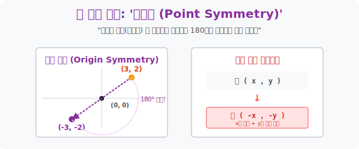

# 3. 우주의 블랙홀: '원점 대칭 (Point Symmetry)'

## [도입부] 학습 목표 (Learning Objectives)
- '선대칭' 이 2D 거울에 반사되는 것이라면, 특정 '점' 을 관통하여 정반대 편으로 튀어나가는 **'점대칭(Point Symmetry)'** 의 웜홀 역학을 기하학적으로 파악합니다.
- 점대칭은 사실 대상 물체를 팽이처럼 **180도 빙그르르 회전**시킨 모션과 완전히 똑같은 현상임을 시각적으로 증명합니다.
- 점 $(x, y)$ 가 블랙홀인 원점 $(0, 0)$ 에 빨려 들어가 반대편 화이트홀로 뱉어질 때, 모든 DNA(부호) 가 파괴되는 **$(-x, -y)$** 의 이중 반전 코드를 파이썬 데이터 매트릭스에 이식해 봅니다.

---

## 1. 원점 (0, 0) 다이브

평면 위에 어떤 점이 존재하고, 그 반대편 우주로 넘어가고 싶을 때 우리는 기준점(블랙홀) 하나를 향해 몸을 던집니다. 가장 기본이 되는 우주의 중심 **'원점(Origin, $0,0$)'** 을 향해 뛰어들어봅시다.

오른쪽 위 1사분면에 있는 점 $P(3, 2)$ 를 원점에 밀어 넣습니다.
거울(선대칭) 처럼 한 번만 부딪혀서 튀어 오르는 것이 아니라, 그 핵을 뚫고 정반대편 3사분면을 향해 화살표가 치고 나갑니다.
**[도착 좌표] $\rightarrow$ $P'(-3, -2)$**

굉장히 직관적입니다. **$x$축과 $y$축의 부호가 모조리 반전**됩니다.
사실 이 원점 대칭이라는 녀석의 뼈대를 해부해 보면, 지난 시간 배운 '선대칭' 시스템을 2연속 콤보로 갈겨버린 것과 완벽히 일치합니다.
> $P(3, 2)$ 를 먼저 $x$축에 거울 반사시킨다! $\rightarrow$ $(3, -2)$
> 그 점을 바로 다시 $y$축에 거울 반사시킨다! $\rightarrow$ **$(-3, -2)$**

수학이나 프로그래밍의 연쇄 렌더링에 있어서, "원점 대칭을 해라!" 라는 명령은 "상하 반전(Flip Vertical) 과 좌우 반전(Flip Horizontal) 기능을 동시에 눌러라" 라는 것과 같은 뜻입니다. 



<br>

## 2. 팽이치기: 사실은 180도 회전이다

노트북 화면을 예로 들어봅시다. 노트북 스크린의 중심(로고가 있는 곳) 을 축으로 삼아, 모니터 화면 전체를 180도 획 돌아버리게(뒤집어지게) 꺾어 보십시오.
오른쪽 위에 파란 폴더가 있었다면, 지금 그 폴더는 왼쪽 아래 박혀 있게 됩니다. 왼쪽 아래의 휴지통은 오른쪽 위로 이동했습니다.
이것이 바로 점대칭의 물리적 실체입니다. 
그 점을 핀으로 콱 박아놓고 **종이 전체를(우주를) $180^\circ$ 회전**시킨 것!

수학적으로 회전 행렬(`Rotation Matrix`) 공식을 돌렸을 때 $\cos(180^\circ)=-1$, $\sin(180^\circ)=0$ 이 되어 결국 $x$와 $y$의 좌표가 모두 떨어지는 마이너스를 맞게 되는 기하학이 숨어 있습니다.

---

## 3. 💻 파이썬(Python) $180^\circ$ 회전 클라이언트 

자이로스코프 센서나 드론의 짐벌이 기체의 180도 뒤집힘을 감지할 때, 모든 물리 좌표와 벡터 방향이 반대로 꺾이는(부호 변경) 것을 모니터링해 봅시다.

### 🐍 파이썬 예제: 드론 좌표 원점 대칭 시스템

```python
print("--- 🛸 드론 플라이트 컨트롤러: 180도 뒤집힘(점대칭) 보정 모듈 ---")

# 현재 드론이 전송한 센서 스텔스기 포인트 3개 (x, y)
drone_shape = [(1, 5), (3, 7), (5, 5)]

# 원점 대칭 해킹: 사실은 x, y 전체 부호가 뒤집힌 것일 뿐이다.
flipped_shape = []

for point in drone_shape:
    x, y = point
    # 원점 다이브(Point Symmetry) 적용: 마이너스의 세례
    inverted_x = -x
    inverted_y = -y
    flipped_shape.append((inverted_x, inverted_y))

print(f" [정상 주행] 원본 드론 기체 좌표: {drone_shape}")
print("-" * 50)
print(f" 🌀 [180도 롤오버] 드론이 뒤집혔습니다! (원점 대칭 발생)")
print(f"    보정된 역방향 좌표망: {flipped_shape}")

# 결과창:
# --- 🛸 드론 플라이트 컨트롤러: 180도 뒤집힘(점대칭) 보정 모듈 ---
#  [정상 주행] 원본 드론 기체 좌표: [(1, 5), (3, 7), (5, 5)]
# --------------------------------------------------
#  🌀 [180도 롤오버] 드론이 뒤집혔습니다! (원점 대칭 발생)
#     보정된 역방향 좌표망: [(-1, -5), (-3, -7), (-5, -5)]
```

모든 그래픽 엔진 처리(`WebGL`, `OpenGL`) 에서 화면을 180도 뒤집을 때, 이미지의 픽셀 매핑을 일일이 루프 돌며 옮길 필요 없이 메모리의 좌표계 어레이 속성 맨 앞에 $(-1)$ 값 하나만 곱해주면 화면이 순식간에 역전됩니다.

---

## [결론] 학습 정리 (Summary)

1. **점대칭의 실체**: 2D 거울 모드가 아닌, 한 점(중심점) 에 핀을 꽂고 우주 전체를 ** $180^\circ$ 회전**시키는 스핀(Spin) 구동 방식입니다.
2. **원점 $(0, 0)$ 대칭 연산**: 가장 대표적인 기본 점대칭인 원점 대칭은, 점이든 도형 식 전체이든 가리지 않고 $x$자리에는 $-x$를, $y$자리에는 $-y$를 그대로 때려 박아 쌍으로 부호를 말살시키는 강력한 연산입니다.
3. 이 개념은 나중에 배울 '기함수(원점 대칭 함수)' 의 절대 정의가 되며, 파동의 상쇄 간섭이나 모터의 역회전 펄스를 설계할 때 쓰이는 기본 진동 좌표가 됩니다.
