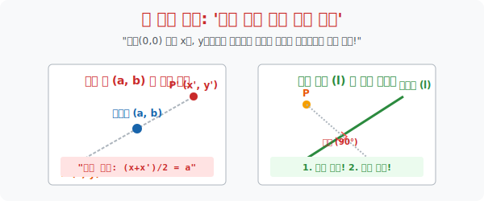

# 4. 좌표의 덫: 일반 점과 선에 대한 대칭

## [도입부] 학습 목표 (Learning Objectives)
- $x$축이나 원점 따위의 편안한 치트키(원점, 기준축) 가 없는, 좌표 평면상에 둥둥 떠 있는 아무 임의의 점 $(a,b)$ 이나 비스듬한 직선 $y = mx+n$을 거울 삼아 튕겨내는 **하드코어 대칭 이동 연산망**을 장착합니다.
- 점대칭의 절대 본질이 **"중점(Midpoint) 이 기준점과 일치한다"** 에 있음을 직관적으로 이해하고, 공식을 도출해 냅니다.
- 선대칭의 까다로운 우주에서 살아남기 위해, 점과 점 사이의 연결선이 거울선과 이루는 **'수직 조건'** 과 거울선 위에 중심이 있다는 **'이등분(중점) 조건'** 의 이중 잠금장치를 파이썬의 방정식(Equation) 풀이 엔진으로 해제합니다.

---

## 1. 엉뚱한 점 $(a, b)$ 을 블랙홀로 삼기

지금까지는 착하게도 원점 $(0, 0)$ 을 중심축 삼아 뒤집었습니다. 
하지만 점 $P(x, y)$ 가 어중간하게 허공에 떠 있는 점 $M(a, b)$ 빨려 들어갔다가 그 반대편으로 뱉어진 새로운 점 $P'(x', y')$ 을 구하라고 하면 뇌가 정지하기 십상입니다.

**수학자들은 거리가 똑같다는 점(중점 스킬) 에 착안했습니다.**
원래 점 $P$ 와 뱉어진 가짜 점 $P'$ 의 사이에, 그들을 조종한 웜홀 $M(a, b)$ 이 완벽히 한가운데 존재합니다.
> $x$좌표들의 평균(중점): $\frac{x + x'}{2} = a$
> $y$좌표들의 평균(중점): $\frac{y + y'}{2} = b$

이를 도착 지점 $x'$ 와 $y'$ 에 대해 깔끔하게 정리하면 막강한 클론 코드가 탄생합니다.
* **$x' = 2a - x$**
* **$y' = 2b - y$**

즉, 기준점이 되는 $a$ 와 $b$ 에 2배 곱하기를 한 뒤, 자신의 원래 몸통($x, y$) 을 깎아내면 거품처럼 반대편 클론이 태어납니다. 원점 $(0,0)$ 은 그냥 $a, b$ 가 각각 0이어서 $-x, -y$ 로 떨어졌을 뿐인 특별 케이스였을 뿐입니다.

<br>

## 2. 삐딱하게 세워진 거울 (일반 직선 대칭)

더 잔인한 보스 몬스터는, $y = 2x+1$ 처럼 좌표를 삐딱하게 가로지르는 대각선 거울 앞입니다. $x$축 반전이나 차원 스왑처럼 한 가지 동작으로 깔끔하게 뒤집히지 않습니다.
점 $A$ 가 삐딱한 거울을 치고 $A'$ 로 탄생하기 위해선 무조건 **2가지 가혹한 수학적 테스트(수직 이등분선의 성질)** 를 통과해야 합니다.

1. **[수직 조건]** 점 $A$ 와 건너편 점 $A'$ 을 이은 긴 막대기(선분) 의 기울기는, 무조건 거울선($y = 2x+1$) 의 기울기($2$) 와 **수직 구도 90도(기울기의 곱이 -1)** 로 부딪혀야 합니다. 즉, 선분 $AA'$ 의 기울기는 $-\frac{1}{2}$이 나와야 합니다!
2. **[중점 조건]** 점 $A$ 와 $A'$ 의 정가운데 배꼽(중점) 은, 허공에 떠 있는 게 아니라 무조건 거울선($y = 2x+1$) 의 레이저 위에 안착되어 있어야 합니다.

이 두 개의 락(Lock) 을 연립방정식으로 풀어내는 것이 일반 직선 대칭의 핵심 미션입니다.



---

## 3. 💻 파이썬(Python) 연립방정식(SymPy) 뚫기

이처럼 인간이 손으로 넘기면 덧셈, 뺄셈, 분수 실수로 수백 번 틀릴 기울기 수직 방정식과 중점 대입 방정식을, 파이썬의 똑똑한 방정식 솔버(Solver) 인 `SymPy` 모듈에 밀어 넣어서 한 방에 $P'$ 의 위치를 해킹해 봅니다.

### 🐍 파이썬 예제: 일반 직선(거울) 대칭 렌더러

```python
import sympy as sp

print("--- 🔬 기하학 엔진: 삐딱한 거울(선대칭) 좌표 생성기 ---")

# 심파이 기호수학 변수 선언 (미지의 타겟 x', y')
xp, yp = sp.symbols('xp yp')

# 원래 점 P의 좌표 (4, 2)
# 거울 빔의 식 (y = 2x - 1) -> 거울의 기울기 m = 2
Px, Py = 4, 2
mirror_m = 2

# 1. 중점 조건 (Midpoint Condition)
# P와 P' 의 중점 M이 거울선 y = 2x - 1 위에 있어야 한다!
# 거울식: y_mid = 2 * x_mid - 1
mid_x = (Px + xp) / 2
mid_y = (Py + yp) / 2
eq_midpoint = sp.Eq(mid_y, 2 * mid_x - 1)

# 2. 수직 조건 (Perpendicular Condition)
# P와 P' 를 이은 기울기( (yp - Py) / (xp - Px) )가 미러 기울기(2) 와 90도 여야 함 (곱해서 -1 -> 즉 -1/2)
# (yp - 2) / (xp - 4) = -1/2  -> 정리하면 2*(yp - 2) = -(xp - 4)
eq_perpendicular = sp.Eq(2 * (yp - Py), -(xp - Px))

# 두 개의 절대 조건(방정식) 을 연립하여 해를 터트린다!
solution = sp.solve((eq_midpoint, eq_perpendicular), (xp, yp))

print(f" [타겟 확인] 원래 점 P: ({Px}, {Py})")
print(f" [거울 인식] 기준 직선: y = 2x - 1")
print("-" * 50)
print(f" 🪞 [계산 레이더 완료] 거울 반대편에 맺힌 클론 P' 의 좌표는: {solution}")
print(f"    (수직이등분선의 이중 잠금을 전부 만족합니다)")

# 결과창:
# --- 🔬 기하학 엔진: 삐딱한 거울(선대칭) 좌표 생성기 ---
#  [타겟 확인] 원래 점 P: (4, 2)
#  [거울 인식] 기준 직선: y = 2x - 1
# --------------------------------------------------
#  🪞 [계산 레이더 완료] 거울 반대편에 맺힌 클론 P' 의 좌표는: {xp: 0, yp: 4}
#     (수직이등분선의 이중 잠금을 전부 만족합니다)
```

이 알고리즘은 오토캐드(AutoCAD) 가 건축 설계 도면에서 삐딱한 지붕 선을 기준으로 창틀 모형 데이터 전체를 반대편으로 미러 복사(`Mirror Copy`) 해 줄 때 내부적으로 초당 수백만 번 굴리는 핵심 코드 베이스입니다.

---

## [결론] 학습 정리 (Summary)

1. **일반 점대칭 식**: 원점이 아닌 아무 임의의 점 $(a, b)$ 을 핵으로 삼아 건너편으로 뒤집을 때는 매일같이 중점 공식을 유도해 **$(2a-x, 2b-y)$** 로 순식간에 좌표를 날려 보냅니다.
2. **선대칭의 두 날개**: 대각선 빔 거울을 통과하려면 무조건, 원래 놈과 가짜 놈의 연결선이 거울에 **직각으로 꽂혀야 하고(기울기의 곱 = $-1$)**, **그 정가운데 배꼽이 거울선 위에 타 있어야(중점 대입)** 합니다.
3. 이 두 가지 복잡한 연립방정식은 수학 소프트웨어와 머신 러닝 렌더러가 역행 데이터나 오류 노드를 거울 뒤편 좌표 공간으로 격리 수용할 때 쓰는 필터링 연산으로 활용됩니다.
