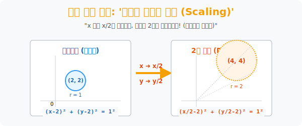

# 5. 우주의 팽창과 수축: '도형의 확대와 축소 (Scaling)'

## [도입부] 학습 목표 (Learning Objectives)
- 그림판에서 사진의 모서리를 잡아당겨 2배로 쭉 늘리듯, 기준점을 중심으로 모든 픽셀 좌표가 우주가 팽창하듯 퍼져 나가는 **'닮음 변환(Dilation)'** 의 기하학적 의미를 파악합니다.
- 평행 이동에서 경험했던 '청개구리 법칙(부호 반전)' 이 덧셈/뺄셈뿐만 아니라 스케일링(크기 조절) 의 곱셈/나눗셈 영역에서도 동일하게 **"반대로 뒤집혀 들어간다(역수 대입)"** 는 무서운 통일성을 깨닫습니다.
- 파이썬(Python)의 수학 플롯 라이브러리를 이용하여, 쪼그마한 포물선의 함수식을 역수 침투 코드로 개조하여 화면을 집어삼킬 듯 거대하게 부풀려 버리는 스케일(Scale) 엔진을 만들어 봅니다.

---

## 1. 2배로 커지려면, 2로 나누어라!

원점 $(0,0)$ 을 기준으로 모든 우주가 $k$배만큼 팽창합니다. 이것은 돋보기로 들여다보는 원근법과 같습니다. 방바닥에 누워 있는 작은 개미가 $2$배로 거대해지려면, 개미를 이루는 모든 외곽선 점 좌표 $(x, y)$ 들이 원점에서부터 $2$배나 더 멀리 떨어진 **$(2x, 2y)$** 로 투사되어야 합니다.

**점의 이동은 아주 직관적(정직) 입니다.**
> $P(1, 3)$ 의 점을 원점 기준으로 2배 쫙 확대해라! 
> $\rightarrow$ $\mathbf{P'(2, 6)}$ 

하지만 거대한 개미 몸체 윤곽선을 그리는 **방정식(도형의 식)** 전체를 2배로 거대하게 키울 때는 어떨까요? 평행이동 때 겪었던 '틀(Frame) 의 왜곡 현상' 이 똑같이 발동(청개구리 역전) 합니다.
도형의 식 $f(x, y) = 0$ 관점에서는, 우주가 2배 팽창해버리면 원래 자기가 보던 격자무늬(그리드) 들의 간격은 반대로 $\frac{1}{2}$ 로 쪼그라들어 촘촘해진 것처럼 느끼게 됩니다.
따라서 도형을 $k$배 확대하라는 명령이 떨어지면 수학자들은 이렇게 대입합니다.

> **방정식에 있는 $x$ 문자를 파내고, 그 자리에 역수인 $\mathbf{(\frac{x}{k})}$ 를 쑤셔 넣어라!**
> **방정식에 있는 $y$ 문자 자리에 $\mathbf{(\frac{y}{k})}$ 를 쑤셔 넣어라!**

* 오리지널 원: $x^2 + y^2 = 1$ (반지름 1)
* 명령: 2배 팽창시켜라!
* 개조된 식: $(\frac{x}{2})^2 + (\frac{y}{2})^2 = 1 \rightarrow \frac{x^2}{4} + \frac{y^2}{4} = 1 \rightarrow \mathbf{x^2 + y^2 = 4}$ (반지름 2짜리 거대 원형 완성!)



<br>

## 2. 확대(Scale) 는 찌그러짐을 포용한다

평행이동(위치 스와이프) 이나 대칭이동(거울 뒤집기) 은 도형의 모양이나 절대 크기를 1mm 도 훼손시키지 않는 **강체 변환(Rigid Transformation)** 이었습니다.
하지만 이 확대/축소 변환은 생물학적 DNA 를 늘리거나 압축시키는 행위로, 본질적인 면적과 모양의 비례 스케일을 조작합니다.

만약 $x$방향으로는 2배 당기고, $y$방향으로는 가만히 내버려(1배) 둔다면 어떻게 될까요?
정원(Circle) 로망을 이루던 원은 순식간에 양옆으로 치즈처럼 쭉 늘어난 타원(Ellipse) 방정식으로 병행 진화하게 됩니다. 컴퓨터 모니터의 해상도(종횡비) 가 안 맞을 때 사람 얼굴이 보름달처럼 찌그러지는 현상이 바로 이 X, Y 스케일의 $k$값이 다르게 적용된 $x/a, y/b$ 타원 오버라이딩 때문입니다.

---

## 3. 💻 파이썬(Python)의 스케일업(Scale-Up) 모터

빅데이터 시계열 분석에서 그래프의 진폭이 너무 현미경처럼 작을 때, 그 식 자체에 역함수 배율을 대입하여 큰 파도로 뻥튀기하는 작업을 실시합니다.

### 🐍 파이썬 예제: 그래프 팽창(Dilation) 렌더러

```python
import numpy as np
import matplotlib.pyplot as plt

print("--- 🔬 현미경 분석기: 함수 파형 확대(Dilation) 시스템 렌더링 ---")

# 관찰 범위 -10 부터 10
x = np.linspace(-10, 10, 200)

# 오리지널: 작은 진폭을 가진 사인(Sine) 파동 함수
# y = sin(x)
y_original = np.sin(x)

# [목표] 파동을 가로(x축) 로 3배 쫙 늘리고, 세로(y축) 로 2배 증폭시켜라!
scale_x = 3
scale_y = 2

# [청개구리 역수 투입 알고리즘]
# x 대신 (x / 3) 을 넣는다.
# y 대신 (y / 2) 를 넣는다. -> y/2 = sin(x/3) -> y = 2 * sin(x/3)
y_dilated = scale_y * np.sin(x / scale_x)

print(f" [시스템] 오리지널 파동: y = sin(x)")
print(f" [명령 입력] x축 방향 {scale_x}배 팽창, y축 방향 {scale_y}배 증폭")
print(f" 🎯 [수학적 알고리즘] x 변수에 (x/{scale_x}), y 변수에 (y/{scale_y}) 역수 장착 완료.")
print(f" 🎯 [최종 출력 함수]: y = {scale_y} * sin(x / {scale_x})")

# 화면 출력 블록
plt.plot(x, y_original, label="Original: y = sin(x)", linestyle='--', color='gray')
plt.plot(x, y_dilated, label="Dilated: y = 2*sin(x/3)", color='blue')
plt.title("Wave Scaling Magic")
plt.legend()
plt.grid(True)
# plt.show()

# 결과창:
# --- 🔬 현미경 분석기: 함수 파형 확대(Dilation) 시스템 렌더링 ---
#  [시스템] 오리지널 파동: y = sin(x)
#  [명령 입력] x축 방향 3배 팽창, y축 방향 2배 증폭
#  🎯 [수학적 알고리즘] x 변수에 (x/3), y 변수에 (y/2) 역수 장착 완료.
#  🎯 [최종 출력 함수]: y = 2 * sin(x / 3)
```

이 압축 및 팽창 스킬은 음원 압축 기술인 MP3 코덱에서 소리 주파수를 수학적으로 절반으로 짧게 찌그러뜨리고($x \rightarrow 2x$), 나중에 재생할 때 다시 잡아 늘리는 역연산 컨버터의 수학적 베이스라인으로 작동합니다.

---

## [결론] 학습 정리 (Summary)

1. **점의 확대**: 원점 좌표 기준으로 공간이 폭발하듯 팽창하면, $x, y$ 좌표계의 모든 숫자들에 물리적으로 정직하게 곱하기($\times k$) 연산을 수행하면 새로운 안착지가 됩니다.
2. **도형(방정식) 의 확대**: 방정식 전체의 세계관을 팽창시킬 때, 식의 문자 틀은 오히려 역수($\frac{1}{k}$) 로 나누어 축소 입력시켜야 정상적으로 도형이 팽창하여 나타나는 마법(청개구리 역전) 의 지배를 받습니다.
3. 영상 변환 소프트웨어 내에서 `Zoom-in / Zoom-out` 버튼을 누르거나 창 크기를 조절하는 순간, 백그라운드 엔진에서는 이 역수 치환 팩토리얼 무한 스크롤이 초당 144번 계산되고 있습니다.
