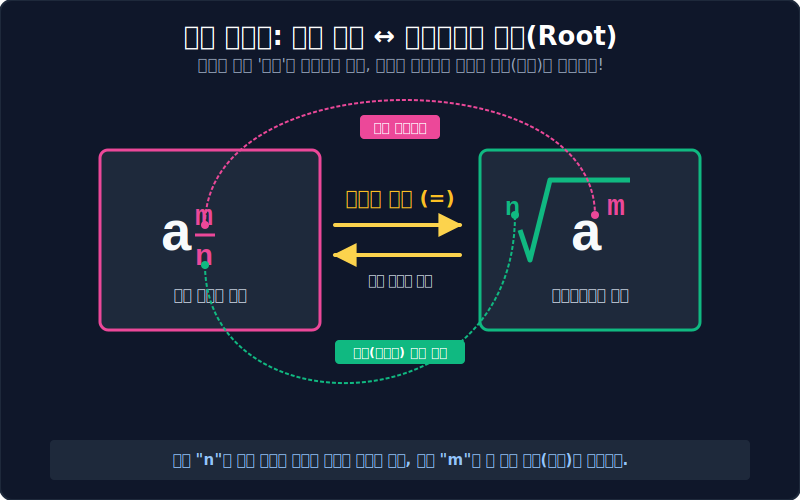



# 02. 지수의 확장 II (분수 지수와 루트 뿌리)

## 1. 학습 목표 (Learning Objectives)
* 0과 음수의 벽마저 넘어, **'소수점/분수 값의 지수'** 가 어떻게 탄생했는지 그 대수학적 논리를 파악합니다.
* 분수 지수 $a^{\frac{1}{n}}$ 와, 무리수 기호의 대명사 '거듭제곱근 $\sqrt[n]{a}$' 이 완벽하게 100% 동일한 도플갱어 엔진이라는 사실을 SVG 시각화로 깨닫습니다.

## 2. 0.5번을 (반 번만) 곱한다는 게 말이 돼? ($a^{\frac{1}{2}}$)
수학자들의 금기 부수기는 분수의 세계로 진입합니다. "지수에 2나 3 말고, $\frac{1}{2}$ 같은 걸 얹으면 식이 망가지려나?"

아직 우리는 $\frac{1}{2}$ 승이 뭔지 모릅니다. 하지만, **지수 법칙의 무적 치트키 (거듭제곱의 거듭제곱은 지수끼리의 곱셈이다. $(a^3)^2 = a^6$)** 가 만약 분수에서도 똑같이 작동한다고 '가정'해 봅시다.
내가 아직 어떤 값인지 모르는 저 무명의 외계인 **$2^{\frac{1}{2}}$** 녀석을 괄호로 묶어 딱 '제곱(2승)'을 씌워 빙글빙글 돌려보겠습니다.

$(2^{\frac{1}{2}})^2$
= 지수 법칙 발동! 지수끼리 곱한다! $\rightarrow \frac{1}{2} \times 2$
= $2^1$
= **$\mathbf{2}$** 

헉! $2^{\frac{1}{2}}$ 이라는 정체불명의 숫자는, **"스스로를 두 번(제곱) 뻥튀기했더니, 루트 껍데기가 벗겨지고 알맹이 2가 튀어 나오는 숫자"** 라는 엄청난 사실이 입증되었습니다. 잠깐, 스스로를 제곱해서 2가 나오는 숫자, 중학교 때 달고 살았던 익숙한 기호가 있지 않습니까? 
그렇습니다. 바로 **루트 $\sqrt{2}$ (제곱근 2)** 의 완벽한 수학적 정의입니다!
(원래 정식 명칭은 $\sqrt[2]{2}$ 이지만 너무 자주 쓰여 숫자 2를 생략할 뿐입니다.)

## 3. 분수 지수와 루트(Root) 매핑 시스템
방금 전의 깨달음에 의해, 기하학을 지배하던 무리수 루트 기호($\sqrt{\quad}$)는 사실 **"미처 깔끔한 정수로 떨어지지 못한 소수점/분수 지수($\frac{1}{n}$ 형)의 또 다른 표기법 (Syntax Sugar)"** 에 불과하다는 것이 세상에 선포되었습니다.

$$ 2^{\frac{1}{3}} = \sqrt[3]{2} $$
$$ a^{\frac{m}{n}} = \sqrt[n]{a^m} $$

분수 지수의 모습을 철저히 해부하면 다음과 같습니다.
1. **[머리 (분자) $\mathbf{m}$]**: 이 숫자는 순수한 진짜 전투력입니다. 몸통 밑수 $a$가 진짜로 몇 번 제대로 파워업(거듭제곱) 했는지를 나타냅니다. 
2. **[꼬리 (분모) $\mathbf{n}$]**: 이 숫자는 나를 억압하는 **던전의 문을 부수기 위한 조건(방어막)** 입니다. 분모가 3이다? 그러면 똑같은 놈 3명이 파티를 맺어야만(3승이 되어야만) 루트라는 외피 방어막을 박살내고 정수로 탈출할 수 있다는 무시무시한 수학적 봉인 장치(루트의 차수)를 뜻합니다. 

모든 복잡한 중첩 루트 (예: $\sqrt{\sqrt[3]{x^5}}$) 식을 만난다면 당황하지 마세요. 이 모든 그물망 같은 루트 기호들을 몽땅 부숴서 **"분수 형태의 지수"** 로 분해 치환시켜 버리면, 초등학교 수준의 단순 분수 덧셈 뺄셈으로 모든 문제를 압살시킬 수 있습니다.

## 4. 학습 정리 (Summary)
1. **분수 지수의 탄생**: 지수 법칙을 소수나 분수 영역까지 오차 없이 연장하기 위해 만들어진 완벽한 차원 확장 논리입니다.
2. **거듭제곱근($\sqrt[n]{}$)의 진짜 정체**: 루트 기호는 하늘에서 뚝 떨어진 외계 문자가 아닙니다. 분수 지수에서 사람을 귀찮게 하는 분모($n$) 파장을 바깥 껍질로 격리시켜 놓은 **"분수 지수의 또 다른 렌더링 스킨(Design)"** 에 지나지 않습니다.

