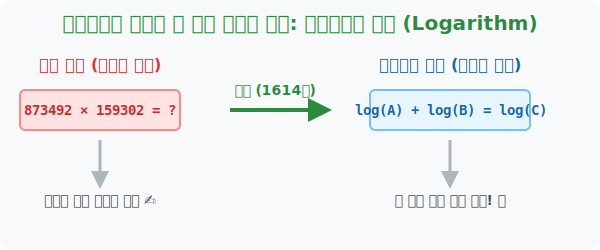

# 1. 천문학자의 수명을 늘려준 기적: 네이피어(Napier)와 로그

## [도입부] 학습 목표 (Learning Objectives)
- '로그(Logarithm)'가 17세기 수학계에 등장하게 된 역사적 배경과 그 위대함을 배웁니다.
- 혐오스러운 곱셈과 나눗셈을, 평화로운 덧셈과 뺄셈으로 둔갑시키는 로그의 핵심 철학을 이해합니다.
- 파이썬(Python)에 내장된 `math.log` 스크립트를 통해 계산기 이전 시대의 기적을 체험합니다.

---

## 1. 17세기의 최대 난제: 천문학자들의 지옥

1600년대, 망원경이 발명되고 사람들은 우주를 관측하기 시작했습니다. 행성과 별의 위치를 계산하려면 엄청나게 큰 숫자들이 필요했습니다. 예를 들어 목성의 궤도를 예측하려면 `8,734,592 × 1,598,302` 같은 끔찍한 곱셈을 손으로 직접 종이에 써가며 몇 달 동안 계산해야 했습니다. 계산하다가 한 개라도 틀리면 처음부터 다시 해야만 했죠. 

수많은 천문학자들이 별을 보다 늙어 죽는 게 아니라, 별의 위치를 '곱하기' 하다가 스트레스로 쓰러져 나가는 시대였습니다. 수학의 위기는 최고조에 달해 있었습니다.



<br>

## 2. 존 네이피어(John Napier)의 구원

이때 스코틀랜드의 귀족이자 수학자였던 **존 네이피어**가 세상을 구원할 기적의 도구를 무려 20년에 걸쳐 만들어냅니다. 그는 어마어마한 수학적 직관으로 다음과 같은 마법 규칙을 발견했습니다.

> **"어떤 수를 특수한 규칙(지수)으로 변환해 놓은 맵(Map)을 만들면, 그 세계 안에서는 골치 아픈 '곱셈'이 그저 '덧셈'으로 바뀐다!"**

즉, 네이피어가 미리 20년 동안 고생해서 만들어둔 거대한 [로그표(Log Table)] 책을 펼치고 규칙에 따라 숫자를 변환하기만 하면, `8734592 × 1598302` 라는 최악의 곱셈을 그냥 **앞 숫자와 뒷 숫자를 더하는(+) 초등학생 덧셈 수준**으로 치환해버릴 수 있게 된 것입니다! (계산이 끝나면 다시 표를 보고 원래 세계의 숫자로 되돌려 놓음)

이 발견으로 인해 유럽의 모든 과학자들은 환호성을 질렀고, 혹자는 **"네이피어가 천문학자들의 수명을 2배로 늘려주었다"**고 극찬했습니다. 컴퓨터가 발명되기 전, 300년 동안 인류의 우주 비행과 달 착륙을 계산해 낸 숨은 1등 공신이 바로 이 **로그(Logarithm)**입니다.

---

## 3. 💻 파이썬(Python)으로 체험하는 네이피어의 곱셈 마법

우리는 손가락 하나만 까딱하면 파이썬을 이용해 네이피어의 기적을 즉각적으로 확인할 수 있습니다. 
컴퓨터 내부에서도 굉장히 큰 숫자를 주고받을 때는 메모리 폭파(오버플로우)를 막기 위해 숫자를 로그로 쪼개어 더하는 방식을 널리 사용합니다.

### 🐍 파이썬 예제: 곱셈을 덧셈으로 속이기

```python
import math

# 어마어마하게 큰 두 숫자라고 가정해 봅시다.
A = 1000
B = 10000

print("--- 17세기로 돌아간 로그 마술 ---")

# 1단계: 원래 세계의 곱셈 결과 (우리가 구해야 할 진짜 답)
real_answer = A * B
print(f"원래 구해야 하는 진짜 값: {A} x {B} = {real_answer}")

# 2단계: 네이피어의 로그표(마법의 맵)를 이용해 덧셈으로 치환!
# math.log10 은 숫자 뒤에 0이 몇 개 붙었는지 세어주는 마법 캐스팅 팩토리입니다.
log_A = math.log10(A)  # 1000은 10을 3번 곱한 수 (로그값 3)
log_B = math.log10(B)  # 10000은 10을 4번 곱한 수 (로그값 4)

# 곱하기를 절대 쓰지 않고 '더하기(+)' 만으로 계산!!!
log_magic_sum = log_A + log_B

print(f"로그 세계의 변환 값: {log_A}  그리고  {log_B}")
print(f"로그 세계에서의 덧셈: {log_A} + {log_B} = {log_magic_sum}")

# 3단계: 로그 세계의 덧셈 결과(7)를 다시 현실 세계 숫자로 부활시킴 (10을 7번 곱함)
restored_answer = 10 ** log_magic_sum

print(f"✨ 짜잔! 최종 복원된 정답: {int(restored_answer)}")
print("(천문학자들의 환호성!)")

# 실행 결과: 진짜 값 10000000 과 덧셈으로 구한 10000000 이 정확히 일치!!
```

머리 아픈 곱하기($\times$) 연산이, 그저 로그값(`3` 과 `4`)을 더하고($+$) 다시 지수로 끌어올리는 과정 3줄로 완벽히 동일한 답을 냅니다. 데이터 과학에서 수백만 개의 인공지능 신경망 확률론적 곱셈이 일어날 때, 파이썬 코드 아래에서는 이 **로그 합(Log-Sum)** 방식을 채택하여 연산 장치(GPU)의 한계를 극복하고 있습니다.

---

## [결론] 학습 정리 (Summary)

1. **로그(Log)의 탄생**: 큰 수의 곱셈이나 나눗셈 때문에 평생을 바쳐야 했던 17세기 천문학자들을 구원하기 위해 고안된 마법의 숫자표입니다.
2. **패러다임의 혁명**: 로그의 가장 강력한 존재 이유는 **"어려운 곱셈($A \times B$)을 쉬운 덧셈($\log A + \log B$)으로 바꾸어 준다"**는 것에 있습니다.
3. **현대 컴퓨터 공학의 뿌리**: 17세기의 로그 연산 전략은 현재 빅데이터와 머신러닝 시스템에서 언더플로우/오버플로우를 막고 빠르고 오차 없는 덧셈 연산을 하기 위해 여전히 매우 강력하게 사용되고 있습니다 `(Log-Sum-Exp Trick)`.
