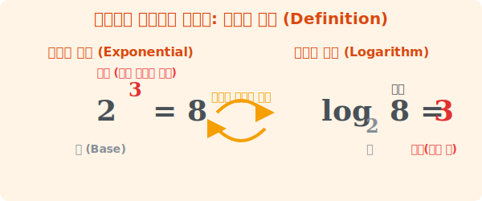




# 2. 어깨 위 지수의 화려한 독립: 로그의 정의 (Definition)

## [도입부] 학습 목표 (Learning Objectives)
- '지수'와 '로그'가 서로 완벽한 거울 이미지(역함수)라는 가장 본질적인 정의를 깨우칩니다.
- 기호 $\log$ 와 작게 쓰여진 '밑(Base)', 크게 쓰여진 '진수'의 위치 관계를 읽는 법을 터득합니다.
- 파이썬(Python)의 `math.log` 함수 파라미터가 수학 기호를 컴퓨터 세계로 어떻게 직역하는지 코딩으로 확인합니다.

---

## 1. 숨어있는 지수를 찾아라!

우리는 이미 지수(Exponent) 시스템에 아주 익숙합니다. 
> $2 \times 2 \times 2 = 8$ 

이것을 좀 더 쿨하게 줄이면 **$2^3 = 8$** 이 됩니다.
여기서 바닥에 있는 $2$를 튼튼한 토대라는 뜻에서 **밑(Base)**이라고 부르고, 어깨에 매달린 $3$을 곱한 횟수를 뜻하는 **지수(Exponent)**라고 부릅니다. 

지금까지 수학의 주인공은 결과 값인 '$8$' 이었습니다. "2를 3번 곱하면 **뭐가 나와(8)?**" 가 항상 질문이었죠. 
하지만 과학이 발전하면서 세상이 바뀌었습니다. 결과값 '$8$'은 이미 아는데, **"도대체 2를 몇 번이나 곱해야 8이 나오느냐(3)?"** 하고 어깨 위의 얹혀있는 **지수($3$)를 주인공으로 끄집어 내고** 싶어진 겁니다.



<br>

## 2. 로그(Log)의 탄생 기호학

어깨에 매달려있던 지수를 주인공 자리(= 결과 값 자리)로 당당하게 독립시킨 기호가 바로 로그($\log$)입니다.
로그(Logarithm)는 영단어 Ratio(비율)와 Arithmos(숫자)의 합성어로 **$\log$** 로 표기합니다.

**지수 세계:** $2^3 = 8$
**로그 세계:** $\log_2 8 = 3$

"로그($\log$) 밑이 $2$고 진수가 $8$일 때, 값은 $3$이다" 라고 읽습니다. 
완벽하게 똑같은 사건을 어떤 시점에서 찍었냐의 차이일 뿐입니다.
- $\log$ 기호 바로 밑에 찰싹 붙어있는 작은 숫자를 지수와 마찬가지로 **밑(Base)**이라 부릅니다.
- $\log$ 기호 옆에 크게 당당하게 쓰여진 숫자 $8$을 진짜 수(True number)라는 뜻에서 **진수**라고 부릅니다.

그래서 $\log_2 16 = ?$ 이라는 퀴즈를 만나면 머릿속에서 재빨리 변역기를 돌려 **"밑인 2를 도대체 몇 번 거듭제곱해야 16이 되니?"** 라고 읽어내면 됩니다. 정답은 당연히 어깨 위의 지수인 $4$가 되겠죠!

---

## 3. 💻 파이썬(Python)으로 부르는 로그의 노래

컴퓨터 프로그래밍에서 로그 함수는 `math` 모듈에 기본 파츠로 탑재되어 있습니다. 
컴퓨터 언어에서도 수학에서 쓰이는 인자(Argument) 배치를 완벽하게 동일하게 설계해 두었습니다. 

### 🐍 파이썬 예제: 컴퓨터의 지수 역해킹 연산

수학적 표기 $\log_{\text{base}} (\text{진수})$ 처럼, 파이썬 코드도 철저하게 `math.log(진수, 밑)` 순서로 적으며, 이는 "어깨 위 지수 끄집어내 줘!" 라는 해킹 명령어와 다름없습니다.

```python
import math

# 1. log_2 (8) = ?
# 2를 몇 번 곱해야 8이 될까?
answer1 = math.log(8, 2)
print(f"2를 몇번 제곱해야 8이 되나요? 정답: {answer1} 번")

# 2. log_3 (81) = ?
# 3을 몇 번 곱해야 81이 될까? 
# 파이썬 math.log(진수 숫자, 밑 숫자)
answer2 = math.log(81, 3)
print(f"3을 몇번 제곱해야 81이 되나요? 정답: {answer2} 번")

# 3. 만약 10을 몇 번 곱해야 1000이 될지 모른다면?
# 로그의 힘으로 역산해 버립시다.
base = 10
target_number = 1000
exponent_result = math.log(target_number, base)

print(f"--- 타겟 넘버: {target_number} ---")
print(f"밑수 {base} 의 어깨 위에 올라갈 지수는 바로 {exponent_result} 입니다!")

# 결과창:
# 2를 몇번 제곱해야 8이 되나요? 정답: 3.0 번
# 3을 몇번 제곱해야 81이 되나요? 정답: 4.0 번
# --- 타겟 넘버: 1000 ---
# 밑수 10 의 어깨 위에 올라갈 지수는 바로 3.0 입니다!
```

이 코드는 보안 암호학(Cryptography)이나 서버 구조에서 뻗어나가는 트리(Tree)의 높이를 역추적(Depth Tracking)할 때, 데이터의 사이즈를 통해 깊이를 반환해버리는 매우 강력한 알고리즘의 기초가 됩니다. 

---

## [결론] 학습 정리 (Summary)

1. **지수와 로그의 대칭성**: 지수($2^3=8$)가 결과물에 집중했다면, 로그($\log_2 8 = 3$)는 그 과정에서 '몇 번 곱했는지($3$)' 그 지수를 끄집어내어 주인공으로 대접하는 수학 식입니다. 
2. **명칭 암기**: $\log$ 바로 아래 조그맣게 붙어 있는 숫자를 **'밑(Base)'**, 옆에 큼지막하게 쓰여 있는 원래 숫자를 **'진수'**라고 부릅니다. 
3. **API의 직관성**: 파이썬 프로그래밍에서 `math.log(진수, 밑)` 함수 하나를 이용해 아무리 복잡한 숫자라도 거듭제곱의 횟수(지수)를 컴퓨터가 순식간에 역산해냅니다.

