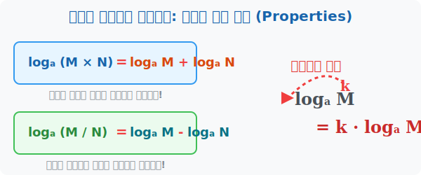

# 3. 마법의 공식: 로그의 기본 성질 (Properties)

## [도입부] 학습 목표 (Learning Objectives)
- 진수 자리에 있는 괴물 같은 곱셈과 나눗셈을 덧셈(+)과 뺄셈(-)으로 찢어발기는 로그의 3대 공식을 배웁니다.
- 진수 위에 달린 무거운 지수를 공중 앞구르기 시켜 앞으로 떨어뜨리는 '지수 내려찍기' 성질을 이해합니다.
- 파이썬(Python)의 수학 식 코딩을 통해 로그의 성질이 컴퓨터 연산 에러를 어떻게 방지하는지 그 작동을 알아봅니다.

---

## 1. 지수 법칙이 거꾸로 쓰여지다

로그는 태생적으로 그 목적이 분명합니다. **"큰 숫자의 계산을 압도적으로 편하게 만들어라!"**
이를 위해 로그는 $4$차원 주머니에서 마법 등식(성질)들을 마구 꺼내어 숫자를 조립식 블록처럼 해체해버립니다. 원리는 우리가 아는 지수법칙($2^2 \times 2^3 = 2^5$)의 반대 버전입니다.



1. **곱셈은 덧셈으로 해체!**
   $$\log_a (M \times N) = \log_a M + \log_a N$$
   로그 안에 있는 어마어마한 곱하기 숫자는 평화롭게 양옆으로 찢어져서 어이없게 작은 덧셈으로 성질이 변합니다.
   
2. **나눗셈은 뺄셈으로 해체!**
   $$\log_a \left(\frac{M}{N}\right) = \log_a M - \log_a N$$
   로그 안의 지독한 분수 덩어리는 빼기(-)로 산산조각 납니다.

3. **지수 앞구르기 (무게 덜어내기)**
   $$\log_a (M^k) = k \cdot \log_a M$$
   진수(M) 머리 위에 올라타 있던 무거운 지수($k$) 녀석을, 공중 앞구르기를 시켜 로그 기호 맨 앞으로 끄집어내어 버립니다!

이 세 가지 마법 공식만 있으면, 아무리 치명적으로 꼬여있는 소수점이나 거듭제곱 연산도 초등학생들의 구구단 수준으로 변환하는 연금술이 탄생합니다.

<br>

## 2. 0과 1의 특별한 룰

로그 세계에는 묻지도 따지지도 않고 성립하는 기본 베이스 룰이 있습니다. (지수 법칙에서 그대로 역수입 됨)
- **$\log_a 1 = 0$** : 어떤 수를 $0$번 제곱하면 무조건 $1$이 됩니다! ($a^0 = 1$)
- **$\log_a a = 1$** : 밑과 진수의 숫자가 완벽하게 같으면, 언제든 통째로 녹아내려 $1$로 소멸합니다! ($a^1 = a$)

---

## 3. 💻 파이썬(Python)에서 로그 곱셈/덧셈 분리 검증하기

인공지능(AI)이나 엄청나게 복잡한 확률 $P(A) \times P(B) \times P(C) \times \cdots$ 모델을 계산할 때, 이 확률값들은 $0.0000001$ 처럼 매우 작습니다. 이 작은 숫자들을 컴퓨터에서 계속계속 곱($\times$)하다 보면, 메모리가 버티지 못하고 결국 $0.0$ (언더플로우, Error) 이라고 퉁쳐버리는 대참사가 발생합니다.

이때 프로그래머들은 위대한 **로그의 '곱셈 $\rightarrow$ 덧셈 분해 공식'**을 사용하여 코딩합니다.

### 🐍 파이썬 예제: 컴퓨터의 한계를 부수는 로그 공식 

```python
import math

# 컴퓨터가 힘들어하는 아주 작은 확률 값 2개
M = 0.00001
N = 0.00000001

print("--- 기계의 언더플로우를 방지하는 로그 덧셈 공식 ---")

# 1. 17세기 무지했던 사람들의 방식 (그냥 막 곱하기)
direct_multiplication = M * N
# 로그 안에 그대로 곱하기를 넣어서 계산 (math.log10 사용)
result_direct = math.log10(direct_multiplication)

print(f"그냥 곱한 것의 로그 값: log(M x N) = {result_direct}")

# 2. 스마트한 프로그래머의 방식 (로그의 덧셈 분해 성질 활용!)
# log(M x N) 은 log(M) + log(N) 과 완벽히 똑같다!
# 더하기를 쓰면 컴퓨터가 소수점 자릿수를 잃어버릴 위험이 '0'이 됩니다.
separated_M = math.log10(M)  # -5.0
separated_N = math.log10(N)  # -8.0

result_separated = separated_M + separated_N

print(f"공식에 의해 덧셈으로 갈라진 값: log(M) + log(N) = {separated_M} + {separated_N} = {result_separated}")

# 3. 검증
if result_direct == result_separated:
    print("✨ 증명 완벽!: 로그 세계에서는 곱하기를 더하기로 마음껏 쪼개서 쓸 수 있습니다!")
```

놀랍게도 `M * N` 부하 연산을 한 줄 지워버리고 `+` 연산으로 대체하는 이 사소해 보이는 수학 공식 하나가, 챗GPT(ChatGPT) 같은 초거대 언어 모델(LLM)이 단어들의 연쇄 파편 확률을 계산할 때 사용하는 **`Log-Probability(로그 확률)`** 알고리즘의 가장 핵심적인 뼈대(Core)입니다. 

---

## [결론] 학습 정리 (Summary)

1. **마법의 분해 성질**: 진수 내부의 극도하게 무겁고 짜증나는 곱셈 기호와 나눗셈 기호를, 로그 부호 바깥쪽으로 끌어내 평범한 `덧셈`과 `뺄셈`으로 쪼개주는 강력한 물리적 해체 능력이 있습니다.
2. **지수 앞구르기**: $\log_a (M^k) = k \log_a M$ 같이 거듭제곱 횟수를 앞쪽 계수로 끄집어 내어 큰 수를 단숨에 작게 제압합니다.
3. **인공지능 최적화**: 곱하기($\times$)를 무한 반복하면 $0$으로 붕괴(Underflow)하는 컴퓨터의 결함을, 모두 로그를 씌워 더하기($+$)로 바꾸는 `로그 확률` 방식으로 완벽하게 방어해냅니다.
