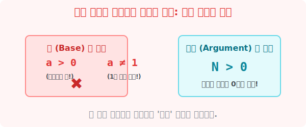

# 4. 가짜 로그를 찾아라: 밑과 진수의 조건

## [도입부] 학습 목표 (Learning Objectives)
- 겉모습은 로그 기호($\log$)를 썼지만 실제로 계산은 불가능한 '가짜 로그' 함정을 피하는 법을 배웁니다.
- '베이스(밑)'와 '진수' 자리에 들어갈 수 없는 금지된 숫자($0$, 음수, $1$)들의 이유를 확실하게 이해합니다.
- 파이썬(Python)의 `math.log` 함수에서 오류(ValueError)가 튀어나오는 상황을 시뮬레이션하며 보안 규칙을 체득합니다.

---

## 1. 아무 숫자나 들어오면 안 됩니다!

$\log$ 기호 밑에 있는 조그만 숫자(밑)와 그 옆에 있는 큰 숫자(진수) 자리에는 무작정 아무 숫자나 끼워 넣는다고 능사가 아닙니다. 이 자리에 들어오기 위해서는 엄청나게 까다로운 수학적 **보안 검색대**를 무조건 통과해야만 합니다!

이를 어기게 되면 "가짜 로그(의미가 없는 식)" 판정을 받고 문제가 폭파됩니다.



<br>

### 🚨 규칙 1: 밑(Base)의 자격 증명
로그 식 **$\log_a N$** 에서 바닥에 있는 $a$ 는 지수의 밑과 동일합니다.
1. **무조건 양수(+)여야 한다! ($a > 0$)**
   음수(예: $-2$)가 되면 짝수 번 곱할 땐 양수, 홀수 번 곱할 땐 음수로 왔다 갔다 하며 춤을 추기 때문에 함수로 만들 수가 없습니다.
2. **절대 $1$ 일 수는 없다! ($a \neq 1$)**
   $1$은 $100$번을 거듭제곱하든 $1000$번을 거듭제곱하든 평생 무조건 `$1$` 입니다. 지수를 추적해내는 과정 자체가 무의미해지므로 밑의 자격에서 즉각 박탈(!) 당합니다.

### 🚨 규칙 2: 진수(True Number)의 자격 증명
지수 결과물 자리인 큰 조각 $N$입니다.
1. **무조건 양수(+)여야 한다! ($N > 0$)**
   양수인 밑($a$)을 아무리 여러 번 거듭제곱한다고 한들 죽었다 깨어나도 결과값이 음수나 0이 될 수는 없습니다! ($2$를 제곱하든 반으로 줄이든 $-1$은 절대 안 됨) 

---

## 2. 💻 파이썬(Python)의 엄격한 보안 프로텍터 

기계도 바보가 아닙니다. 파이썬의 `math.log` 함수는 이 수학의 황금 룰을 이미 보안 시스템 코드로 내부에 장착하고 있습니다. 밑이나 진수 자리에 음성적으로 나쁜 코드를 주입하면 파이썬은 즉각 `Math Domain Error`라는 치명타를 터뜨리며 작동을 중지시켜 허위 논리를 차단시킵니다.

### 🐍 파이썬 예제: 가짜 로그를 검거하는 `try-except` 블록

```python
import math

# 세 개의 실험용 가짜/진짜 로그들
test_logs = [
    {"name": "테스트 1번", "value": 8, "base": -2}, # 밑이 음수!
    {"name": "테스트 2번", "value": -5, "base": 3}, # 진수가 음수!
    {"name": "테스트 3번", "value": 9, "base": 3}   # 정상 (양수 & 밑이 1이 아님)
]

print("--- 파이썬 가짜 로그 보안 검색대 가동 ---")

for test in test_logs:
    v = test["value"]
    b = test["base"]
    print(f"\n[{test['name']}] log_{b}({v}) 검사 중...")
    
    # 예외 처리(Try-Except)를 이용해 오류가 나도 프로그램이 꺼지지 않고 잡아냅니다.
    try:
        # 파이썬 math 엔진에 로그 계산 요청!
        result = math.log(v, b)
        print(f"✅ 통과! 정상적인 (진짜) 로그입니다. 정답 계수: {result}")
        
    except ValueError as e:
        # ValueError: math domain error 오류가 터지는 순간!
        print("🚨 삐빅-! [경고] 가짜 로그 발견! 계산 불가능 (ValueError 발생)")
        if b <= 0 or b == 1:
            print("   -> 이유: 밑(Base)은 양수여야 하며 1이 될 수 없습니다.")
        if v <= 0:
            print("   -> 이유: 진수(Value)는 무조건 0보다 커야 합니다.")

# 결과창:
# [테스트 1번] log_-2(8) 검사 중...
# 🚨 삐빅-! [경고] 가짜 로그 발견! 계산 불가능 (ValueError 발생)
#    -> 이유: 밑(Base)은 양수여야 하며 1이 될 수 없습니다.

# [테스트 2번] log_3(-5) 검사 중...
# 🚨 삐빅-! [경고] 가짜 로그 발견! 계산 불가능 (ValueError 발생)
#    -> 이유: 진수(Value)는 무조건 0보다 커야 합니다.

# [테스트 3번] log_3(9) 검사 중...
# ✅ 통과! 정상적인 (진짜) 로그입니다. 정답 계수: 2.0
```

컴퓨터 과학에서는 이런 입력 데이터의 "유효성 검사(Validation)" 절차가 생명줄과 같습니다. 
아무리 수식을 잘 짰더라도, 해커나 유저가 `진수` 자리에 스파이 데이터 `-5` 나 `0` 을 밀어 넣었을 때 에러(오류)를 내뿜지 않고 이상한 쓰레기 값을 뱉어낸다면, 자율 주행 자동차나 은행 전산망은 그 오류 위에 곱하기를 반복하다 어마어마한 사고로 직결될 수 있습니다. 

---

## [결론] 학습 정리 (Summary)

1. **밑의 조건 ($a > 0$, $a \neq 1$)**: 함수가 지수와 진동 사이에서 혼란을 겪지 않기 위해 $0$보다 커야 하며, 계산의 무의미함을 피하기 위해 자기 자신 그대로인 $1$은 박탈당합니다.
2. **진수의 조건 ($N > 0$)**: 거듭제곱 결과물은 0 이하로 절대 떨어질 수 없으므로 무조건 양수여야 합니다.
3. **컴퓨터 프로그래밍의 방패**: 파이썬은 내부 엔진에 이미 이 3가지 룰을 `ValueError`라는 방어막으로 쳐두었으며, 우리가 수학 조건의 엄격함을 이해하고 코드를 짜야 버그가 터지지 않는 튼튼한 서비스를 만들게 됩니다.
