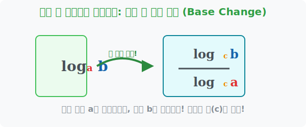

# 5. 컴퓨터 세계로의 다리: 밑 변환 공식 (Base Change)

## [도입부] 학습 목표 (Learning Objectives)
- 내가 원하는 어떠한 숫자로든 로그의 '밑(Base)'을 자유자재로 뜯어고칠 수 있는 궁극의 해킹 툴 **밑 변환 공식**을 배웁니다.
- 왜 수학자들이 $\log_2$ 나 $\log_3$ 을 쓰다가도, 결국엔 $\log_{10}$ 이나 $\ln(e)$ 로 강제로 통일시키려 하는지 그 이유를 알아봅니다.
- 파이썬(Python) 내장 계산기에서 지원하지 않는 밑(Base)을 맞닥뜨렸을 때 공식을 활용해 계산하는 프로그래밍 기법을 체득합니다.

---

## 1. 내 마음대로 튜닝하는 로그 자동차

지난 시간에 우리는 밑과 진수 자리에 아무 숫자나 들어가면 안 된다는 아주 엄격한 심사 기준을 통과했습니다. 그런데 막상 로그끼리 더하고(+) 빼려고(-) 보니 문제가 생겼습니다. 

$$\log_2 8 + \log_3 9$$

두 로그의 계산을 하나로 예쁘게 합치고 싶은데, 하나는 밑이 자동차($2$)고 하나는 밑이 비행기($3$)라서 합칠 수가 없는 것입니다! 
이때 등장하는 것이 수학사에 길이 남을 기적의 **'밑 변환 공식(Base Change Formula)'** 입니다.

이 공식은 기존의 불편한 밑($a$)을 내가 원하는 아무 숫자($c$)로 순식간에 탈바꿈시켜 버립니다.

**$$ \log_a b = \frac{\log_c b}{\log_c a} $$**

1. 원래 **진수(b)** 였던 놈은 그대로 분수의 **위층(분자)**으로 올라갑니다.
2. 원래 조그맣게 **밑(a)** 에 깔려있던 놈은 분수의 **아래층(분모)** 진수 자리로 쫓겨갑니다.
3. 그리고 위/아래의 텅 빈 밑 자리에는 **내가 맘대로 고정하고 싶은 새로운 밑($c$)** 을 똑같이 하나씩 박아주면 끝입니다!



이 공식 덕분에 수학자들과 엔지니어들은 중구난방이던 세상의 모든 밑을 무조건 $10$ 이나 $e(자연상수)$ 통일시켜 놓고 계산하는 **'표준화'** 의 축복을 누리게 되었습니다. 

<br>

## 2. 💻 파이썬(Python)으로 느끼는 밑 변환의 힘

파이썬의 `math.log()` 함수는 옛날 버전에선 무조건 밑(Base)이 $e$ (약 $2.718...$)인 자연로그만 계산할 수 있는 철저한 깡통이었습니다. 
하지만 프로그래머들은 당황하지 않고 바로 이 밑 변환 공식을 사용해 밑이 2인 로그든 10인 로그든 알아서 계산해내는 코드를 짜 넣었습니다.

### 🐍 파이썬 예제: 밑 변환 공식을 적용한 나만의 로그 생성기

```python
import math

# 파이썬의 math.log(x) 는 기본적으로 밑이 자연상수 e 인 자연로그(ln)입니다.
# 밑이 2인 로그(log_2 8)를 파이썬 자연로그만으로 계산하려면?

A = 8  # 위의 진수
B = 2  # 아래의 밑수

print("--- 밑 변환 공식을 이용한 수학 엔진 구동 ---")

# 내장 함수가 빈약해도 공식만 알면 내가 직접 새로운 함수를 창조할 수 있습니다.
# 공식: log_B (A) = log_e (A) / log_e (B)
custom_log_result = math.log(A) / math.log(B)

print(f"새롭게 창조해낸 log_2 (8) 의 결과값: {custom_log_result}")

# 검증을 위해 파이썬 최신버전에서 추가해준 패치 함수 log2 와 비교해봅시다.
built_in_result = math.log2(8)
print(f"파이썬 최신 내장 log2(8) 의 결과값  : {built_in_result}")

if round(custom_log_result, 5) == round(built_in_result, 5):
    print("✨ 만세! 밑 변환 공식이 컴퓨터 엔진에서도 완벽하게 작동합니다!")

# 결과창:
# 새롭게 창조해낸 log_2 (8) 의 결과값: 3.0
# 파이썬 최신 내장 log2(8) 의 결과값  : 3.0
# ✨ 만세! 밑 변환 공식이 컴퓨터 엔진에서도 완벽하게 작동합니다!
```

이 밑 변환 코드는 현재 우리가 쓰는 일반 계산기(계산기 앱)가 $\log$ 버튼을 눌렀을 때, 내부 칩셋이 작동하는 알고리즘과 $100\%$ 동일합니다. 계산기 안에는 오로지 분수계산(`/`) 시스템 하나만 하드웨어로 탑재해 두고 모든 로그의 밑을 처리해 내는 것입니다.

---

## [결론] 학습 정리 (Summary)

1. **밑 변환 공식(Base Change Formula)**: 서로 달라서 융합할 수 없었던 밑(Base)들을 내가 원하는 하나의 기준(c)으로 완벽하게 통일시켜 분수 형태로 뜯어고치는 해킹 마법입니다.
2. **분모와 분자의 운명**: 본래의 진수는 분수 위쪽 진수 자리로 이동하고, 본래 구석에 작게 있던 밑은 분수 아래의 진수 자리로 쫓겨 내려갑니다.
3. **컴퓨터 과학의 표준화**: 컴퓨터와 계산기 칩의 설계자들은 수천 개의 로그 테이블을 메모리에 저장하지 않고, 밑 변환 공식 하나만 코딩하여 세상 모든 진법의 로그 값을 연산해 냅니다.
