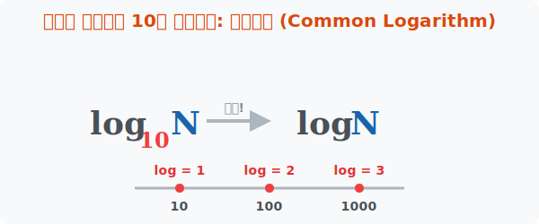

# 6. 인류가 선택한 비밀번호 10: 상용로그 (Common Logarithm)

## [도입부] 학습 목표 (Learning Objectives)
- 인류가 10진법 체계를 사용하기 때문에 수학에서 밑(Base)을 $10$으로 한 로그가 왜 특별한 대접을 받는지 그 이유를 학습합니다.
- 너무나도 흔하게 상용으로 쓰여서 기호에서 $10$이라는 숫자를 통째로 **'투명 인간'** 취급하고 지워버리는 규칙을 확인합니다.
- 파이썬(Python)의 `math.log10` 모듈을 이용해 일상 세계의 자릿수가 로그 안에서 어떻게 압축되는지 코딩해 봅니다.

---

## 1. 지긋지긋한 10을 쓰지 않기로 하다

인류는 양손의 손가락이 $10$개였던 조상님들 덕분에 모든 숫자를 $10$ 단위로 끊어 읽는 **10진법(Decimal system)** 체계의 굴레를 쓰게 되었습니다. $1, 10, 100, 1000 ...$ 숫자가 끝이 없죠.

그래서 지구상에서 로그를 쓸 때 가장 인기 폭발인 주인공 밑(Base)은 바로 $10$ 입니다. $\log_{10} 1000 = 3$ 처럼 그냥 "결과가 동그라미(0) 개수 그대로 나오기 때문"에 암산이 가장 편했죠.
수학자들은 100번 쓰면 99번은 밑이 $10$인 로그를 쓴다는 사실을 깨달았습니다.

> "야, 너무 귀찮다. 그냥 밑이 10인 로그는 밑 숫자를 전부 지우고 쓰는 걸로 하자! 아무 숫자도 안 적혀 있으면 무조건 10이 숨어 있는 걸로 쳐!!"

이렇게 탄생한 것이 밑 $10$을 투명하게 생략해 버린 **상용로그(Common Logarithm)**입니다. 상용(常用)이란 일상적으로 늘 사용한다는 뜻입니다.
**$$\log_{10} N \quad\Rightarrow\quad \log N$$**



<br>

## 2. 엄청난 숫자를 한 자릿수로 압축하다

상용로그는 세상에 존재하는 아주 거대한 자릿수 괴물들을 유치원생 숫자 박스로 구겨 넣는 마법의 포켓볼입니다.

- $\log 10$ = $1$ ($10^1$)
- $\log 100$ = $2$ ($10^2$)
- $\log 1,000,000$ (백만) = $6$ ($10^6$)
- $\log 1,000,000,000$ (십억) = $9$ ($10^9$)

당신의 전 재산이 10억 원이라고 은행에 자랑하러 갔더니, 스위스 은행의 상용로그 시스템은 당신의 재산을 고작 숫자 무미건조한 숫자 **'9'** 로 전산망에 등록해 버립니다. 이는 부자들에게는 슬픈 일이지만 천문학이나 세균 증식을 관찰하는 빅데이터 과학자들에게는 모니터 화면 크기를 줄일 수 있는 어마어마한 선물입니다.

---

## 3. 💻 파이썬(Python)의 전용 상용로그 계산기

파이썬 개발자들도 10진법의 위대함을 알기 때문에 `math.log` 와는 별개로 밑 변환 없이도 한 방에 10을 밑으로 깔고 계산하는 전용 엔진 **`math.log10`**을 특별히 만들어 두었습니다.

### 🐍 파이썬 예제: 우주의 별 개수를 압축하는 상용로그 시스템

```python
import math

# 우리 은하에 존재하는 별의 대략적인 개수 (약 천억 개)
stars_in_galaxy = 100_000_000_000

# 지진 강도를 측정하는 리히터 규모의 에너지 크기 차이 상수
earthquake_energy = 1000

print("--- 우주와 지구의 스케일을 줄여주는 상용로그(log10) ---")

# math.log10() 함수가 상용로그 역할을 대신합니다!
compressed_stars = math.log10(stars_in_galaxy)
compressed_earthquake = math.log10(earthquake_energy)

# 천억이라는 긴 숫자가 단 한 줄의 숫자로 변신합니다.
print(f"은하계 별의 개수 {stars_in_galaxy} 개 -> 상용로그 변환: {compressed_stars: .0f} 레벨")
print(f"지진 에너지 {earthquake_energy} J 단위 -> 상용로그 변환: {compressed_earthquake: .0f} 레벨")

# 결과창:
# 은하계 별의 개수 100000000000 개 -> 상용로그 변환:  11 레벨
# 지진 에너지 1000 J 단위 -> 상용로그 변환:  3 레벨
```

지진의 파괴력을 측정하는 리히터 규모($M$)가 $5.0$ 에서 $6.0$으로 $1$ 올랐을 뿐인데 실제 폭발 에너지는 $32$배씩 뛰는 이유는, 지진 센서 기계에서 화면에 숫자를 표기할 때 **상용로그를 이용해 11자리가 넘어가는 무식한 숫자를 1자리 숫자로 압축시켜 모니터에 뿌려놓았기 때문**입니다. 상용로그를 모르면 일상에서 사기를 당할 수도 있습니다!

---

## [결론] 학습 정리 (Summary)

1. **상용로그(Common Log)**: 우리가 양손의 10 손가락을 쓰는 10진법 시대에 맞추어 태어난 로그로, **밑수 $10$**을 가장 많이 사용하기 때문에 **과감히 생략($\log$)**해 버린 특별한 표기법입니다.
2. **동그라미 압축기**: $1,000,000$ 뒤에 붙은 $0$의 개수($6$개)가 곧 상용로그 값이 되므로 기하급수적으로 폭발하는 숫자를 $0$에서 $10$ 사이의 작은 숫자로 우아하게 접어버리는 자릿수 압축기입니다. 
3. **코딩의 특권**: 세상 모든 프로그래밍 언어의 라이브러리에는 `log10` 이라는 상용로그 전용 단축 메소드가 항상 세트로 존재하여 무거운 데이터를 즉시 가공합니다.
