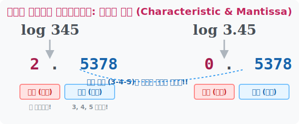

# 7. 숫자의 신분증: 상용로그의 지표와 가수

## [도입부] 학습 목표 (Learning Objectives)
- 상용로그를 계산했을 때 튀어나오는 결과값을 '지표(정수 부분)'와 '가수(소수 부분)'로 해부하여 분석해 봅니다.
- 지표는 숫자의 **'자릿수(스케일)'**를, 가수는 숫자의 **'DNA(배열)'**를 의미함을 깨닫습니다.
- 파이썬(Python)의 수학 모듈에서 결과값을 소수점과 정수로 `split()`처럼 쪼개어 빅데이터 패턴을 찾는 코딩 기법을 익힙니다.

---

## 1. 로그 결과물을 반으로 쪼개보자!

상용로그 계산기에 어떤 숫자를 넣고 돌리면 결과값이 무조건 `무엇.무엇무엇` 형태로 튀어나옵니다. 

마치 우리의 주민등록번호가 (앞자리: 생년월일 - 뒷자리: 개인정보) 인 것처럼 상용로그의 출력값도 앞과 뒤가 완벽하게 분리된 정보 덩어리입니다. 수학자들은 소수점 앞의 정수를 **지표(Characteristic)**라고 부르고, 소수점 뒤의 꼬투리를 **가수(Mantissa)**라고 부릅니다.

> $\log 345 = 2.5378 \quad\rightarrow\quad$ **지표(2)** + **가수(0.5378)**

1. **지표 (정수)**: 원래 숫자($345$)가 몇 자릿수 짜리의 거대한 거인인지 스케일(Scale)을 알려줍니다. 예를 들어 정수 부분이 $2$가 나오면 이 숫자는 '세 자릿수(백 단위)' 임을 확정합니다. (항상 지표 공식은 자릿수-1 이기 때문)
2. **가수 (소수점)**: 아무리 0이 많이 붙어도 절대 변하지 않는 원래 숫자의 진짜 면상(얼굴 뼈대)입니다. 숫자 배열이 $3, 4, 5$ 순서로 생겨먹었으면 가수는 평생 $0.5378$ 입니다!



<br>

## 2. 0이 붙거나 소수점이 되어도 유전자(가수)는 같다

수학자들은 깜짝 놀랄만한 뒷자리 도플갱어 현상을 발견했습니다.
- $\log 345 = 2.5378$
- $\log 3450 = 3.5378$
- $\log 3450000 = 6.5378$
- $\log 0.345 = -1 + 0.5378$

모든 계산의 뒤쪽 소수 꼬리(가수)가 `.5378`로 완벽하게 동일합니다!
자릿수가 팽창하든 소수점으로 먼지가 되든, 그 근간이 되는 숫자 배열 조합이 **3-4-5** 구조라면, **상용로그의 가수(소수 부분)는 절대로 변하지 않고 똑같은 DNA 유전자 번호를 남깁니다!**

이 꼼수를 쓰면 우리는 어마어마한 천문학적인 숫자가 `3`으로 시작하는지, `7`로 시작하는지 (가장 첫 대가리 숫자)까지 단숨에 때려 맞출 수 있습니다!

---

## 3. 💻 파이썬(Python)으로 상용로그 분해기 만들기

프로그래밍에서 숫자를 받았을 때 이것의 정수와 소수를 분리해서 유전자를 분석하는 시스템을 파이썬 내부 함수를 이용해 코딩할 수 있습니다. `math.modf()` 함수는 입력받은 소수 데이터를 정수 부분과 소수 부분 튜플 2개로 칼같이 갈라놓습니다.

### 🐍 파이썬 예제: 숫자의 크기와 배열 유전자 분석기

```python
import math

# 분석할 데이터 배열
data_list = [345, 34500, 0.00345]

print("--- 상용로그 데이터 지표/가수 유전자 분석기 ---")

for data in data_list:
    # 1. 상용로그 장치에 통과시킨다!
    log_val = math.log10(data)
    
    # 2. 파이썬 마법 math.modf() 
    # 파이썬은 소수점이랑 정수를 깔끔하게 두 조각으로 뽀개어 반환합니다.
    # 단, 음수의 경우 가수가 마이너스가 되면 안되므로 수학적 보정이 필요합니다.
    mantissa, characteristic = math.modf(log_val)
    
    # 가수는 무조건 0~1 사이 양수여야 함 (수학적 보정 로직)
    if mantissa < 0:
        mantissa += 1
        characteristic -= 1

    # 지표(Characteristic)를 이용해 원래 데이터 자릿수 예측
    if characteristic >= 0:
        scale = f"{int(characteristic) + 1}자리 숫자"
    else:
        scale = f"소수점 {abs(int(characteristic))}번째 자리에서 최초로 0아닌 숫자 시작"

    # 원래 데이터의 구조를 파헤쳐 출력!
    print(f"\n원본 데이터: {data}")
    print(f"로그 값: {log_val: .4f}")
    print(f"├── 지표(크기): {int(characteristic)} -> ({scale})")
    print(f"└── 가수(배열): {mantissa: .4f} -> (3-4-5 배열 유전자 확인!)")

# 실행해 보면 어떤 데이터든 가수(소수부분)는 '0.5378' 로 고정되어 나옵니다!
```

이 코드는 실제 데이터 마이닝이나 금융 시스템(Benford's Law)에서 엄청나게 다양한 영수증 숫자들이 조작된 사기(Fraud)인지, 정상적인 거래 패턴인지 판별할 때 숫자의 첫 번째 자릿수 확률 조사를 수행하는 코어 알고리즘 방어막으로 활용됩니다. 

---

## [결론] 학습 정리 (Summary)

1. **지표(정수 부분)**: $\log 345 = 2.\text{xxxx}$ 처럼 튀어나온 소수점 앞 정수이며, 계산된 숫자가 얼마나 큰 스케일(자릿수)을 가지고 있는지 즉시 스캔해 줍니다.
2. **가수 (소수 부분)**: 소수점 뒤에 뻗어나가는 소수 부분이며, 원래 숫자가 `3, 4, 5` 같이 어떻게 뼈대가 잡혀있는지 판별해주는 바뀌지 않는 고유 DNA 번호입니다.
3. **데이터 분석 코딩**: 지수 법칙으로만 배운 상용로그의 앞/뒷자리 해부 방법론은 0이 무수히 붙은 거대한 데이터 셋을 작은 소수들의 패턴으로 변환시켜 금융 사기 검출과 빅데이터 마이닝 시스템으로 응용할 수 있습니다.
