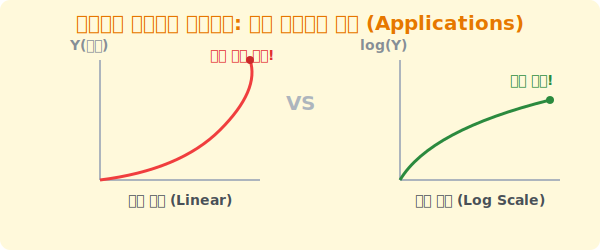

# 8. 세상의 모든 거대한 것을 지배하다: 로그의 활용 (Applications)

## [도입부] 학습 목표 (Learning Objectives)
- 지구의 멘틀이 깨지는 지진 강도, 별의 밝기, 박테리아의 증식 등 우리 사회 요소요소에 로그 함수가 어떻게 쓰이는지 학습합니다.
- 기하급수적으로 폭발하여 화면을 뚫어버리는 그래프를, 로그를 씌워 완만하게 통제하는 **'로그 스케일(Log Scale)'** 모드를 이해합니다.
- 파이썬(Python)의 데이터 시각화 도구를 활용해 폭주하는 실전 바이러스 데이터를 로그 차트로 변환해 봅니다.

---

## 1. 세상에는 "일반 차트" 로 그릴 수 없는 것들이 참 많다

우리의 일상생활 뉴스나 과학 관측 데이터들은 종종 $1, 2, 3, 4...$ 처럼 더해지지 않고 $2, 4, 8, 16, 1000...$ 처럼 엄청난 기하급수(지수 팽창)로 늘어나 버립니다. 
1. **박테리아 번식률**: 아침에는 1마리였는데 밤이 되니 100조 마리로 증식합니다. 이 데이터를 엑셀(Excel)에 넣고 그래프를 그리면, 차트 선이 아예 노트북 모니터 화면 천장을 뚫고 우주로 치솟아 버려 분석조차 할 수 없게 됩니다.
2. **소리의 크기(데시벨, dB)**: 숨 쉬는 소리에 비해 로켓 엔진 소리의 에너지는 무려 10,000,000,000배가 큽니다. 일반 눈금표로는 절대 비교할 수 없습니다.

모니터 화면은 기껏해야 세로로 $1,000$ 픽셀밖에 안 됩니다. 저런 괴물 같은 수치를 화면 안에 얌전히 가둬놓고 기울기의 변화를 보려면 어떻게 해야 할까요? 

정답은 데이터에 전부 **거대한 무기인 로그($\log$) 도장**을 찍어버려, $10^9$을 고작 숫자 $9$로 패대기치는 것입니다! 이것이 바로 언론이나 주식 시장, 바이러스 발생 현황판에서 많이 사용하는 **'로그 스케일(Log Scale)'** 차트입니다.



<br>

## 2. 우리가 당하고 있는 수많은 로그들!

이미 여러분은 로그 스케일에 속으며 살고 있습니다.
- **음향(데시벨, dB)**: 스피커 볼륨이 $10$dB 올랐다고 해서 "소리가 살짝 $10$ 커졌네?" 라고 착각하면 안 됩니다. 데시벨 공식 코어에는 $\log_{10}$ 이 장착되어 있기 때문에, 방금 우리는 에너지가 **$10$배(!)** 증폭된 비트 위에 있는 것입니다. ($20$dB 차이면 $100$배 쾅쾅!!)
- **지진(리히터 규모, M)**: 일본에서 지진 규모가 $7.0$ 에서 $8.0$ 으로 올랐다는 앵커의 말은, "숫자 $1$ 올라갔네요" 가 아니라 지표면이 뿜어내는 다이너마이트 폭발 에너지가 자그마치 **$31.6$배** 커졌다는 괴물 같은 소리입니다.
- **별의 밝기(등성)**: 북극성(2등성)과 저기 안 보이는 희미한 $6$등성은 3배 차이가 아니라 엄청난 배수 차이가 납니다 (이 또한 로그 스케일).

---

## 3. 💻 파이썬(Python)으로 바이러스 기하급수 통제하기

인공지능이나 데이터 과학자(Data Scientist)들이 폭발적인 조회수의 틱톡 동영상 확산 트렌드나 전염병 감염자 차트를 사람들에게 발표할 때, 시각화 도구인 `matplotlib` 에 내장된 **로그 모드(Log Scale)** 단추 하나를 눌러 시각적 진정을 줍니다. 

### 🐍 파이썬 예제: 바이러스 전파 시각화를 위한 로그 차트 변환

```python
import math
import matplotlib.pyplot as plt

# 1일차 10명, 2일차 100명, 3일차 1000명, 4일차 10000명 ... 바이러스 폭파 중!
days = [1, 2, 3, 4, 5, 6, 7]
infections = [10, 100, 1000, 10000, 100000, 1000000, 10000000]

print("--- 기하급수적 데이터를 통제하는 파이썬 시각화 시스템 ---")

# (이론적 구조 설명. 파이썬 환경의 코딩 스타일)
# 1. 뼈대 그리기: 그냥 데이터를 집어 넣는다.
# plt.plot(days, infections)

# 2. 바로 이 한 줄의 주문이 파이썬 차트 모듈에 장착되어 있습니다!
# plt.yscale('log')  ==> "Y축에 강제로 상용로그(log10) 스티커를 다 붙여버려!"

# 3. 만약 위 기능이 없이 내가 직접 로그 차트를 코딩한다면? 리스트 변환!
log_infections = []
for pop in infections:
    # 1000명은 3으로, 100만명은 6으로 납작하게 찍어 누릅니다.
    log_infections.append(math.log10(pop))

print(f"1일차~7일차 바이러스 원래 데이터 : {infections}")
print(f"화면에 그려질 통제된 로그 스케일: {log_infections}")

# 결과창: 
# 1일차~7일차 바이러스 원래 데이터 : [10, 100, 1000, 10000, 100000, 1000000, 10000000]
# 화면에 그려질 통제된 로그 스케일: [1.0, 2.0, 3.0, 4.0, 5.0, 6.0, 7.0]
```

원래 데이터는 10명에서 10,000,000(천만) 명으로 하늘 높이 솟구쳤지만, 파이썬이 즉각 $\log_{10}$ 엔진을 가동시켜 1, 2, 3, 4, 5, 6, 7 이라는 자로 잰 듯한 깔끔한 일차 함수(직선)로 화면에 안정적으로 렌더링(Drawing) 해줍니다. 이 편안한 일직선 차트가 바로 코로나-19 현황판에서 보았던 유명한 **로그 스케일 감염자 차트**입니다.

---

## [결론] 학습 정리 (Summary)

1. **로그 스케일(Log Scale)**: 지수 함수적으로 어마어마하게 팽창하여 감당이 안 되는 수치 데이터를 시각적으로 통제하고 관리하기 위해 사용되는 궁극의 숫자 마술 필터입니다.
2. **일상의 로그 공식들**: 사람이 느끼는 소음의 강도나, 지진의 붕괴 에너지 파워 등은 본질적으로 수학의 로그 패러다임이 아니고서는 설명할 방법이 없습니다. 
3. **데이터 시각화 무기**: 프로그래머들은 주식 시장의 초급등 그래프나 데이터 마이닝의 팽창 곡선을 분석할 때 `yscale('log')` 함수 단 한 줄을 호출하여 기하급수적 위협을 시각적인 평온함 선형(Linear) 직선형으로 전환합니다.
