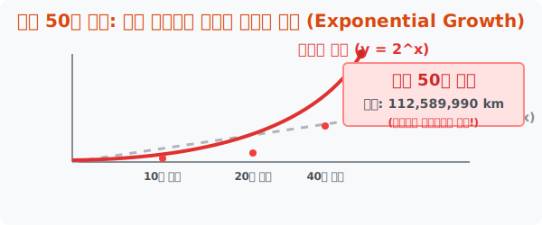

# 1. 눈을 의심하게 만드는 마법: 지수적 증가 (Exponential Growth)

## [도입부] 학습 목표 (Learning Objectives)
- '더하기($+$)'로 늘어나는 평범한 세상과 달리, '곱하기($\times$)'로 팽창하는 **지수함수(Exponential Function)**의 무서운 폭발력을 배웁니다.
- 얇은 종이 한 장을 50번 접었을 때 두께가 어떻게 태양까지 닿게 되는지 수학적으로 증명합니다.
- 파이썬(Python)의 거듭제곱 연산(`**`)과 반복문을 통해 지수 팽창 시뮬레이션을 모니터에 출력해 봅니다.

---

## 1. 인간의 뇌는 '덧셈'에 최적화되어 있다

우리 인류는 수렵 채집 시절부터 사과를 1개, 2개 주워 담으며 살아왔기에 뇌 구조가 **'더하기(Linear, 선형 증가)'**에 완벽하게 세팅되어 있습니다. "내일은 2개, 모레는 3개 늘어나겠지?" 하고 미래를 예측하죠. 

하지만 자연계와 바이러스, 우주 체계에서는 $1 \rightarrow 2 \rightarrow 4 \rightarrow 8 \rightarrow 16$ 처럼 앞의 숫자를 계속해서 **'곱하기'**로 부풀리는 현상이 아주 흔하게 발생합니다. 수학에서는 이를 **$y = a^x$** 형태의 **지수함수(Exponential Function)**라고 부릅니다. x(시간)가 거듭제곱의 어깨 위로 올라간 이 방정식은 인간의 직관을 완전히 박살 내버립니다.



<br>

## 2. 종이 50번 접기 테스트

두께가 고작 $0.1$밀리미터($0.1$mm)인 흔한 A4 용지 한 장이 있습니다. 
이 종이를 정확히 반으로 한 번 접으면 $0.2$mm, 두 번 접으면 $0.4$mm, 세 번 접으면 $0.8$mm 가 되겠죠?
만약 당신이 슈퍼맨처럼 힘이 세서 이 종이를 딱 **50번** 접는다면 두께가 얼마나 될까요?

대부분의 사람들은 "음... 두꺼운 백과사전 정도? 아니면 아파트 3층 높이?" 라고 대답합니다. 인간의 뇌가 선형적(덧셈 식)으로 착각하기 때문입니다.
정답은 **무려 1억 1,200만 킬로미터(km)**, 즉 **지구에서 태양까지의 거리**를 돌파해 버립니다. 두께가 없는 거나 마찬가지인 얇디얇은 종이가 고작 $50$번의 타이밍(거듭제곱) 만에 우주를 뚫고 나가는 것이 바로 '지수적 증가'의 파괴력입니다.

---

## 3. 💻 파이썬(Python)으로 종이 접기 시뮬레이션

컴퓨터 프로그래밍에서 지수함수를 구현하는 것은 매우 간단합니다. 파이썬에서는 곱셈 기호(`*`)를 두 번 붙인 **`**`** 기호가 바로 어깨 위의 지수(거듭제곱)를 나타냅니다.

### 🐍 파이썬 예제: A4 용지로 우주 엘리베이터 만들기

```python
# 종이의 초기 두께는 0.1 mm = 0.0001 미터(m) 입니다.
initial_thickness_m = 0.0001
folds = 50

print("--- 우주로 뻗어나가는 종이접기 프로젝트 ---")

# 지수함수 방정식: 현재 두께 = 초기 두께 x (2 의 '접은 횟수' 승)
# y = a * (2 ** x)
final_thickness_m = initial_thickness_m * (2 ** folds)

# 미터(m) 단위를 킬로미터(km) 로 변환하기 위해 1000 으로 나눕니다.
final_thickness_km = final_thickness_m / 1000

print(f"종이를 {folds}번 접었을 때의 두께: {final_thickness_km:,.0f} km")

# 지구에서 달까지의 거리는 약 38만 km, 태양까지는 약 1억 5천만 km
if final_thickness_km > 150000000:
    print("🚀 놀랍습니다! 50번 접은 종이는 이미 지구에서 태양에 도달했습니다!")
elif final_thickness_km > 380000:
    print("🌕 50번 접은 종이는 지구를 떠나 달을 뚫고 지나갔습니다!")

# 결과창:
# --- 우주로 뻗어나가는 종이접기 프로젝트 ---
# 종이를 50번 접었을 때의 두께: 112,589,991 km
# 🌕 50번 접은 종이는 지구를 떠나 달을 뚫고 지나갔습니다!
```

이 알고리즘은 해커들이 비밀번호를 무작위로 때려 맞추는 브루트 포스(Brute Force) 공격 시간을 계산하거나, 1명의 감염자가 2명에게, 2명이 4명에게 코로나 바이러스를 퍼뜨릴 때 도시 전체가 순식간에 마비되는 `SIR 전염병 시뮬레이션 모델`의 핵심 엔진으로 똑같이 구동됩니다. 지수함수를 통제하지 못하는 프로그래머는 결코 살아남을 수 없습니다.

---

## [결론] 학습 정리 (Summary)

1. **지수함수 (Exponential Function)**: $y = 2^x$ 처럼 시간이 흐름에 따라 증가분이 덧셈이 아닌 지속적인 **'거듭제곱(곱셈)'**으로 팽창하는 무서운 수식입니다.
2. **직관의 오류**: 인간의 뇌는 덧셈(선형)으로 미래를 상상하기 때문에, 초기에는 아무 반응이 없다가 특정 시점부터 수직으로 수백만 배 치솟아 오르는 지수 함수의 파괴력을 예측하지 못합니다.
3. **IT와 지수 스케일**: 컴퓨터 공학과 빅데이터(Big Data)의 확산 속도, 반도체 집적도가 2년마다 2배로 뛰는 '무어의 법칙'은 모두 이 지수적 증가 공식을 베이스로 코딩되어 있습니다.
