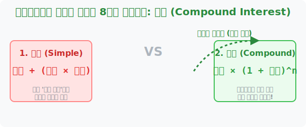

# 2. 아인슈타인도 놀란 기적: 이자, 복리법과 단리법

## [도입부] 학습 목표 (Learning Objectives)
- 은행의 이자 계산 방식인 **단리(Simple Interest)**와 **복리(Compound Interest)**의 결정적인 차이점을 이해합니다.
- 복리가 어떻게 '지수함수(Exponential)'의 꼴을 갖추어 눈덩이처럼 재산을 증식시키는지 스노우볼 이펙트를 학습합니다.
- 파이썬(Python) 반복문을 작성하여 100만 원이 복리를 통해 30년 뒤 얼마로 팽창하는지 금융 백테스팅 코드를 짜봅니다.

---

## 1. 정직한 덧셈: 단리(Simple Interest) 체계

천재 물리학자 알베르트 아인슈타인은 "우주에서 가장 강력한 힘은 복리다. 이를 아는 자는 돈을 벌고, 모르는 자는 돈을 지불할 것이다" 라는 명언을 남겼습니다. 도대체 복리가 무엇이길래 지수함수 챕터에 단골로 등장할까요?

은행에 100만 원을 연이율 10%로 맡겼다고 칩시다. 
**단리(Simple)** 시스템은 가장 정직하고 단순한 시스템입니다. 오로지 '최초 원금' 100만 원에 대해서만 10%의 이자($10$만 원)를 매년 지급합니다.
- 1년 뒤: 100만 + 10만 = 110만 원
- 2년 뒤: 110만 + 10만 = 120만 원
- 3년 뒤: 120만 + 10만 = 130만 원
단리는 매년 딱 정해진(고정된) 상수값 형태의 수치만 더해집니다. 수학에서는 이를 일차함수, 즉 직선형 그래프라고 부릅니다.

<br>

## 2. 눈덩이 굴리기: 복리(Compound Interest) 체계

반면, **복리(Compound)** 시스템은 1단계를 거친 이후부터 본색을 드러내는 무법자입니다. 방금 들어온 '이자'까지 원금이랑 퓨전 합체시켜서 전체 몸집을 키워버린 다음, 그 덩치 전체에 비례해서 다시 10% 이자를 먹입니다.

- 1년 뒤: 100만 + (100만의 10%) = 110만 원 (여기까진 단리와 동일!)
- 2년 뒤: **110만 원 전체 몸통**의 10% 이자 부과! $\rightarrow 110만 + 11만$ = 121만 원
- 3년 뒤: **121만 원 전체 몸통**의 10% 이자 부과! $\rightarrow 121만 + 12.1만$ = 133.1만 원

수학 공식으로 표현하면 초기 원금 $A$, 이율 $r$, 시간 $n$년에 대해 **$A \times (1+r)^n$** 이 됩니다. 
시간 $n$ 이 거듭제곱의 어깨 위 지수 자리로 올라갔네요? 네, 복리가 무서운 이유는 바로 "이자 위에 이자가 붙으며 커지는" **지수함수(Exponential Function)** 그 자체이기 때문입니다. 산꼭대기에서 조그만 눈뭉치를 굴리면 산기슭에선 거대한 눈사태가 되어 마을을 덮치는 이치와 똑같습니다.



---

## 3. 💻 파이썬(Python)의 금융 엔지니어링 

아무리 위대한 은행가라도 30년 치 일수(日數)가 누적된 복리를 암산으로 계산할 수는 없습니다. 프로그래머들은 거듭제곱(`**`) 연산을 수행하는 2줄짜리 파이썬 알고리즘으로 전 세계 증권사의 자동 수익률 추종화면(MTS) 시스템을 그려냅니다.

### 🐍 파이썬 예제: 투자의 신 워렌 버핏 스노우볼 계산기

```python
# 내 초기 자산 1,000,000 원 (백만 원)
principal = 1000000 
# 연 수익률 10% (0.1)
rate = 0.10
# 투자 기간: 30년 존버(장기투자)
years = 30

print(f"--- 원금 {principal}원, 자산 증식 30년 시뮬레이터 ---")

# 1. 단리 30년 수학 공식: 원금 + (원금 * 이자율 * 년수)
simple_interest_total = principal + (principal * rate * years)

# 2. 복리 30년 지수함수 공식: 원금 * (1 + 이자율) ** 년수
compound_interest_total = principal * ((1 + rate) ** years)

print(f"🏦 단리 시스템 결과 (30년 뒤): {int(simple_interest_total):,} 원")
print(f"🚀 복리 시스템 결과 (30년 뒤): {int(compound_interest_total):,} 원")

# 격차 계산
difference = compound_interest_total - simple_interest_total
print(f"\n=> 30년이라는 시간이 '지수함수'의 어깨에 올라간 대가: {int(difference):,} 원의 압도적 차이!")

# 결과창:
# --- 원금 1000000원, 자산 증식 30년 시뮬레이터 ---
# 🏦 단리 시스템 결과 (30년 뒤): 4,000,000 원
# 🚀 복리 시스템 결과 (30년 뒤): 17,449,402 원
# 
# => 30년이라는 시간이 '지수함수'의 어깨에 올라간 대가: 13,449,402 원의 압도적 차이!
```

코드를 보면 시간이 흐를수록 자본주의의 격차가 벌어지는 이유가 수학적으로 증명됩니다. 파이썬과 핀테크(Fin-Tech) 분야에서 로보 어드바이저가 주식 포트폴리오를 짜줄 때, 내부 핵심 모터로 구동되는 최우선 알고리즘 결합 공식이 바로 이 지수함수를 차용한 복리 시스템입니다.

---

## [결론] 학습 정리 (Summary)

1. **단리(Simple)의 성질**: 맨 처음 원금에 대해서만 이자를 지급하므로, 시간이 지남에 따라 일직선(선형 방정식)으로 똑같은 보폭으로 걷는 성장입니다.
2. **복리(Compound)의 성질**: 이자가 원금에 합쳐져 덩치를 불리고 그 전체에 다시 이자가 쏟아지는 구조로, 지수함수 곡선처럼 어느 임계점부터 하늘 위로 로켓처럼 솟구치는 구조입니다.
3. **지수함수 최강의 무기**: 은행 시스템 코딩에 내장된 $y = A(1+r)^x$ 이 거듭제곱 코드는 시간이 오래 주어질수록 진정한 지수 팽창의 공포스러운 파괴력을 발휘합니다.
