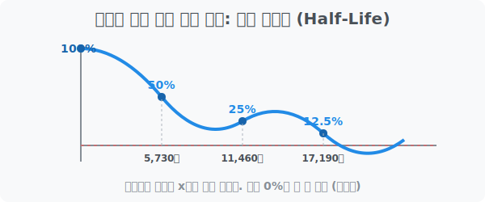

# 3. 영원히 죽지 않는 절반의 마법: 반감기 (Half-Life)

## [도입부] 학습 목표 (Learning Objectives)
- 지수함수의 역방향 모델인 '감소하는 지수함수' 곡선의 형태와 특징(점근선)을 이해합니다.
- 방사성 동위원소(탄소-14)가 왜 평생토록 0으로 소멸하지 않고 살아남는지 수학 공식을 통해 분석해 봅니다.
- 파이썬(Python) 시뮬레이터로 공룡 화석의 나이를 역추적하는 고고학자의 연대측정 코딩을 체험합니다.

---

## 1. 0(Zero) 에 영원히 닿을 수 없는 저주

이전 챕터에서 이자가 폭발하는 지수함수(예: $y = 2^x$)를 보았습니다. 이 녀석의 밑(Base)을 $1$보다 작게($0 < a < 1$) 만들어서 $y = (0.5)^x$ 로 둔갑시키면 어떻게 될까요?
놀랍게도 우주로 치솟던 로켓이 갑자기 바닥을 향해 추락하기 시작합니다. 하지만 무작정 바닥에 쾅! 하고 박히는 일반적인 직선(Linear) 감소와는 차원이 다릅니다.

어떤 양이 정확히 절반($1/2$)으로 줄어들 때 걸리는 시간을 **'반감기(Half-Life)'** 라고 부릅니다. 
어떤 물질 1,000개가 반감기를 한 번 겪으면 500개가 되고, 두 번 겪으면 250개, 125개, 62.5개... 이렇게 계속 반의반의 반 토막이 납니다. 중요한 점은 **지수함수는 평생 가도 절대 '0'이 될 수 없다는 것**입니다. 종이 한 장을 아무리 반으로 잘라도 미립자 단위까지 쪼개질 뿐 완전히 `사라짐(0)` 상태가 되지는 않는 것과 같은 수학적 우주의 원리입니다. (이를 X축에 끝없이 다가간다고 하여 **점근선**이라고 부릅니다.)



<br>

## 2. 공룡의 뼈에서 나이를 캐내다

지구상의 모든 생명체는 살아숨쉬는 동안 공기 중의 '탄소-14(Carbon-14)'라는 특수한 원소를 마십니다. 그리고 죽는 순간부터 호흡이 멈추기 때문에 체내의 탄소-14 시계가 서서히 붕괴되기 시작합니다.

탄소-14의 붕괴 패턴은 자연계의 법칙에 따라 무조건 **지수 감소 함수**를 따르며, 그 반감기(절반으로 줄어드는 시간)는 정확하게 **5,730년**입니다.
어느 날 고고학자가 티라노사우루스의 화석을 캤더니 뼛속에 남아있는 탄소-14 농도가 원래 살아있을 때의 **$12.5\%$** 밖에 안 남았다고 합니다. 
계산해 볼까요?
1. 1차 반 토막 ($50\%$) : $5,730$년 지남
2. 2차 반 토막 ($25\%$) : $5,730$년 또 지남
3. 3차 반 토막 ($12.5\%$): $5,730$년 또 지남

결론: $5,730 \times 3 = 17,190$년. 이 공룡 화석은 약 1만 7천 년 전 빙하기 무렵에 죽은 것으로 판명되는 것입니다. 이것이 **'방사성 탄소 연대 측정법'** 의 지수함수 원리입니다.

---

## 3. 💻 파이썬(Python)으로 구현하는 고고학 시뮬레이터

과학자들은 복잡한 수학 퍼즐을 손으로 풀지 않습니다. 파이썬의 거듭제곱 방정식과 역산(로그)을 이용하여 현재 남아있는 퍼센트($\%$)만 입력하면 즉각적으로 몇만 년 전 유물인지 뱉어내는 스크립트를 사용합니다.

### 🐍 파이썬 예제: 탄소 연대 측정 코딩

```python
import math

print("--- 🦖 파이썬 고고학 연구소: 탄소 연대 측정기 ---")

# 탄소-14의 수학적 물리 상수 (반감기)
half_life_years = 5730

# 화석에서 추출된 현재 탄소-14 잔여량 (예: 12.5%)
current_carbon_ratio = 12.5 / 100

# 지수함수 역산 알고리즘
# 잔여율 = (1/2) ** (지나간 시간 / 반감기)
# 양변에 로그(log)를 씌워서 '지나간 시간(Time)'을 끄집어냅니다!
# Time = 반감기 * (log_2 (잔여율) 의 절대값)

# 파이썬 math.log2 를 이용해 지수(시간비율)를 역추적
time_passed = half_life_years * abs(math.log2(current_carbon_ratio))

print(f"화석의 탄소 잔여량: {current_carbon_ratio * 100}%")
print(f"방사능 역추적 결과: 이 생명체는 약 {int(time_passed):,} 년 전에 사망했습니다!")

# 결과창:
# --- 🦖 파이썬 고고학 연구소: 탄소 연대 측정기 ---
# 화석의 탄소 잔여량: 12.5%
# 방사능 역추적 결과: 이 생명체는 약 17,190 년 전에 사망했습니다!
```

이 간단하며 우아한 수식 모델은 탄소 측정뿐만 아니라, 우리 몸 안에서 해열제 약효가 언제 떨어지는지(약물의 반감기), 폐기된 원자력 발전소의 우라늄 방사능이 언제쯤 안전해지는지 계산하는 **자연계의 필수 제어 코어 알고리즘**입니다.

---

## [결론] 학습 정리 (Summary)

1. **감소하는 지수함수**: 밑(Base)이 $0$과 $1$ 사이($0 < a < 1$)일 때 발생하는 수식으로, 빠르게 추락하다가 X축에 닿을 듯 말 듯 평행하게 날아가는 점근선을 가집니다.
2. **반감기(Half-Life)**: 어떤 물질이 최초 양의 절반($50\%$)으로 줄어드는 데 걸리는 고정된 시간을 뜻하며, 우주 물질이 스스로 부서지는 붕괴 현상은 모두 이 지수 곡선을 따릅니다. 
3. **영원한 0의 부재**: 지수함수에는 뺄셈이 들어있지 않고 지속적인 소수 곱셈만 이뤄지므로, 데이터가 작아질지언정 기계적으로 '0' 에 도달하지 못하게 코딩되어 있습니다.
