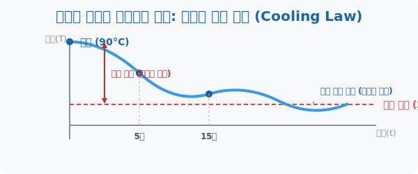

# 4. 방치된 커피의 온도: 뉴턴의 냉각 법칙

## [도입부] 학습 목표 (Learning Objectives)
- 감소하는 지수함수의 가장 뛰어난 물리학적 예시인 **'뉴턴의 냉각 법칙'**이 그리는 곡선의 궤적을 살펴봅니다.
- 왜 $90^\circ$C의 펄펄 끓는 물은 금세 미지근해지지만, 한 번 미지근해진 물은 한참을 놔둬도 온도 변화가 적은지 그 수학적 원리를 배웁니다.
- 파이썬(Python)의 `math.exp()` 자연 지수함수를 이용해 커피가 식어가는 온도를 분(Minute) 단위로 예측해 봅니다.

---

## 1. 자연은 '차이'가 클수록 맹렬하게 작동한다

추운 겨울 $0^\circ$C의 교실 밖에, 갓 끓인 $90^\circ$C의 뜨거운 커피를 놔두면 어떻게 될까요?
물리학과 미적분학의 창시자 아이작 뉴턴(Isaac Newton)은 자연계의 열이 이동하는 방식을 측정하다가 소름 돋는 패턴을 발견했습니다.

**"물체의 온도가 떨어지는 하락 속도는, 그 물체와 바깥 공기의 '온도 차이'에 비례한다!"**
- 커피방금 뽑음($90^\circ$C) vs 교실밖($0^\circ$C) $\rightarrow$ 차이 $90$도! 
  차이가 엄청 크니까 $\rightarrow$ **빛의 속도로 온도가 뚝! 뚝!** 급전직하로 떨어집니다.
- 커피 조금 식음($10^\circ$C) vs 교실밖($0^\circ$C) $\rightarrow$ 차이 10도. 
  나름 비슷해졌으므로 $\rightarrow$ **거북이처럼 아주 천~천히** 조금씩 식습니다.

이 변화를 점으로 찍어보면 앞부분은 벼랑 끝처럼 수직 낙하하다가, 뒷부분은 점근선(교실 공기 온도)에 붙어서 기어가는 완벽한 **'지수함수 꼬리(Exponential Tail)'** 모양 곡선이 완성됩니다.



<br>

## 2. 지수 평형 상태(Equilibrium)를 향한 수렴

반감기가 끝없이 반으로 쪼개져 0에 다가갔다면, 냉각 곡선은 절대 온도 0도가 아니라 **'주변 환경의 온도(실내 온도)'**라는 바닥 선(점근선)을 향해 뻗어갑니다.

이 자연 법칙은 냉장고나 자동차 엔진, 컴퓨터 CPU 쿨러 설계의 코어 로직이 됩니다. CPU 코어 온도가 100도에 육박할 때는 쿨러 팬이 조금만 돌아도 열이 확확 떨어지지만, 40도 정도의 평범한 상태에서는 쿨러 팬을 아무리 세게 돌려봤자 실내 온도 25도 이하로는 절대 안 떨어지는 '비효율' 구간이 오기 때문입니다. 이것이 지수 감소 곡선이 빚어내는 피할 수 없는 병목 현상입니다.

---

## 3. 💻 파이썬(Python) 방구석 바리스타 시뮬레이션

뉴턴의 냉각 방정식은 지수함수 부품 중에서도 인공지능이나 물리학에서 끝판왕으로 불리는 **자연상수 $e$ ($2.718...$)**를 밑(Base)으로 사용합니다. 파이썬에서는 `math.exp(x)` 를 사용해 $e^x$ 를 무식하게 빠른 속도로 계산할 수 있습니다.

### 🐍 파이썬 예제: 15분 뒤 내 아메리카노의 온도는?

```python
import math

# 변수 설정
room_temp = 20.0       # 실내 온도: 20도 (이 그래프의 최종 바닥 선, 점근선)
coffee_temp_0 = 90.0   # 처음 뽑은 뜨거운 커피 온도: 90도
k = 0.05               # 커피의 냉각 상수 (주변 환경과 컵 재질에 따라 다름)

print("--- ☕ 뉴턴의 커피 냉각 시뮬레이터 가동 ---")

# 5분 간격으로 커피 온도가 떨어지는 모습 시뮬레이션
for time_minutes in range(0, 31, 5):
    # 뉴턴의 냉각 법칙 공식: T(t) = 방온도 + (초기온도 - 방온도) * e^(-k * 시간)
    # 지수 -k 파워가 시간을 거듭하면서 0에 수렴해버리는 무시무시한 로직
    cooling_factor = math.exp(-k * time_minutes)
    current_temp = room_temp + (coffee_temp_0 - room_temp) * cooling_factor
    
    print(f"[{time_minutes:2d}분 경과] 커피 온도: {current_temp: .1f} °C")

# 결과창:
# --- ☕ 뉴턴의 커피 냉각 시뮬레이터 가동 ---
# [ 0분 경과] 커피 온도:  90.0 °C
# [ 5분 경과] 커피 온도:  74.5 °C  (5분 만에 무려 15.5도 급락!)
# [10분 경과] 커피 온도:  62.5 °C  (12도 하락 폭 감소)
# [15분 경과] 커피 온도:  53.1 °C
# [20분 경과] 커피 온도:  45.8 °C
# [25분 경과] 커피 온도:  40.1 °C
# [30분 경과] 커피 온도:  35.6 °C  (실내온도 20도에 가까워질수록 하락 폭이 점차 미미해짐)
```

이 알고리즘을 이용하면 굳이 컵에 온도계를 꽂아놓고 기다리지 않아도, 30분 뒤면 맛없고 미지근해진 35도짜리 커피가 될 것이란 미래를 손쉽게 예측(Prediction)해낼 수 있습니다. 법의학자들이 CSI 과학수사대에서 범죄 사건 불시의 사망 시간을 "사체의 실시간 온도"를 기반으로 역추적해 내는 것도 파이썬에 얹어놓은 이 지수 냉각 렌더링 결과입니다.

---

## [결론] 학습 정리 (Summary)

1. **지수 감소의 꼬리**: 온도나 밀도 차이가 클 때는 극단적으로 하락하지만, 그 차이가 좁혀질수록 기울기가 평평해지며 한계선에 끝없이 이어지는 곡선 모델입니다.
2. **점근선 (Asymptote)**: 냉각 곡선에서 그래프가 결단코 넘을 수 없는 바닥(하한선)이며, 물리학적으로는 "외부 실내의 온도"를 의미합니다.
3. **자연의 알고리즘 `exp()`**: 뉴턴, 아인슈타인 등 최고의 학자들이 자연을 수식으로 코딩할 때 무조건 가져다 쓴 베이스 숫자 세트는 $2, 10$ 이 아니라 자연 상수 $e$이며 파이썬 시스템에서는 `math.exp` 인스턴스로 돌아갑니다.
