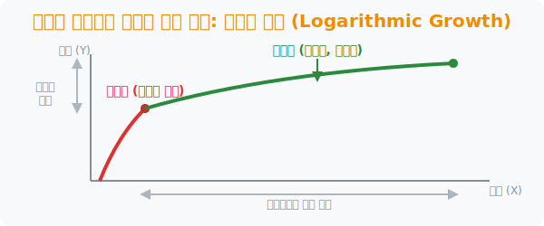

# 5. 한계 효용 체감의 법칙: 로그적 증가 (Logarithmic Growth)

## [도입부] 학습 목표 (Learning Objectives)
- 지수함수의 정반대 성향을 가진 **'로그함수(Logarithmic Function)'** 의 완만한 궤적의 특징을 학습합니다.
- 초반에는 급격히 오르지만 나중에는 아무리 노력해도 거의 오르지 않는 정체기(Plateau) 현상을 이해합니다.
- 파이썬(Python)으로 게임 캐릭터의 레벨업 경험치 한계 시스템을 디자인해 보며 일상의 법칙을 코딩합니다.

---

## 1. 지수함수의 정반대 세계, 로그 세계

앞에서 본 지수함수 $y = 2^x$ 는 처음엔 변화가 없다가 나중에 수직으로 치솟았습니다. 
그렇다면 로그함수 $y = \log_2 x$ 는 어떻게 생겼을까요? 

입력되는 X값이 `1, 2, 4, 8, 16, 32, 64...` 처럼 미친 듯이 커져도 결과값 y는 고작 `0, 1, 2, 3, 4, 5, 6...` 하면서 거북이처럼 기어갑니다. 즉, 처음에는 팍! 하고 오르다가 나중에는 평평해지는 모양을 그립니다. 

이를 가장 잘 설명하는 단어가 경제학의 **'한계 효용 체감의 법칙(Law of Diminishing Marginal Utility)'** 입니다. 
- 배가 고플 때 먹는 첫 번째 햄버거(초반)는 눈물 나게 맛있습니다 (만족도 급상승!). 
- 하지만 두 개, 세 개, 네 개째 먹을수록(노력값 X는 증가) 토할 것 같아지면서 만족도(결과 치 y) 증가폭은 거의 0에 수렴합니다.



<br>

## 2. 공부와 운동의 딜레마 (정체기)

롤(LOL) 게임이나 피아노 연습, 영어 공부, 헬스장 근력 운동 모두 초반에는 '뉴비 버프'를 받아 실력이 수직 상승합니다. 하지만 중급자를 넘어 상급자, 국가대표 급으로 갈수록 실력 향상(Y)을 1mm 올리기 위해 투자해야 하는 뼈를 깎는 노력 시간(X)은 천문학적으로 벌어집니다. 

이 평평한 구간을 **플래토(Plateau, 고원/정체기)**라고 부릅니다. 
현실 세계에서 "나는 왜 이렇게 성장이 더디지?" 하고 좌절하는 이유는 여러분이 못나서가 아니라, **인간의 숙련 기술 연마가 완벽한 로그함수 궤도를 타고 있기 때문입니다.** 이 수학적 원리를 알면 성장이 더딘 순간에도 "아, 나는 지금 상위 1% 로그 곡선 구간에 진입했구나!" 하고 버틸 수 있습니다.

---

## 3. 💻 파이썬(Python)으로 게임 경험치 시스템 만들기

MMORPG 게임을 기획할 때 레벨(Y)에 필요한 경험치(X)를 그냥 직선(Linear)으로 설계하면, 유저들이 하루 만에 최고 레벨(만렙)을 찍어버려 게임이 망합니다. 게임 기획자들은 파이썬 로그함수 방정식을 돌려 후반부로 갈수록 어마어마한 노가다(사냥)를 요구하도록 코딩합니다.

### 🐍 파이썬 예제: 극악무도한 만렙 경험치 설계

```python
import math

# 게임 레벨에 따른 사냥 마릿수(경험치) 시뮬레이션
# 레벨(level) = 상수 * log2(경험치)

print("--- ⚔️ RPG 게임 몬스터 사냥 경험치 요구량 (로그 시스템) ---")

levels_to_reach = [5, 10, 20, 30]

for target_level in levels_to_reach:
    # 역산: 경험치 = 2 ** (타겟레벨 / 상수)
    # 기획자가 밸런스를 위해 짠 로그 역산 지수 공식
    req_exp = 2 ** target_level
    
    # 몬스터 한 마리당 경험치 1을 준다고 가정
    print(f"[{target_level:2d} 레벨 도달] 필요한 몬스터 사냥 마리 수: {req_exp:,} 마리")

# 결과창:
# --- ⚔️ RPG 게임 몬스터 사냥 경험치 요구량 (로그 시스템) ---
# [ 5 레벨 도달] 필요한 몬스터 사냥 마리 수: 32 마리  (금방 찍음!)
# [10 레벨 도달] 필요한 몬스터 사냥 마리 수: 1,024 마리 
# [20 레벨 도달] 필요한 몬스터 사냥 마리 수: 1,048,576 마리 (갑자기 백만 마리??)
# [30 레벨 도달] 필요한 몬스터 사냥 마리 수: 1,073,741,824 마리 (만렙은 인생을 갈아 넣어야 함)
```

게임에서 29레벨에서 30레벨로 단 '1' 오르는 데 걸리는 시간이, 1레벨에서 29레벨 가는 전체 시간보다 더 걸린다는 흉악한 법칙은 모두 위 파이썬 수학 로그 코드가 만들어낸 잔인하고도 정교한 유저 체류 시간(Retention) 확보 기술입니다.

---

## [결론] 학습 정리 (Summary)

1. **로그 계단(Logarithmic Function)**: 엄청난 $X$ 값을 투입해야 아주 미미한 $Y$ 결과를 찔끔찔끔 내어주는 초반 러쉬형, 후반 정체형 수식 궤도입니다.
2. **현실계의 만능 열쇠**: 소리의 한계, 근육 벌크업 속도, 외국어 습득 능력 등 사람의 몸뚱어리로 할 수 있는 대부분의 숙련도 향상은 이 로그 성장을 따릅니다.
3. **게임 밸런싱의 코어**: 프로그래머가 게임 유저의 경험치 통계를 매길 때, 무한한 레벨업을 방지하기 위하여 고의적으로 로그함수를 설계하여 장기 체류 유저를 양산합니다.
