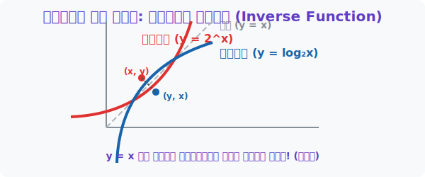

# 6. 거울 속 쌍둥이: 지수함수와 로그함수의 역함수 관계

## [도입부] 학습 목표 (Learning Objectives)
- '지수'와 '로그'가 본질적으로 완전히 똑같은 현상을 앞뒤 방향만 바꾸어 부르는 것임을 통찰합니다.
- 좌표 평면에서 $y = x$ 대각선 거울을 기준으로 서로 완벽하게 포개지는 **데칼코마니(역함수)** 구조를 파헤칩니다.
- 파이썬(Python) 딕셔너리와 차트 시스템을 이용해 인풋과 아웃풋이 완전히 거꾸로 매핑(Mapping)되는 거울 세계 코드를 작성해 봅니다.

---

## 1. 정문으로 들어가느냐, 후문으로 들어가느냐

이전 장들에서 입이 닳도록 이야기한 핵심이 있습니다.
> $2^3 = 8$ (지수)는 $\log_2 8 = 3$ (로그)와 완전히 একই 사건이다.

이 관계를 '함수계의 좌표 평면(X축, Y축)' 위로 가져오면 마법 같은 데칼코마니 작품이 그려집니다.
지수함수 $y = 2^x$ 에 $x=3$ 을 넣으면 $y=8$ 이 나옵니다 $\rightarrow$ 점 **$(3, 8)$**
로그함수 $y = \log_2 x$ 에 $x=8$ 을 넣으면 $y=3$ 이 나옵니다 $\rightarrow$ 점 **$(8, 3)$**

$X$와 $Y$의 자리가 정확하게 거꾸로(Reverse) 뒤집혔습니다! 이것을 수학에서 **역함수(Inverse Function)**라고 부릅니다. 
역함수는 언제나 도화지를 정방향 대각선($y=x$)으로 반 접었을 때 양쪽 잉크가 완벽하게 포개어지는 거울 쌍둥이의 특징을 갖습니다.



<br>

## 2. 모든 특징이 거꾸로 바뀐다!

거울에 비치면 왼손이 오른손이 되듯, 지수의 모든 성질은 로그로 넘어오면서 거꾸로 적용됩니다.
- 지수에 $x=0$을 넣으면 고정적으로 결과가 $1$이었죠? **점 ($0, 1$) 통과**
- 로그 거울은 $x=1$을 넣어야 결과가 $0$이 튀어나옵니다. **점 ($1, 0$) 통과**
- 지수함수는 하늘 위로($Y$축 상승) 치솟습니다.
- 로그함수는 오른쪽 바다($X$축 진행)로 쭉 뻗어나갑니다.
- 지수함수의 점근선(안 닿는 선)은 $X$축 바닥 선이었습니다.
- 로그함수의 점근선은 반대로 돌아가서 $Y$축 기둥 선이 됩니다. (진수 조건 $X>0$ 방어막)

이 쌍방 구조를 알고 있으면 지수함수가 어려울 때 재빨리 로그함수로 변환해서 문제를 탈출할 수 있습니다!

---

## 3. 💻 파이썬(Python)의 In/Out 역전 시스템

컴퓨터 과학의 데이터베이스(DB)에서 인덱스(Key)와 데이터(Value)를 통째로 뒤바꿔버리는 리버스 엔지니어링 훅이 바로 역함수의 원리입니다.

### 🐍 파이썬 예제: (x, y) 쌍 뒤집어엎기 매크로

```python
# 지수함수 y = 2^x 의 데이터 포인트를 딕셔너리로 만듭니다 (Key: x, Value: y)
exponential_data = {
    "x=1": 2,
    "x=2": 4,
    "x=3": 8,
    "x=4": 16,
    "x=5": 32
}

print("--- 🪞 파이썬 데이터 거울 (역함수) 제네레이터---")

# 지수함수 데이터세트 (X값 리스트와 Y값 리스트 추출)
exp_X = [1, 2, 3, 4, 5]
exp_Y = [2, 4, 8, 16, 32]

print(f"지수함수의 X(원인) 입력값: {exp_X}")
print(f"지수함수의 Y(결과) 출력값: {exp_Y}")
print("-" * 40)

# 역함수(로그함수)의 데이터는? 그냥 두 배열을 통째로 바꿔버리면 됩니다!
log_X = exp_Y
log_Y = exp_X

print("✨(마법의 Y=X 대각선 거울 반사)✨")
print(f"로그함수의 X(원인) 입력값: {log_X}")
print(f"로그함수의 Y(결과) 출력값: {log_Y}")

# 한 지점 검증
test_x = log_X[-1] # 맨 마지막 데이터 32
test_y = log_Y[-1] # 그 결과인 5
print(f"검증: 로그 세계에 X로 32를 집어넣으면? Y는 {test_y} 가 나온다! (log2 32 = 5)")

# 결과창:
# --- 🪞 파이썬 데이터 거울 (역함수) 제네레이터---
# 지수함수의 X(원인) 입력값: [1, 2, 3, 4, 5]
# 지수함수의 Y(결과) 출력값: [2, 4, 8, 16, 32]
# ----------------------------------------
# ✨(마법의 Y=X 대각선 거울 반사)✨
# 로그함수의 X(원인) 입력값: [2, 4, 8, 16, 32]
# 로그함수의 Y(결과) 출력값: [1, 2, 3, 4, 5]
# 검증: 로그 세계에 X로 32를 집어넣으면? Y는 5 가 나온다! (log2 32 = 5)
```

이미지 처리(머신러닝)에서 사진의 음영과 명암을 완전히 정반대 필름(Negative)으로 뒤집어버리는 행렬 인버스(Inverse Matrix) 변환 작업 역시, $f(x)$에 있는 점들을 거울 뒷면 $f^{-1}(y)$ 에 다시 투영시키는 이 대칭성에서 출발합니다.

---

## [결론] 학습 정리 (Summary)

1. **역함수 (Inverse Function)**: 함수계의 원인($X$)과 결과물($Y$)을 뒤바꾼 관계($y=x$ 대칭)이며 지수의 유일한 맞춤형 짝꿍 포지션이 바로 로그입니다.
2. **거울 세계 데칼코마니**: 교차점, 점근선, 뻗어 나가는 방향 등 원래의 지수함수가 가지고 있던 모든 X/Y 축 특성 룰이 완벽하게 반대로 180도 뒤집힙니다.
3. **대칭의 코딩**: 인공지능이 무수한 확률 곱셈 배열을 뒤집어 다시 원상태로 복구하는 알고리즘 최적화를 수행할 때 수학의 강력한 `반사회적 거울(Inverse)` 패러다임을 필수로 내장시킵니다.
