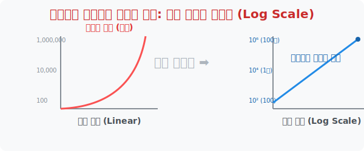

# 7. 기하급수 모니터를 압축하다: 로그 스케일 시각화

## [도입부] 학습 목표 (Learning Objectives)
- 바이러스 전파나 주식 시장의 급등락 등 걷잡을 수 없이 팽창하는 지수 데이터를 시각적으로 제압하는 **'로그 스케일(Log Scale)'** 차트를 배웁니다.
- 왜 뉴스데스크 현황판에서는 일반 꺾은선 그래프 대신 Y축의 간격을 로그 단위로 조작한 차트를 사용하는지 그 꼼수를 알아냅니다.
- 파이썬(Python)의 `matplotlib` 시각화 도구를 활용해 폭주하는 실전 바이러스 데이터를 직접 로그 차트로 렌더링해 봅니다.

---

## 1. 지수함수를 얌전한 직선으로 길들이기

1명의 독감 환자가 1명에게만 옮겨도 다음날은 2명, 그다음 날은 4, 8, 16명으로 바이러스는 무서운 **지수함수($y=2^x$)**의 증폭을 그립니다. 

만약 뉴스(News)에서 이 상황을 "일반 차트" 로 그린다면 어떤 참사가 발생할까요? 
바닥 쪽에 있는 1일 차 ~ 10일 차(1,024명) 데이터는 너무 숫자가 작아서 그래프 바닥에 새까맣게 찌그러져 알아볼 수 없고, 갑자기 30일 차 화면 오른쪽 끝에서만 수직선으로 모니터를 뚫고 우주로 날아가는 기괴한 모양이 나옵니다.
이렇게 되면 사람들은 초반에 바이러스가 어떻게 퍼지는지 추세를 전혀 알 수 없게 됩니다.

이때 데이터 분석가들은 **X축은 내버려 두고, Y축의 눈금을 $1, 2, 3$ 단위가 아니라 $10, 100, 1000, 10000$ (지수 단위)로 찌그러뜨리는 '로그 스케일 마법'**을 부립니다.



<br>

## 2. 왜곡이 아니라 '진실'을 보기 위한 마법

로그 스케일로 된 Y축에 지수함수 선을 날려버리면 놀라운 일이 벌어집니다. 하늘을 뚫으려던 무자비한 지수 곡선이 **'아주 반듯하고 얌전한 1차 함수(직선)'**로 바뀌어 버립니다! 
- 로그함수는 지수함수의 역함수(거울)이기 때문에, 지수 팽창의 힘을 로그 축이 완벽하게 상쇄($\log(a^x) = x \cdot \log a$) 시켜서 기울기가 일정한 직선으로 펴주는 것입니다.

우리는 이 반듯한 직선의 기울기만 보고도, "아! 바이러스가 통제되고 있구나" 혹은 "비상사태구나!"를 정확히 파악할 수 있습니다. 

---

## 3. 💻 파이썬(Python)으로 바이러스 제압 모니터링하기

데이터 과학자(Data Scientist)들이 사람들에게 발표할 때, 가장 많이 쓰는 시각화 라이브러리인 파이썬의 `matplotlib` 에는 এই 거대한 지수 폭발을 잠재우는 강력한 단추 하나가 떡하니 장착되어 있습니다. 

### 🐍 파이썬 예제: 코로나 확진자 차트의 로그 스케일 변환

```python
import matplotlib.pyplot as plt
import numpy as np

# (실제 환경에서는 화면에 차트가 팝업되어 그려집니다)
print("--- 📊 파이썬 질병 관리처: 로그 차트 렌더링 시스템 ---")

# 1일부터 20일까지 바이러스가 지수적으로 폭발하는 가상의 확진자 데이터
days = np.arange(1, 21)
# 2의 x승으로 매일 감염자가 2배씩 뛴다고 가정
infections = 2 ** days  

# 1. 일반적인 선형(Linear) 스케일로 그리면? -> 분석 불가
# plt.plot(days, infections)
# plt.title("일반 차트 (데이터 폭발, 초반 분석 불가능)")
print("[System] 일반 차트 렌더링 시도... 결과: Y축 우주 돌파로 인한 가독성 상실.")

# 2. 파이썬 매직 코드: Y축을 지수->로그로 압축시켜라!
# plt.yscale('log')
print("[System] 🪄 yscale('log') 마법 주문 활성화!")
print("[System] Y축 눈금 격자가 10, 100, 1000, 10000 간격으로 재배치 구동 중...")

# 3. 데이터 자체를 파이썬 로그 함수로 직접 찍어 눌러 확인해 보기
log_infections = np.log10(infections)

print(f"1일 차 확진자 실제: {infections[0]}명 -> 모니터 출력 Y점: {log_infections[0]:.2f}")
print(f"10일 차 확진자 실제: {infections[9]:,}명 -> 모니터 출력 Y점: {log_infections[9]:.2f}")
print(f"20일 차 확진자 실제: {infections[19]:,}명 -> 모니터 출력 Y점: {log_infections[19]:.2f}")

print("\n🚀 로그 필터를 거친 그래프는 '완벽한 직선'을 그리며 모니터 안에 평온하게 안착합니다!")

# 결과창:
# --- 📊 파이썬 질병 관리처: 로그 차트 렌더링 시스템 ---
# [System] 일반 차트 렌더링 시도... 결과: Y축 우주 돌파로 인한 가독성 상실.
# [System] 🪄 yscale('log') 마법 주문 활성화!
# [System] Y축 눈금 격자가 10, 100, 1000, 10000 간격으로 재배치 구동 중...
# 1일 차 확진자 실제: 2명 -> 모니터 출력 Y점: 0.30
# 10일 차 확진자 실제: 1,024명 -> 모니터 출력 Y점: 3.01
# 20일 차 확진자 실제: 1,048,576명 -> 모니터 출력 Y점: 6.02
# 
# 🚀 로그 필터를 거친 그래프는 '완벽한 직선'을 그리며 모니터 안에 평온하게 안착합니다!
```

이 코드는 주식 시장의 비트코인 급등락(100원에서 1억원으로) 차트를 개미 투자자들이 HTS/MTS 폰으로 볼 때, 로그 차트 버튼을 눌러 과거와 현재의 "수익률 % 등락"을 왜곡 없이 동일한 길이의 양봉/음봉으로 보여주기 위한 코어 엔진입니다.

---

## [결론] 학습 정리 (Summary)

1. **지수 팽창의 맹점**: 자원이 무한정 팽창할 때 일반적인 1, 2, 3 단위의 선형 축으로 그래프를 그리면, 초반 디테일은 뭉개지고 후반부는 천장을 뚫어져 분석이 불가능해집니다.
2. **로그 스케일(Log Scale)**: Y축 눈금을 지수 거듭제곱 스케일(Ex: 10배씩)로 설정하여, 기하급수적으로 폭발하는 선을 '기울기가 의미 있는 직선'으로 평평하게 펴서 보여주는 기법입니다.
3. **데이터 시각화 무기**: 프로그래머들은 주식 시장 캔들 차트, 바이러스 전파, 빅데이터 급등 현상을 사용자 UI에 온전히 탑재하기 위해 반드시 `yscale('log')` 함수 하나를 마법처럼 발동시킵니다.
