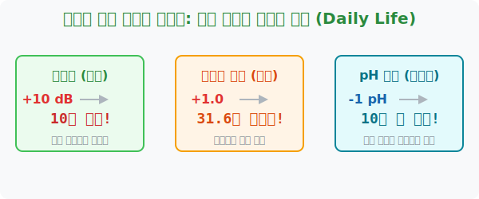

# 8. 보이지 않는 일상의 지배자: 지수와 로그의 활용 (Daily Life)

## [도입부] 학습 목표 (Learning Objectives)
- 우리 주변에 만연해 있는 소리, 지진, 산성도 등의 과학 법칙이 수학의 '지수와 로그' 로 포장되어 있음을 깨닫습니다.
- 데시벨(dB)이나 리히터 규모가 숫자 $1$ 증가할 때 실제 에너지가 얼마나 폭발적으로 상승하는지 로그 공식을 해부합니다.
- 파이썬(Python)의 로그 반전 스크립트를 통해 일상생활 뉴스 속 숫자에 숨겨진 거대한 사기극(?)을 방어해 내는 법을 배웁니다.

---

## 1. 세상의 모든 속임수는 '로그' 로 되어 있다.

우리는 일상속에서 "지진 규모 6.0 발생!", "층간 소음 50데시벨 돌파!", "산성비 pH 4.0 주의보!" 같은 뉴스 보도를 매일 접합니다. 안타깝게도 이 수치들은 모두 수학자들과 과학자들이 만들어낸 철저한 **'로그(Log) 압축 수치'** 입니다. 수학을 모르는 대중은 숫자가 조금 올랐다고 대수롭지 않게 여깁니다. 로그의 늪에 빠진 결과죠.



**[1] 데시벨 (Decibel, 소리 크기)**
데시벨은 상용로그($\log_{10}$)를 기반으로 설계되었습니다. 
소리가 **$10$dB(데시벨)** 올라갈 때마다, 실제 스피커에서 뿜어져 나오는 공기의 진동 에너지는 **$10$배**씩 수직 상승합니다!
예를 들어 아이들 뛰어노는 소리(50dB)에서 제트기 소음(120dB)은 숫자는 고작 $70$ 차이 같지만, 에너지로는 $10^7$ = **1천만 배**가 큰 고막 파괴 에너지입니다.

**[2] 리히터 규모 (Richter Scale, 지진의 힘)**
일본에 강진이 나서 리히터 규모 **6.0 에서 7.0 으로 딱 +1.0** 올랐다고 칩시다. "별 차이 없네?" 라고 생각하시면 안 됩니다. 리히터 규모는 에너지가 무려 **$10^{1.5}$ ($= \text{약 } 31.6$) 배** 폭증했다는 뜻입니다. 1.0 오를 때마다 원자폭탄 32개가 추가로 터지는 위력이라고 보면 됩니다.

**[3] pH 지수 (수소 이온 농도, 산성/알칼리성)**
레몬의 pH 가 $2.0$ 이고, 땀이 pH $4.0$ 이라면? 숫자가 고작 2 차이가 난다고 해서 레몬이 조금 더 십니다 라고 말하면 낙제점입니다. 
pH 공식은 **$- \log_{10} [\text{H}^+]$** 입니다. pH 숫자가 거꾸로 1 떨어질 때마다 신맛의 이온 파워는 무조건 **10배**씩 가속 페달을 밟습니다. 고로 레몬은 땀보다 무려 **100배 ($10^2$)** 가 강력합니다.

<br>

## 2. 💻 파이썬(Python) 뉴스 팩트 체크 방패 

기자들이 뉴스에 대입하는 로그 수치 뒤에 가려진 '진짜 에너지 폭격량'을 알아내려면 파이썬의 지수함수 복원 엔진이 필요합니다. 우리가 지수함수($**$) 역산 엔진을 돌리면 숨겨진 팩트가 폭로됩니다.

### 🐍 파이썬 예제: 일상 로그 수치의 공포탄 해제기

```python
# 뉴스에 보도된 로그 단위 수치들
quake_A = 5.0
quake_B = 7.0

sound_A = 60 # 일상 대화 (60dB)
sound_B = 90 # 록 콘서트 (90dB)

print("--- 🚨 파이썬 뉴스 팩트 체커 (로그 해독 엔진) ---")

# 1. 지진 역추적 모델 (에너지 차이 배수 = 10 ** (1.5 * (규모 B - 규모 A)))
quake_diff_scale = quake_B - quake_A
quake_energy_multi = 10 ** (1.5 * quake_diff_scale)

print(f"규모 {quake_A} vs 규모 {quake_B} 지진 비교")
print(f"☞ 앵커 멘트: 숫자가 고작 {quake_diff_scale} 밖에 안 올랐습니다.")
print(f"☞ 팩트 체커: 아닙니다! 땅이 파열되는 에너지가 정확히 {int(quake_energy_multi):,} 배 폭발했습니다!!")
print("-" * 50)

# 2. 소음 역추적 모델 (에너지 차이 배수 = 10 ** ((소음 B - 소음 A) / 10))
sound_diff_db = sound_B - sound_A
sound_energy_multi = 10 ** (sound_diff_db / 10)

print(f"도서관 {sound_A}dB vs 공사장 {sound_B}dB 소음 비교")
print(f"☞ 앵커 멘트: 소음 숫자가 {sound_diff_db} 정도 늘어났군요.")
print(f"☞ 팩트 체커: 귀청을 찢는 공기 진동 에너지가 {int(sound_energy_multi):,} 배 강해졌습니다!!")

# 결과창:
# --- 🚨 파이썬 뉴스 팩트 체커 (로그 해독 엔진) ---
# 규모 5.0 vs 규모 7.0 지진 비교
# ☞ 앵커 멘트: 숫자가 고작 2.0 밖에 안 올랐습니다.
# ☞ 팩트 체커: 아닙니다! 땅이 파열되는 에너지가 정확히 1,000 배 폭발했습니다!!
# --------------------------------------------------
# 도서관 60dB vs 공사장 90dB 소음 비교
# ☞ 앵커 멘트: 소음 숫자가 30 정도 늘어났군요.
# ☞ 팩트 체커: 귀청을 찢는 공기 진동 에너지가 1,000 배 강해졌습니다!!
```

이 알고리즘 코드는 건축 시뮬레이션이나 음향 엔지니어링 오디오 믹싱 콘솔 내부에서 `압축된 사용자 설정`을 물리 모터의 `실제 전기 출력`으로 100% 매핑(Mapping)시킬 때 구동되는 최중요 백엔드 로직입니다. 

---

## [결론] 학습 정리 (Summary)

1. **에너지의 지수 팽창**: 번개, 지진, 우주의 파동 같은 자연 에너지는 무조건 거듭제곱으로 덩치를 키우기 때문에 인간은 이를 압축해서 표현해야만 합니다.
2. **사회의 거짓말(로그)**: 우리가 편안하게 보는 뉴스, 환경 기준표, 화학 산성도 표기 등의 숫자는 사실 무수히 많은 '0' 을 $\log_{10}$ 캡슐 하나로 가둬놓은 시한폭탄과도 같습니다.
3. **지수/로그의 이중생활**: 두 함수는 컴퓨터 과학, 딥러닝(Deep Learning), 핀테크, 그리고 우리 일상생활 곳곳의 센서 데이터 처리에 완벽하게 녹아있는 떼려야 뗄 수 없는 가장 위력적인 수학 쌍둥이입니다.
