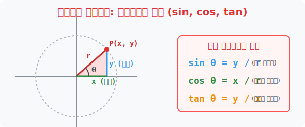

# 2. 그림자를 추적하라: 삼각함수의 정의 (sin, cos, tan)

## [도입부] 학습 목표 (Learning Objectives)
- 중학교 시절 직각삼각형 안에 갇혀 있던 $\sin, \cos, \tan$ 를 꺼내어, 거대한 $x, y$ 좌표 평면 위에서 뱅글뱅글 돌아가는 **원 모양의 트래킹 엔진(단위 원)** 으로 재정의합니다.
- 점이 원을 따라 움직일 때 그 점이 땅에 떨어뜨리는 '그림자($x$)'가 $\cos$이 되고, 벽에 비추는 '높이($y$)'가 $\sin$이 되는 위치 추적 메커니즘을 시각적으로 체화합니다.
- 파이썬(Python)의 `math.sin()`, `math.cos()` 함수에 각도(라디안) 정보만 박아 넣으면 밀리초 만에 플레이어의 2D, 3D 좌표를 찾아내는 삼각망 해킹을 구현합니다.

---

## 1. 직각삼각형을 버려라: 원 위의 좌표 추적기

중3 때까지 우리는 삼각비를 '직각삼각형의 변과 변 길이의 비율'로만 배웠습니다. ($S$자 그리고 $C$자 그리고 $\dots$)
하지만 고등학교의 '삼각함수'는 삼각형의 변 길이를 완전히 무시하고 오직 **$x, y$ 좌표 평면 위에서 빙글빙글 도는 관람차(원)** 에 탑승합니다.

좌표 평면에 반지름이 $r$ 인 거대한 원을 그리고, 원의 테두리 위에 점 $P(x, y)$ 를 딱 찍습니다. 이때 가운데 원점에서 선을 그으면 $x$축과 벌어진 각도 $\theta$ (세타) 가 생깁니다. 
수학자들은 빗변(반지름 $r$), 밑변(가로 $x$), 높이(세로 $y$)를 이용해 함수를 새롭게 정의했습니다.

- **$\sin \theta = \frac{y}{r}$ (높이 비율)**
- **$\cos \theta = \frac{x}{r}$ (가로 비율)**
- **$\tan \theta = \frac{y}{x}$ (기울기, 경사도)**

특히 반지름 $r = 1$ 인 깐깐한 원(단위원)에서는 공식이 충격적일 정도로 심플해집니다.
$\sin \theta = y$ 좌표! $\cos \theta = x$ 좌표!
즉, $\cos$과 $\sin$은 그저 각도만 입력하면 화면 위 점의 가로($x$), 세로($y$) **위치 좌표를 실시간으로 100% 때려 맞춰주는 만능 레이더 추적기** 로 진화한 것입니다.

<div align="center">
  
</div>

<br>

## 2. All-사-탄-코 의 저주 (부호 판별법)

관람차($P$점)가 1사분면을 지나 2사분면, 3사분면 등 화면의 뒷골목으로 넘어가면 $x$나 $y$좌표 중 하나가 마이너스($-$) 로 떨어지기 시작합니다. 이때 길이는 전부 양수라는 구닥다리 관념이 깨지며, 삼각함수의 결과값에도 마이너스 폭탄이 터집니다.

- **1사분면 (우상단):** $x(+), y(+)$ $\rightarrow$ $\sin, \cos, \tan$ 셋 다 **All** 양수!
- **2사분면 (좌상단):** $x(-), y(+)$ $\rightarrow$ 오직 $\sin$ 자식만 양수! (얼**사**)
- **3사분면 (좌하단):** $x(-), y(-)$ $\rightarrow$ 마이너스끼리 나뉜 $\tan$ 가 양수! (**안**)
- **4사분면 (우하단):** $x(+), y(-)$ $\rightarrow$ 오직 $\cos$ 자식만 양수! (**코**)

이 유명한 "올-사-탄-코(All-sin-tan-cos)" 암기 주문은 사실 암기할 필요도 없이 점이 속한 동네의 $x, y$ 부호만 눈으로 쓱 보면 1초 만에 렌더링 됩니다.

---

## 3. 💻 파이썬(Python)의 2D 게임 미사일 탄착군 좌표 찾기

여러분이 롤(LoL) 이나 배틀그라운드 같은 게임에서 45도 상단으로 미사일을 쏘아 올릴 때, 1초 뒤 미사일이 어느 좌표 화면($x, y$)에 찍힐지 컴퓨터는 파이썬(C++) 삼각함수를 돌려 실시간으로 위치를 뿌립니다.

### 🐍 파이썬 예제: 대포알 미사일의 2D 좌표 렌더링

```python
import math

print("--- 🚀 삼각 레이더: 미사일 탄착군 좌표 스캐너 ---")

# (데이터 셋) 포신이 X축 기준 '60도' 각도로 들려있음. 포탄은 직선거리 100m 를 날아감.
angle_deg = 60
distance_r = 100

# 1. 포신 각도를 인간어(60도)에서 기계어(라디안)로 번역
theta_rad = math.radians(angle_deg)

# 2. X 좌표 추출 (코사인 기동 발동!) -> x = r * cos(theta)
x_coord = distance_r * math.cos(theta_rad)

# 3. Y 좌표 추출 (사인 기동 발동!) -> y = r * sin(theta)
y_coord = distance_r * math.sin(theta_rad)

print(f"▶ 60도 각도로 100m 발사된 미사일 추적!")
print("-" * 50)
print(f"📡 감지된 X 좌표 (가로 그림자): {x_coord:.1f} m")
print(f"📡 감지된 Y 좌표 (세로 고도)  : {y_coord:.1f} m")
print(f"💥 최종 탄착 미사일 위치: Point({x_coord:.1f}, {y_coord:.1f})")

# 결과창:
# --- 🚀 삼각 레이더: 미사일 탄착군 좌표 스캐너 ---
# ▶ 60도 각도로 100m 발사된 미사일 추적!
# --------------------------------------------------
# 📡 감지된 X 좌표 (가로 그림자): 50.0 m
# 📡 감지된 Y 좌표 (세로 고도)  : 86.6 m
# 💥 최종 탄착 미사일 위치: Point(50.0, 86.6)
```

이 고작 4줄짜리 코드가 없었다면 게임 속 아바타들은 팔을 돌리지도 못하고 일직선 좌우로 뻣뻣하게만 움직여야 했을 것입니다. 삼각함수는 거리를 $x$와 $y$ 로 갈기갈기 찢어 벡터를 통제하는 게임 엔진의 핵심 심장입니다.

---

## [결론] 학습 정리 (Summary)

1. **좌표 평면으로의 이주**: 삼각형의 좁은 감옥을 탈출해 $x, y$ 가 무한대로 십자(+)를 그리는 평면 위로 이사 오며, 각도($\theta$)가 90도를 넘어 1만 도까지 빙글빙글 돌아도 함수값을 영원히 뽑아낼 수 있는 자유를 얻었습니다.
2. **x는 $\cos$, y는 $\sin$**: $x$좌표의 위치를 추적할 때는 무조건 $x$축 위로 내려찍는 그림자인 '코사인'을 켜고, 고도($y$좌표) 위치를 스캔할 때는 세로로 찌르는 '사인'을 켜는 것이 2D 공간의 불문율입니다.
3. **그래픽 렌더링의 코어**: 파이썬 게임이나 지도 시뮬레이터를 짤 때 화면 중심에서 캐릭터가 회전하며 발사체를 쏠 때 이 사인/코사인 엔진 하나만 탑재하면 컴퓨터가 0.01초 만에 다음 프레임 위치를 화면상에 그려냅니다.
