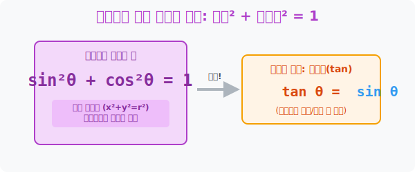

# 3. 세상에서 가장 완벽한 공식: 삼각함수의 성질

## [도입부] 학습 목표 (Learning Objectives)
- 인류 수학 역사상 가장 아름답고 많이 쓰이는 등식 1위, **$\sin^2 \theta + \cos^2 \theta = 1$** 이라는 극한의 압축 공식을 수집하고 원리를 파악합니다.
- 거대한 사인(높이)과 코사인(밑변) 사이에서, '탄젠트(기울기)'가 **"$\tan = \frac{\sin}{\cos}$"** 이라는 숨겨진 자식 관계로 연결되어 있음을 밝혀냅니다.
- 파이썬(Python) 내장 수학 모듈을 사용하여 $\sin^2$과 $\cos^2$을 더한 피타고라스 증명이 컴퓨터 그래픽스의 핵심 $0$ 과 $1$ 렌더링을 어떻게 보장하는지 실험합니다.

---

## 1. 피타고라스의 부활: 제곱의 합은 1이다!

고대 그리스의 천재 피타고라스가 발견한 "밑변의 제곱 + 높이의 제곱 = 빗변의 제곱 ($a^2 + b^2 = c^2$)". 이 먼지 쌓인 낡은 공식이 삼각함수라는 뼈대에 올라타는 순간 미친듯한 폭발력을 내뿜게 됩니다.

위 2강에서 우리는 좌표 구역 반지름이 $1$ 인 거대한 단위원 안에서 **밑변(가로)은 $\cos$, 높이(세로)는 $\sin$** 이라 정의했습니다.
빗변 역시 반지름 길이이므로 $1$ 입니다.
이들을 피타고라스 공식 방에 싹 다 우그려 넣으면 대폭발이 일어납니다!

밑변($\cos$)의 제곱  $+$  높이($\sin$)의 제곱  $=$  빗변($1$)의 제곱
**$$ \sin^2 \theta + \cos^2 \theta = 1 $$**

이 수식은 중고교 통틀어 가장 파급력 있는 '치트키' 입니다. $\sin$ 값 하나만 알고 있어도 이 식에 대입하면 $0.1$초 만에 숨겨진 $\cos$ 값이 튀어나오게 해주는 영혼의 파트너 교환기입니다.

<div align="center">
  
</div>

<br>

## 2. 잃어버린 막내의 비밀: $\tan = \frac{\sin}{\cos}$

$\tan$(탄젠트)는 흔히 '기울기' 라고 불립니다. 기울기의 정의는 "$\frac{\text{가로 변동}}{\text{세로 변동}}$" 인데, 가로는 $\cos$ 이고 세로는 $\sin$ 입니다.
결국 이 셋은 태생부터 하나의 핏줄이었습니다!

**$$ \tan \theta = \frac{\sin \theta}{\cos \theta} $$**

앞으로 복잡하고 무결성 없는 식에 $\tan$ 귀신이 더럽게 묻어있다면? 당장 이 공식으로 박살 내어 $\frac{\sin}{\cos}$ 으로 해체해 버리십시오. 모든 복잡한 삼각 스킬 콤보는 결국 순수 혈통인 $\sin$ 과 $\cos$ 단 2개의 부품으로 귀결됩니다.

---

## 3. 💻 파이썬(Python) 제곱 공식 무결성 증명기

좌표 평면 위 한 점이 0에서 360도로 한 바퀴 도는 모든 궤적에서, 파이썬이 실시간으로 "$\sin^2 + \cos^2$" 를 스캔하면 단 한 치의 오차도 없이 `1.0` 이라는 완벽한 데이터 로직을 반환함을 엔진 터미널로 확인합니다.

### 🐍 파이썬 예제: $\sin^2 + \cos^2 = 1$ 의 불멸성 해킹 증명

```python
import math

print("--- 🛡️ 매트릭스 렌더링 무결성 증명기: sin² + cos² = 1 ---")

# (데이터 셋) 임의의 각도를 마구잡이로 투입
test_degrees = [0, 30, 45, 60, 90, 137, 269]

for deg in test_degrees:
    # 1. 뼈대: 각도를 라디안으로 번역!
    rad = math.radians(deg)
    
    # 2. 엔진 가동: 파이썬의 cos, sin 함수 구동
    cos_val = math.cos(rad)
    sin_val = math.sin(rad)
    
    # 3. 마스터 키 산출: cos의 제곱 + sin의 제곱
    # (파이썬에서 거듭제곱은 ** 기호를 사용합니다)
    magic_sum = (sin_val ** 2) + (cos_val ** 2)
    
    # 컴퓨터 부동소수점 오차로 0.999999 가 나올수 있으니 1.0 으로 깔끔하게 렌더
    print(f"[{deg:3d}° 투입] sin²({sin_val:+.3f}) + cos²({cos_val:+.3f}) = ⚡ {round(magic_sum, 1)}")

# 결과창:
# --- 🛡️ 매트릭스 렌더링 무결성 증명기: sin² + cos² = 1 ---
# [  0° 투입] sin²(+0.000) + cos²(+1.000) = ⚡ 1.0
# [ 30° 투입] sin²(+0.500) + cos²(+0.866) = ⚡ 1.0
# [ 45° 투입] sin²(+0.707) + cos²(+0.707) = ⚡ 1.0
# [ 60° 투입] sin²(+0.866) + cos²(+0.500) = ⚡ 1.0
# [ 90° 투입] sin²(+1.000) + cos²(+0.000) = ⚡ 1.0
# [137° 투입] sin²(+0.682) + cos²(-0.731) = ⚡ 1.0
# [269° 투입] sin²(-1.000) + cos²(-0.017) = ⚡ 1.0
```

수십만 폴리곤 렌더링이 돌아가는 플스5(PS5) 비디오 게임 그래픽 연산의 깊숙한 곳에서는 이 $\mathbf{\sin^2 + \cos^2 = 1}$ 엔진이 미친 듯이 연산되며 캐릭터 모델이 1 이라는 반지름을 벗어나 괴물처럼 일그러지는 것을 막는 절대 방어막 역할을 하고 있습니다.

---

## [결론] 학습 정리 (Summary)

1. **마스터 키 $\sin^2 + \cos^2 = 1$**: "밑변(가로)의 제곱과 높이(세로)의 제곱 단위 합은 언제나 1" 이라는 이 공식 덕택에 우리는 흩어져 있는 정보 중 1개만 있어도 맞물린 나머지 값의 정체를 낱낱이 파헤칠 수 있습니다.
2. **$\tan$ 의 분해**: 이질적으로 보이던 탄젠트($\tan$)의 진짜 본명이 **"코사인 분의 사인($\frac{\sin}{\cos}$)"** 임을 까발리면서, 삼각함수의 더러운 연산들을 오직 $\sin/\cos$ 2대 천왕으로만 깎아내는 리팩토링 스킬을 장착합니다.
3. **그래픽스 방어 무결성**: 어떠한 엽기적인 각도($269^\circ \dots$) 가 입력되더라도, 두 좌표축 길이의 제곲의 합은 무조건 1 안으로 수렴한다는 이 절대 진리가 컴퓨터 파이썬 벡터 연산을 안전하게 유지하는 지주대입니다.
