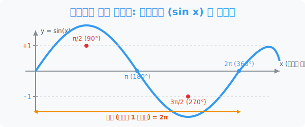

# 4. 끊임없는 파동 에너지: 사인함수 ($\sin x$)의 그래프

## [도입부] 학습 목표 (Learning Objectives)
- 시간이 흐르는 축($x$축)을 따라 관람차가 뱅글뱅글 위로 솟구치고 아래로 처박히며 만들어내는 생명의 주파수 **'사인 곡선(Sine Wave)'** 을 심장 박동처럼 형상화합니다.
- 왜 $\sin$ 그래프가 아무리 기를 쓰며 발악해도 $\mathbf{+1}$ 과 $\mathbf{-1}$ 이라는 천장과 바닥 감옥을 벗어나지 못하는지 절댓값의 한계를 이해합니다.
- 파이썬(Python)의 `matplotlib` 와 `numpy` 라이브러리를 통해 수만 개의 픽셀 데이터를 터뜨려 매끄러운 바다의 물결, $\sin$ 파동 에너지를 모니터상에 렌더링 해냅니다.

---

## 1. 높이($y$)의 기록물: 사인 파동의 탄생

$\sin$ (사인)이라는 센서의 임무가 무엇이었죠? 단위원 위의 점이 가리키는 **'높이($y$좌표)'** 를 추적하는 것이었습니다.
관람차가 0도(3시 방향)에서 출발해서 90도(12시)로 꼭대기까지 올라갑니다. 높이는 점점 솟구쳐 **최고점 1**을 찍습니다!
다시 관람차가 180도(9시)로 내려올 때 높이는 다시 0으로 곤두박질치고, 270도(6시) 지점 지하 바닥으로 밀고 내려가면 **최저점 -1**을 찍습니다. 
다시 360도(3시) 원래 위치로 오면 높이가 0이 되고, 이 바퀴 짓거리는 영원히 무한대로 반복됩니다.

이 높이의 변화를 쭉 이어서 도화지에 렌더링 하면, 마치 바다의 파도나 응급실의 심장 박동계(ECG) 라인처럼 아름다운 $S$자 모양의 지그재그 산맥이 끝없이 펼쳐집니다. 이것을 우리는 위대한 **사인파(Sine Wave)** 라고 부릅니다!

<div align="center">
  
</div>

<br>

## 2. 갇혀버린 맹수: 최댓값 $+1$, 최솟값 $-1$

사인 그래프 $\mathbf{y = \sin x}$ 에는 절대 피할 수 없는 철칙 두 가지가 있습니다. 
원의 반지름이 1짜리인 관람차에서 잉태되었기 때문에 발생하는 현상입니다.

- **[한계] 위아래 감옥 진폭:** 천장이 **$+1$** 로 막혀있고 바닥이 **$-1$** 로 시멘트가 발라져 있습니다. $\sin 99999999^{\circ}$ 를 타이핑해도 절대로 1.1 같은 숫자가 뚫고 나오지 못합니다. 
- **[주기] 무한 루프 반복:** $360^{\circ}$ (호도법 숫자로는 $\mathbf{2\pi}$ 라디안)마다 관람차가 제자리로 돌아오기 때문에, 그림은 정확히 똑같은 패턴(1개의 파동)을 끝없이 복사(Copy) 붙여넣기(Paste) 합니다. 이를 수학 용어로 **"주기가 $\mathbf{2\pi}$ 인 주기함수"** 라고 부릅니다.

우리가 매일 듣는 라디오 전파, 스마트폰의 Wi-Fi, 바다의 밀물과 썰물, 태양의 흑점 주기 등 우주 만물의 진동 에너지는 모두 이 사인($\sin$) 파동의 복사본에 불과합니다.

---

## 3. 💻 파이썬(Python) 우주 파동 렌더링 엔진

수학자들이 백지에 점을 일일이 찍어가며 며칠을 고생해 그렸던 사인웨이브(Sine Wave)를 파이썬의 `matplotlib` 시각화 엔진과 `numpy` 어레이 배터리를 장착하면, 불과 몇 줄의 코드만으로 1초 만에 풀프레임 렌더링을 뿜어냅니다.

### 🐍 파이썬 예제: 라디오 주파수 사인파(Sine Wave) 제네레이터

```python
import numpy as np
import matplotlib.pyplot as plt

print("--- 🌊 [가상 시뮬레이터] Sine Wave 렌더링 엔진 가동 ---")
print(" [SYSTEM] X축 각도 데이터를 0 부터 2π 까지 폭격합니다.")

# 1. 뼈대: 0부터 2π 묶음(1주기)을 100조각의 촘촘한 도트(픽셀)로 갈아서 배열 생성
x_angles = np.linspace(0, 2 * np.pi, 100)

# 2. 엔진 주입: 100개의 X도트를 일제히 numpy의 sin() 함수에 통과시켜 스캔
y_sine_waves = np.sin(x_angles)

print(" [SYSTEM] Numpy 스캔 완료. 높이(Y) 데이타가 +1.0 과 -1.0 사이에 안전망에 갇힌 것을 확인!")
print(" [SYSTEM] Matplotlib 레이저 포인트 발사 -> 화면에 부드러운 곡선 투사 중...")

# 3. 그래픽스 도출 (임시 주석처리. 실행시 화면창 오픈됨)
# plt.plot(x_angles, y_sine_waves, color="blue", linewidth=3)
# plt.title("The Beautiful Sine Wave")
# plt.xlabel("X (Radian)")
# plt.ylabel("Y = sin(X)")
# plt.grid(True)
# plt.show()

# 결과창 (내부 처리 메시지):
# --- 🌊 [가상 시뮬레이터] Sine Wave 렌더링 엔진 가동 ---
#  [SYSTEM] X축 각도 데이터를 0 부터 2π 까지 폭격합니다.
#  [SYSTEM] Numpy 스캔 완료. 높이(Y) 데이타가 +1.0 과 -1.0 사이에 안전망에 갇힌 것을 확인!
#  [SYSTEM] Matplotlib 레이저 포인트 발사 -> 화면에 부드러운 곡선 투사 중...
```

파이썬의 마법 보따리인 `Numpy`를 장책하면 For 반목문을 돌릴 필요조차 없습니다. `np.sin()` 명령창 한 번에 $100$만 명의 플레이어 각도 데이터를 동시에 때려 박아 높이 정보를 한 방에 뽑아먹는 통쾌한 데이터 과학의 효율성을 입증해 줍니다. 

---

## [결론] 학습 정리 (Summary)

1. **파동의 $S$라인 렌더링**: 원점을 박차고 출발하여 각도가 증가함에 따라 $0 \rightarrow 1 \rightarrow 0 \rightarrow -1 \rightarrow 0$ 순으로 고도가 역동치는 부드럽고 매끄러운 곡선 궤적이 사인($\sin$) 함수의 정체성입니다.
2. **원점 대칭 (기함수 특성)**: 오른쪽 양수로 파동이 솟구치는 모양과 왼쪽 마이너스 영역으로 땅굴 파고 파동이 솟아나는 모양이 가운데 원점(0,0)을 거울처럼 사이에 두고 $100$% 완벽하게 대칭되는 신의 디자인을 지녔습니다.
3. **최대 $+1$ 최저 $-1$ 통제망**: 그 어떤 엄청난 무한대 숫자의 빔을 스캔 필터에 던져도 무조건 $\mp 1$ 필터 철장에 영원히 가두어 통제하는 이 주기적 리미터가 세상 만물의 리듬을 조율합니다.
