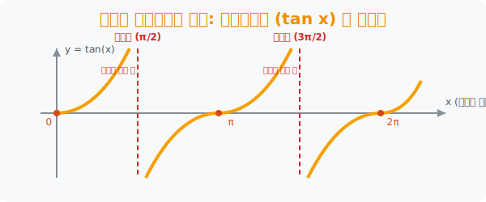

# 6. 하늘을 뚫어버리는 광기: 탄젠트함수 ($\tan x$) 의 점근선

## [도입부] 학습 목표 (Learning Objectives)
- $\pm 1$ 이라는 감옥에 갇혀있던 겁쟁이 $\sin, \cos$ 들과 달리, 각도가 90도($\frac{\pi}{2}$)에 다가갈수록 천장과 우주의 한계를 뚫고 무한대로 치솟아 버리는 $\tan$ 의 **'상남자(기울기 폭주)' 특성**을 배웁니다.
- 절대로 닿지 못하는 마의 투명 벽, **'점근선'** 의 존재와 $\tan$ 의 주기가 혼자서만 $180^{\circ}(\pi)$ 로 반 토막 난 돌연변이 구조를 시각화합니다.
- 파이썬(Python) 엔진이 $\tan 90^{\circ}$ 를 마주했을 때 내부에서 무한대(Infinity) 런타임 분모 0 에러가 터지는 현상을 방어하는 데이터 사이언스 방어 기술을 익힙니다.

---

## 1. 1 한계를 찢어버린 기울기의 마법

$\tan$(탄젠트)함수의 정체는 무엇입니까? 높이와 가로의 비율, 즉 길의 **'경사도(기울기)'** 입니다.
- 산길이 0도면 평지(0)입니다.
- 언덕이 45도면? 가로세로 비율이 같아져 기울기 1을 찍습니다 ($\tan 45^{\circ} = 1$). 사인과 코사인이 평생 헤딩해도 못 뚫던 벽을 단 45도 만에 돌파했습니다! 
- 그리고 관람차가 89도, $\mathbf{89.99^{\circ}}$ 로 수직에 가깝게 치솟으면? 높이($y$)는 끝장나게 길어지는데 가로($x$) 밑변은 먼지처럼 $\mathbf{0}$ 에 수렴합니다.

분모가 0에 한없이 가까워진다? 이것은 수학에서 "숫자 값이 우주의 끝 **무한대($\infty$) 로 치솟는다**"는 뜻입니다.
따라서 탄젠트 렌더링 그래프는 중간중간 기둥을 타고 하늘 꼭대기로 로켓포처럼 발사되는 곡선들의 집합으로 모니터를 가득 채우게 됩니다.

<div align="center">
  
</div>

<br>

## 2. 접근 금지 투명 벽: 점근선(Asymptote)

$\tan$ 가 이렇게 발악하며 올라가지만, 정작 **완벽한 $90^{\circ}$ (호도법: $\frac{\pi}{2}$)** 가 되는 순간 시스템 에러가 발생합니다. 분모의 길이($x$) 가 완벽하게 '0'이 되어버리기 때문에, 대수학에서 이 지점의 답은 "계산 불가(정의되지 않음)" 즉 딥블랙홀입니다.
그래서 그래프 도화지에는 **$90^{\circ}, 270^{\circ}$ 마다 영원히 닿을 수 없는 세로줄 점선 벽**이 처지게 되는데, 이것을 "점점 가까워만 질뿐 만나진 않는 선" $\mathbf{\rightarrow}$ **점근선** 이라고 부릅니다. 

방해물(점근선 벽)이 곳곳에 세워져 공간이 좁아진 탓에, $\tan$ 의 똑같은 그림이 반복되는 **주기(Cycle)는 $\sin, \cos$ 의 절반인 딱 $180^{\circ}$ (호도법: $\mathbf{\pi}$)** 로 쪼그라든 돌연변이가 되는 이유입니다.

---

## 3. 💻 파이썬(Python) 무한대 에러 회피 엔진

수억 개의 데이터를 렌더링 하는 파이썬 AI 좌표 시뮬레이터가 $\tan$ 계산 중 각도 $90^{\circ}$($\frac{\pi}{2}$) 데이터를 정통으로 맞아버리면, "분모 0 (ZeroDivisionError)" 폭탄에 맞아 서버 전체가 셧다운되어버립니다. 이를 파이썬으로 관찰해 봅니다.

### 🐍 파이썬 예제: $\tan(90^\circ)$ 치솟음 폭발 한계치 측정기

```python
import math

print("--- 🚀 점근선 폭주: Tangent 우주 발사 시뮬레이터 ---")

# 90도 근처로 슬금슬금 다가가며 기울기(tan) 수치의 폭주 상태를 모니터링
danger_angles = [80, 89, 89.9, 89.999]

for deg in danger_angles:
    rad = math.radians(deg)
    tan_power = math.tan(rad)
    
    # 90도에 도달할수록 tan 값이 수십만 배로 수직 상승!
    print(f"[{deg}° 기동] 현재 기울기 파워: 💥 {tan_power:10.1f}")

print("-" * 50)
print("🚨 [경고] 만약 정확히 90도(π/2)를 뚫으려 시도하면?!")
# 완벽한 90도(pi/2) - 파이썬 부동소수점 시스템에서는 에러가 나거나
# 165경(1.63e+16) 이라는 말도 안 되는 숫자 무한대 쓰레기값을 토해냅니다.
absolute_90_rad = math.pi / 2
print(f"👉 System Panic: tan(90) = {math.tan(absolute_90_rad)}")  # 허구의 숫자 토출됨

# 결과창:
# --- 🚀 점근선 폭주: Tangent 우주 발사 시뮬레이터 ---
# [80° 기동] 현재 기울기 파워: 💥        5.7
# [89° 기동] 현재 기울기 파워: 💥       57.3
# [89.9° 기동] 현재 기울기 파워: 💥      573.0
# [89.999° 기동] 현재 기울기 파워: 💥    57295.8
# --------------------------------------------------
# 🚨 [경고] 만약 정확히 90도(π/2)를 뚫으려 시도하면?!
# 👉 System Panic: tan(90) = 1.633123935319537e+16
```

컴퓨터 과학자들은 이 `e+16` (1 뒤에 0이 16개 붙는 미친 숫자) 라는 쓰레기 폭주 데이터 에러를 막기 위해, 탄젠트 각도가 점근선($\pi/2$) 근방에 도달하면 `if` 방어선 필터 코드를 심어 강제로 계산을 스킵(Skip)하도록 데이터 로직을 짜야만 합니다.

---

## [결론] 학습 정리 (Summary)

1. **상남자 폭주 그래프 ($S$라인 우로 파고들기)**: 둥글둥글한 사인파 무리와는 태생부터 다르게, 위아래로 한계선 없이 뚫고 날아가는 $\mathbf{S}$ 자 뱀 모양의 곡선들이 무한히 세로줄로 꽂히는 공포감을 지녔습니다.
2. **미지의 벽 (점근선)**: 가로축 $x$ (코사인)가 0으로 파탄 나는 파산 지점(각도: $90^{\circ}, 270^{\circ} \dots$)에는 얇은 유리 벽인 점근선이 들어서며 어떠한 함수 실선도 이곳을 건너뛸 수 없습니다.
3. **돌연변이 절반 주기 ($\pi$)**: 점근선 벽에 가로막혀 활동 반경이 좁아진 탓에, 탄젠트 한 패턴이 복사되는 주기는 사인/코사인의 $2\pi(360^{\circ})$ 가 아니라 딱 절반인 **$\pi(180^{\circ})$** 에 불과하다는 것이 시험의 핵심 함정입니다.
