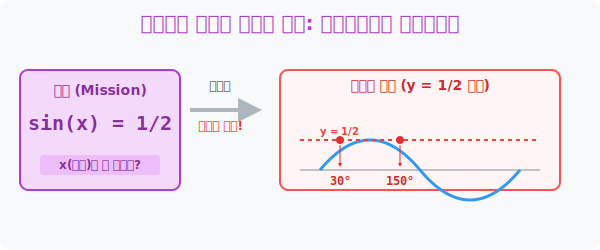

# 7. 그래프를 이용한 레이저 커팅: 삼각방정식과 삼각부등식

## [도입부] 학습 목표 (Learning Objectives)
- $\sin(x) = \frac{1}{2}$ 처럼 $x$ 각도를 구해야 하는 끔찍한 방정식 문제를 머릿속 암기($30^{\circ}$)에 의존하지 않고, **[그래프 두 개를 겹쳐서 그리는 레이저 타격법]**으로 시각화하여 분쇄합니다.
- 부등호($\sin(x) < \frac{1}{2}$)가 나오면 레이저 선 밑쪽으로 형광펜을 칠하여, 무한히 이어지는 파동의 어느 동네가 통과 지점(구간 정답)인지 색출해 냅니다.
- 파이썬(Python)의 `SymPy` 연산으로 복잡한 파동 방정식을 자동 분해하여 로봇이 찾아내는 30도, 150도, 390도 등 복수 정답의 파도를 체감합니다.

---

## 1. 눈으로 보는 방정식 (그래프 커팅)

여러분이 **$\sin(x) = \frac{1}{2}$** ($0 \le x \le 2\pi$) 라는 삼각방정식을 마주쳤다고 칩시다. 
암기력이 좋은 학생은 "아! 사인 30도가 2분의 1이지!" 라고 $x = 30^{\circ}$ (호도법 $\frac{\pi}{6}$) 하나를 적고 틀려버립니다. 왜 그럴까요? $\sin$ 이라는 놈은 파도처럼 올라갔다 내려갔다를 반복하기 때문에, 높이가 딱 $\frac{1}{2}$ 이 되는 지점(각도 $x$)이 한 주기 안에서도 무조건 **2번** 나타나기 때문입니다!

이 참사를 막는 유일한 정석은 방정식을 두 개의 함수 그래프로 찢어발기는 것입니다.
- 왼쪽 놈: $y = \sin(x)$ (굽이치는 파도 곡선 그리기)
- 오른쪽 놈: $y = \frac{1}{2}$ (가로로 일직선 쏴버리는 레이저!)

그래프를 딱 포개어 그리면 파란색 물결(사인파)과 빨간색 레이저 빔이 **"쾅, 쾅" 하고 두 번 교차(충돌)** 합니다. 첫 번째 충돌 좌표가 바로 우리가 외운 $30^{\circ}$($\frac{\pi}{6}$) 이고, 언덕을 지나 내려오다가 또 부딪히는 두 번째 좌표가 대칭성에 의해 완벽하게 도출되는 $150^{\circ}$($\frac{5\pi}{6}$) 입니다.

<div align="center">
  
</div>

<br>

## 2. 부등식은 '형광펜 칠하기' 다

방정식 기호($=$)가 부등호($<$ 또는 $>$)로 살짝 진화하면 **삼각부등식** 이 됩니다. 
예를 들어 **$\sin(x) < \frac{1}{2}$** 를 풀라고 칩시다. 

방금 전처럼 똑같이 사인파동 곡선을 그리고, $y=1/2$ 레이저를 가로로 발사합니다. 
부등호가 "작다($<$)" 를 가리키므로, 물결(파동)이 레이저 선보다 **아래쪽(물속)**에 잠겨있는 모든 구역을 형광펜으로 칠해버립니다. 
- 출발점 $0$ 부터 첫 번째 충돌인 $30^{\circ}$ 전까지! 
- 그리고 두 번째 충돌을 지나 물 밑으로 가라앉은 $150^{\circ}$ 부터 끝점 $360^{\circ}$ 까지!

이것이 삼각부등식을 눈 감고도 풀어내는 무적의 "그래프 스캐닝 판독법" 입니다. 파동 에너지의 고도(높이)를 눈으로 보고 잘라내는 것입니다.

---

## 3. 💻 파이썬(Python)의 다중 근(Root) 자동 탐색기

파이썬의 방정식 인공지능 `SymPy`는 단순히 1개의 정답을 찾는 것을 넘어, 제한구역($0 \sim 360^{\circ}$) 내에서 레이저와 충돌하는 모든 접점(Roots)을 남김없이 긁어모아 배열로 반환합니다.

### 🐍 파이썬 예제: $\sin(x) = 0.5$ 레이저 타격 충돌점 스캔

```python
import sympy as sp
import math

print("--- 🎯 삼각 지대 레이더: 파동 충돌 좌표 스캐너 ---")

# 미지의 각도 x를 선언
x = sp.Symbol('x')

# 방정식 세팅: sin(x) 와 0.5(1/2) 가 충돌하는 지점 찾기
# (SymPy에서 방정식은 Eq(좌변, 우변) 으로 넣습니다)
equation = sp.Eq(sp.sin(x), 0.5)

print("▶ 스캔 명령 하달: sin(x) 파동과 높이 0.5 의 수평 레이저 충돌점 찾기!")

# solve를 발동하면 레이저에 닿는 모든 각도(라디안) 정답을 배열로 뽑아냅니다.
roots = sp.solve(equation, x)

print("--------------------------------------------------")
for i, root in enumerate(roots):
    # 컴퓨터가 토해낸 라디안 값을 인간이 읽기 편한 디그리(도)로 변환
    # (evalf() 부동소수점 처리)
    rad_val = float(root.evalf())
    deg_val = round(math.degrees(rad_val), 1)
    
    print(f" 💥 타격 확인! [충돌점 {i+1}] 각도: {deg_val} 도 (Radian: 약 {rad_val:.3f})")

# 결과창:
# --- 🎯 삼각 지대 레이더: 파동 충돌 좌표 스캐너 ---
# ▶ 스캔 명령 하달: sin(x) 파동과 높이 0.5 의 수평 레이저 충돌점 찾기!
# --------------------------------------------------
#  💥 타격 확인! [충돌점 1] 각도: 30.0 도 (Radian: 약 0.524)
#  💥 타격 확인! [충돌점 2] 각도: 150.0 도 (Radian: 약 2.618)
```

우리가 손바닥 위에서 그래프를 낑낑대며 그리고 잘라낼 때, 시스템 인공지능은 순식간에 **30도 타격**, **150도 타격** 이라는 두 개의 복수 충돌 좌표를 모두 도출해 내며 주기함수의 다중 정답 특성을 완벽히 포착해 냅니다.

---

## [결론] 학습 정리 (Summary)

1. **머리로 푸는 암기를 죽여라**: 삼각방정식은 "사인 30도는 1/2" 이라는 암기법 하나에만 의존했다가는, 언덕을 따라 주르륵 반복 출몰하는 두 번째, 세 번째 똑같은 높이의 복수 정답 구역을 모조리 날려먹게 됩니다.
2. **함수를 두 개로 찢기**: 무조건 왼쪽의 $\sin$ (혹은 $\cos, \tan$) 파동 곡선을 크게 그리고, 오른쪽 숫자를 일직선 수평 레이저 빔($y = k$)으로 그은 뒤, 그 둘이 만나는 교점에 구멍을 뻥 뚫는 가시화 연습이 삼각수학의 궁극체입니다.
3. **부등식의 스캐닝**: "크다"면 레이저 빔 위로 솟구친 산봉우리 영역을 형광펜으로 칠하고, "작다"면 레이저 빔 아래에 잠긴 심해 영토를 칠하여 최종 정답 범위를 적어내는 직관성이 삼각부등식 팩트의 본질입니다.
