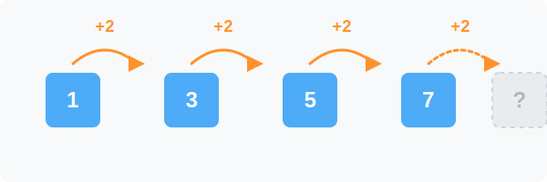

# 1. 수열의 기초 (Basics of Sequence)

## [도입부] 학습 목표 (Learning Objectives)
- 수열이 무엇인지 일상적인 예시를 통해 이해합니다.
- 수열의 규칙을 파악하고 일반항의 개념을 알아봅니다.
- 파이썬(Python)의 리스트(List) 구조와 수열 사이의 공통점을 이해합니다.

---

## 1. 수열이란 무엇인가?

우리는 일상생활에서도 무언가가 순서대로 나열되어 있는 것을 쉽게 볼 수 있습니다. 건물 층수를 나타내는 1층, 2층, 3층부터 시작해서 징검다리를 건널 때 밟는 돌들의 번호까지 모두 일정한 '순서'를 가지고 있죠.

**수열(Sequence)**은 말 그대로 **'수(Number)의 나열'**을 의미합니다. 단순히 아무 숫자나 막 던져둔 것이 아니라, 어떤 **규칙(Rule)**을 가지고 순서대로 나열된 숫자들의 집합입니다.


위 그림처럼 슈퍼마리오가 숫자가 적힌 블록 위를 뛰어다닌다고 상상해 봅시다. 마리오는 1, 3, 5, 7 번호가 적힌 블록을 차례대로 밟고 있습니다.
여기서 규칙을 발견하셨나요?
$$1 \rightarrow 3 \rightarrow 5 \rightarrow 7 \rightarrow \cdots$$

계속해서 **2씩 커지는 규칙**을 가지고 있죠! 이렇게 다음 숫자로 넘어갈 때마다 2씩 더해지는 수열을 가리켜 일정한 규칙을 가진 수열이라고 부릅니다.

<br>

## 2. 수열의 규칙 한눈에 보기

수열이 어떻게 변하는지 눈으로 쉽게 확인하기 위해 화살표로 나타낸 동적인 흐름을 살펴볼까요?



수열을 이루고 있는 숫자 하나하나를 우리는 **항(Term)**이라고 부릅니다. 
- 첫 번째 숫자를 **제 1항(첫째항)**
- 두 번째 숫자를 **제 2항**
- $n$ 번째 숫자를 **제 $n$항(일반항)**

마리오가 밟은 수열에서는 제 1항이 1, 제 2항이 3, 제 3항이 5가 됩니다. 이것을 수학적인 기호로는 $a_1, a_2, a_3, \dots, a_n$ 으로 표기합니다.

---

## 3. 💻 파이썬(Python)으로 보는 수열

컴퓨터 과학(Computer Science)에서 수열과 가장 똑닮은 개념이 무엇일까요? 바로 **리스트(List)와 배열(Array)**입니다. 여러 개의 데이터(수)를 일정한 순서(인덱스)대로 저장한다는 점에서 수학의 수열과 완벽하게 1:1로 매칭됩니다!

### 🐍 파이썬 코드로 수열 만들기

다음은 위에서 배운 1, 3, 5, 7로 이어지는 홀수 수열을 파이썬 코드로 만들어 출력하는 예제입니다.

```python
# 파이썬 리스트(List)를 이용해 수열 정의하기
sequence = [1, 3, 5, 7, 9, 11]

# 수열의 각 항(Term)에 접근하기
# (파이썬의 인덱스는 0부터 시작한다는 점을 기억하세요!)
print("제 1항:", sequence[0]) # 결과: 1
print("제 2항:", sequence[1]) # 결과: 3
print("제 3항:", sequence[2]) # 결과: 5

# 반복문(for loop)을 사용하여 수열의 모든 항 출력하기
print("수열의 모든 항:")
for i in range(len(sequence)):
    print(f"제 {i+1}항: {sequence[i]}")
```

수학에서는 첫째항을 $a_1$이라고 부르지만, 파이썬을 비롯한 대부분의 프로그래밍 언어에서는 `sequence[0]` 처럼 0번방부터 시작합니다. 이름표(인덱스)만 다를 뿐, 순서대로 상자 안에 숫자를 담아두고 꺼내 쓴다는 원리는 완전히 동일합니다.

---

## [결론] 학습 정리 (Summary)

1. **수열의 정의**: 어떤 일정한 규칙을 가지고 순서대로 나열된 수의 집합을 수열(Sequence)이라고 합니다.
2. **항(Term)**: 수열을 이루고 있는 하나하나의 숫자를 항이라고 부르며, 순서에 따라 제 1항, 제 2항 등으로 표현합니다.
3. **컴퓨터와의 연결**: 수학의 수열은 컴퓨터 프로그래밍에서 여러 개의 데이터를 순서대로 저장하는 **배열(Array)이나 리스트(List)** 자료구조와 완벽히 대응됩니다.
