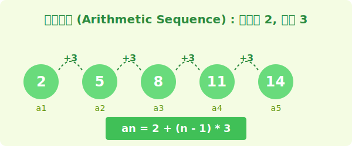

# 2. 등차수열 (Arithmetic Sequence)

## [도입부] 학습 목표 (Learning Objectives)
- 등차수열의 개념과 공차(Common Difference)의 의미를 이해합니다.
- 등차수열의 일반항 식을 스스로 유도하고 계산할 수 있습니다.
- 파이썬(Python)의 `range()` 함수와 `while` 문을 이용해 등차수열을 프로그래밍적으로 구현해봅니다.

---

## 1. 일정하게 커지거나 작아지는 수열

수열 중에서 가장 기본적이면서도 중요한 수열이 바로 **등차수열(Arithmetic Sequence)**입니다.
'등차'라는 말은 '차이가 같다(Equal Difference)'라는 뜻을 가집니다. 즉, 앞의 수에 일정한 숫자를 계속 더해나가면서 만들어지는 수열입니다.

예를 들어, 2부터 시작해서 3씩 계속 더해지는 수열을 상상해보세요.



- 첫 번째 숫자(첫째항): **$2$**
- 두 번째 숫자(제 2항): $2 + 3 = \mathbf{5}$
- 세 번째 숫자(제 3항): $5 + 3 = \mathbf{8}$
- 네 번째 숫자(제 4항): $8 + 3 = \mathbf{11}$

여기서 계속해서 일정하게 더해지는 수를 수학에서는 **공차(Common difference)**라고 부르며, 보통 알파벳 **$d$**로 표시합니다. (Difference의 머리글자입니다!)

<br>

## 2. 등차수열의 일반항 ($a_n$) 찾기

수열의 규칙을 파악했다면, "이 수열의 100번째 숫자는 무엇일까?" 와 같은 질문에 답할 수 있어야 합니다. 100번을 일일이 더하고 있을 순 없으니까요.
아무 자리나 바로 계산해낼 수 있는 마법의 공식을 **일반항($a_n$)**이라고 합니다.

위의 그림 속 규칙을 다시 한번 볼까요?
- $a_1 = 2$
- $a_2 = 2 + 3$ (공차 1번 더함)
- $a_3 = 2 + 3 + 3 = 2 + (2 \times 3)$ (공차 2번 더함)
- $a_4 = 2 + 3 + 3 + 3 = 2 + (3 \times 3)$ (공차 3번 더함)

만약 10번째 숫자($a_{10}$)를 구한다면 공차를 몇 번 더해야 할까요? 시작하는 1번째부터 세기 때문에, 총 9번 징검다리를 건너면 됩니다. (즉, $10 - 1 = 9$)

수학 공식으로 표현하면 다음과 같습니다.
**$$a_n = a_1 + (n-1)d$$**
- $a_n$: 제 $n$항 (원하는 번째의 숫자)
- $a_1$: 첫째항 (시작하는 숫자)
- $n$: 항의 번호
- $d$: 공차 (더해지는 일정한 숫자)

이 공식에만 대입하면 100번째 숫자든, 1000번째 숫자든 바로 찾아낼 수 있습니다!

---

## 3. 💻 파이썬(Python)으로 등차수열 만들기

이러한 수학적인 똑같은 계산을 반복하는 것은 파이썬이 가장 잘하는 일입니다! 
수학의 일반항 공식을 쓰지 않고, 컴퓨터의 반복문(`while` 또는 `for`)을 사용해서 스스로 숫자를 더해나가게 만들어 봅시다. 파이썬의 `range()` 함수는 자체가 등차수열의 생성기입니다.

### 🐍 파이썬 예제 1: `range` 함수를 이용한 등차수열

파이썬의 `range(시작, 끝, 간격)` 함수는 등차수열을 아주 쉽게 만들어냅니다.

```python
# 첫째항이 2이고, 공차가 3인 등차수열 출력 (15 미만까지만)
# range(시작점, 끝점, 공차(간격))
arithmetic_seq = list(range(2, 16, 3))

print("등차수열:", arithmetic_seq)
# 결과: 등차수열: [2, 5, 8, 11, 14]
```

### 🐍 파이썬 예제 2: `while` 반목문을 활용해 등차수열 10번째 항 구하기

이번엔 컴퓨터가 변수에 값을 계속 누적하여 더해나가도록 만들어 보겠습니다.

```python
a_1 = 2      # 첫째항 (a)
d = 3        # 공차 (d)
n = 1        # 현재 항 번호 카운터
current_val = a_1

# 10번째 항(n=10)이 될 때까지 반복
while n < 10:
    current_val = current_val + d  # 공차를 계속 더해줌
    n = n + 1  # 징검다리 한 칸 이동

print(f"제 10항의 값은 {current_val} 입니다.")
# 수학 공식 확인: 2 + (10 - 1) * 3 = 29
```

수학에서 공식을 암기해서 한 번에 푸는 것과, 컴퓨터가 0.001초만에 반복 작업을 수행해서 목표값에 도달하는 원리가 똑같죠!

---

## [결론] 학습 정리 (Summary)

1. **등차수열**: 첫째항에서부터 일정한 수(공차)를 차례대로 더하여 만들어지는 수열입니다.
2. **일반항 공식**: 등차수열의 일반항은 **$a_n = a_1 + (n-1)d$** 로 구합니다.
3. **코딩의 반복문 및 range()**: 일정한 간격으로 변하는 등차수열의 논리는 파이썬 프로그래밍에서 `for`문이나 `while`문을 제어하는 가장 기본적인 인덱스 조작 원리와 동일합니다.
