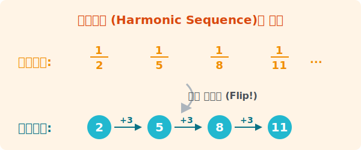

# 3. 조화수열 (Harmonic Sequence)

## [도입부] 학습 목표 (Learning Objectives)
- 겉보기에는 아무런 규칙이 없어 보이는 조화수열이 사실은 등차수열의 '역수(Reciprocal)'임을 이해합니다.
- 조화중항과 기타 평균(산술/기하/조화)들의 관계를 알아봅니다.
- 파이썬의 분수 모듈(`fractions`)을 사용해 조화수열을 어떻게 계산하는지 확인합니다.

---

## 1. 조화수열의 정체: 뒤집어진 등차수열!

칠판에 다음과 같은 분수들이 나열되어 있다고 합시다.

$$ \frac{1}{2}, \frac{1}{5}, \frac{1}{8}, \frac{1}{11}, \cdots $$

분수들이 점점 줄어들고 있는데 도무지 일정하게 더해지지도 않고, 일정하게 곱해지지도 않아서 아무 규칙도 없어 보입니다. 하지만 수학자들은 이것을 위아래로 '뒤집는' (역수를 취하는) 기발한 생각을 해냈습니다.
위의 수열 각각의 항들을 뒤집어버리면?



$$ 2, 5, 8, 11, \cdots $$

맙소사! 숫자를 위아래로 거꾸로 뒤집었더니, 아까 우리가 배웠던 **공차가 3인 완벽한 등차수열**이 되었습니다!!
이처럼 **역수(Reciprocal)를 취했을 때 등차수열을 이루는 원래의 수열**을 가리켜 **조화수열(Harmonic sequence)**이라고 부릅니다. 

<br>

## 2. 조화수열의 일반항 찾기 전략

따라서 조화수열의 $n$번째 숫자를 쉽게 찾는 꿀팁 전략은 **"일단 뒤집어서 계산하고, 나중에 다시 뒤집어라!"** 입니다.

1. **역수로 만들기**: $a_n$ 수열을 뒤집어 $\frac{1}{a_n}$ 수열로 바꿉니다. 이제 이것은 등차수열입니다.
2. **등차수열의 일반항 구하기**: 뒤집힌 수열의 첫째항과 공차를 찾아 등차수열 공식 $b_n = b_1 + (n-1)d$ 를 사용해 값을 구합니다.
3. **다시 뒤집기**: 마지막에 우리가 구한 최종 값을 다시 거꾸로 $\frac{1}{b_n}$ 형태로 뒤집어 주면 조화수열의 정답입니다.

<br>

#### [Tip] 등차중항과 조화중항
수열의 가운데 숫자는 양 옆 숫자의 성질을 딱 절반씩 나눠가집니다.
- **등차중항 (산술평균)**: $x, y, z$가 등차수열이면, 가운데 숫자 $y = \frac{x+z}{2}$
- **조화중항 (조화평균)**: $a, b, c$가 조화수열이면, 가운데 숫자 $b = \frac{2ac}{a+c}$

---

## 3. 💻 파이썬(Python)으로 조화수열 다루기

파이썬에서 흔한 실수 중 하나는 `1/3` 같은 분수를 계산할 때 `0.3333333...` 의 소수(Float) 형태로 바뀌어 오차가 발생하는 것입니다. 조화수열처럼 정수형 분수를 있는 그대로 정확하게 다루려면, 파이썬 내장 라이브러리인 `fractions` (분수 객체)를 활용해야 합니다.

### 🐍 파이썬 예제: 역수 취하기

```python
from fractions import Fraction

# 조화수열의 역수인 등차수열의 첫째항(2)과 공차(3)
a_1 = 2
d = 3

print("--- 파이썬 조화수열 계산기 ---")
# 1항부터 5항까지 출력하기
for n in range(1, 6):
    # 1. 등차수열의 n번째 항 계산하기
    arithmetic_term = a_1 + (n - 1) * d
    
    # 2. 파이썬 Fraction 을 이용하여 분수로 뒤집기 (역수)
    harmonic_term = Fraction(1, arithmetic_term)
    
    print(f"제 {n}항: {harmonic_term}")

# 결과:
# 제 1항: 1/2
# 제 2항: 1/5
# 제 3항: 1/8
# 제 4항: 1/11
# 제 5항: 1/14
```

컴퓨터 메모리는 소수점 아래 오차(부동 소수점 오차)를 만들어내지만, `Fraction` 모듈을 사용하면 유리수의 분모와 분자를 각각 정수로 저장하므로 수학에서 요구하는 완벽한 정밀도를 지키며 계산할 수 있습니다.

---

## [결론] 학습 정리 (Summary)

1. **조화수열**: 각 항의 **역수(뒤집은 수)**가 등차수열을 이루는 특징을 가진 수열입니다.
2. **문제 꿀팁 풀이법**: 직접 조화수열 공식을 외울 필요 없이, $\rightarrow$ 일단 역수로 둔갑시켜 등차수열로 푼 뒤 $\rightarrow$ 결과값을 최후에 다시 한 번 뒤집어주는 센스를 발휘합니다.
3. **분수 모듈(fractions)**: 분모와 분자로 떨어진 분수 데이터를 손상 없이 연산하기 위해서 파이썬에서는 기본 자료구조 대신 `Faction(분자, 분모)` 모듈을 이용합니다.
