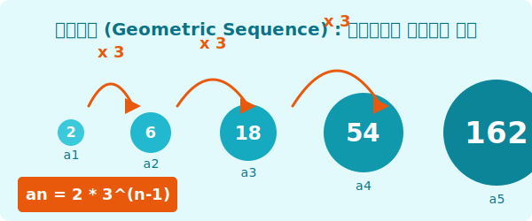

# 4. 등비수열 (Geometric Sequence)

## [도입부] 학습 목표 (Learning Objectives)
- '곱하기'로 인해 폭발적으로 기하급수적으로 증가하는 등비수열의 개념을 배웁니다.
- 공비(Common Ratio)를 파악하고 등비수열의 일반항 식을 이해합니다.
- 파이썬(Python)의 거듭제곱 연산자인 `**` 기호를 활용하여 컴퓨터가 어떻게 등비수열을 순식간에 처리하는지 확인합니다.

---

## 1. 일정하게 '곱해지는' 수열

손에 묻은 세균 한 마리가 1초마다 자기 자신을 3배로 증식(분열)시킨다고 해봅시다.
- 0초: 1마리
- 1초: 3마리
- 2초: 9마리
- 3초: 27마리 ...

아까 배웠던 등차수열(일정하게 숫자를 더하는 수열)은 서서히 커지는 느낌이었지만, 일정하게 숫자를 곱하는 이 수열은 눈덩이처럼 겉잡을 수 없이 **폭발적으로 커집니다.** 수학이나 경제학에서는 이러한 증가율을 **'기하급수적'**이라고 부르죠.
이처럼 **앞의 수에 일정한 숫자를 계속 곱해나가면서 만들어지는 수열**을 바로 **등비수열(Geometric sequence)**이라고 부릅니다. 



그리고 등차수열에서 더해지는 숫자를 '공차($d$)'라고 하듯, 등비수열에서 곱해지는 숫자를 **공비(Common Ratio)**라고 부르며 알파벳 **$r$**을 사용합니다. 앞항과 뒷항의 '비율(Ratio)'이 똑같다는 뜻입니다. (예: $6/2 = 3$, $18/6 = 3$)

<br>

## 2. 등비수열의 일반항 ($a_n$) 찾기

공식을 외우기 전에, 또 원리부터 접근해 볼까요?
첫째항을 $a_1$이라고 하고, 곱해지는 숫자 공비를 $r=3$이라고 가정해봅시다.
- $a_1 = 2$
- $a_2 = 2 \times 3$ (공비 1번 곱함)
- $a_3 = 2 \times 3 \times 3 = 2 \times 3^2$ (공비 2번 곱함)
- $a_4 = 2 \times 3 \times 3 \times 3 = 2 \times 3^3$ (공비 3번 곱함)

등차수열 때와 마찬가지로 징검다리를 한 칸 앞서 이동하기 때문에 곱해지는 횟수는 $(n-1)$번이 됩니다!
따라서 등비수열의 마법 공식도 이렇게 깔끔하게 유도됩니다.

**$$a_n = a_1 \times r^{n-1}$$**
- $a_n$: 제 $n$항
- $a_1$: 첫째항 
- $n$: 항의 번호
- $r$: 공비 (곱해지는 일정한 숫자)

이 공식은 바이러스 확산, 인구 증가율, 매달 이자가 이자를 낳는 은행의 '복리 계산' 등에 핵심으로 들어가는 지구에서 가장 강력한 공식 중 하나입니다.

---

## 3. 💻 파이썬(Python)으로 느끼는 등비수열의 위력!

인간은 $3^{10}$(3의 10승)만 손으로 계산하려고 해도 한참 걸리고 틀리기 쉽상입니다. 그러나 컴퓨터의 CPU는 거듭제곱 연산에 특화되어 있어 $3^{100}$(3의 100승)도 눈 깜짝할 사이에 계산해냅니다. 파이썬에서는 거듭제곱(승수)을 표시할 때 `**` 기호를 사용합니다!

### 🐍 파이썬 예제: 미친 듯이 커지는 세균 증식 시뮬레이션

```python
# 첫 세균은 1마리, 매 시간마다 3배씩 증식하는 등비수열 (a_1=1, r=3)

a_1 = 1     # 첫째항 시작 수치
r = 3       # 공비 (매번 3배씩 늘어남!)

print("--- 세균 증식 무서운 속도 확인하기 ---")

for time in [1, 2, 5, 10, 20]:
    # 수학 공식: a_n = a_1 * r^(n-1)
    # Python 코드: 파워 연산자 ** 를 사용
    virus_count = a_1 * (r ** (time - 1))
    
    # 세 자리수 콤마를 찍어주기 위해 f"{변수:,}" 사용
    print(f"{time}시간 경과 후 세균 수: {virus_count:,} 마리")

# 결과:
# 1시간 경과 후 세균 수: 1 마리
# 2시간 경과 후 세균 수: 3 마리
# 5시간 경과 후 세균 수: 81 마리
# 10시간 경과 후 세균 수: 19,683 마리
# 20시간 경과 후 세균 수: 1,162,261,467 마리 (순식간에 11억 마리!)
```

겨우 20번의 루프만 지났을 뿐인데, 결과값이 $11$억이라는 어마어마한 수치에 도달했습니다. 파이썬의 연산 기호 중 `+` 나 `*` 도 강력하지만, 거듭제곱을 뜻하는 별 두 개 언어 `**` 가 데이터의 폭발적 성장에 최적화 된 가장 무시무시한 괴물임을 깨달아야 합니다.

---

## [결론] 학습 정리 (Summary)

1. **등비수열**: 첫째항에서부터 일정한 수(공비, r)를 연속해서 곱하여 만들어지는 폭발적인 수열입니다.
2. **일반항 공식**: 거듭제곱이 들어가 **$a_n = a_1 \cdot r^{n-1}$** 가 됩니다.
3. **거듭제곱 연산**: 컴퓨터 코딩 시 파이썬에서는 `**` 기호를 통해 수학의 지수승($r^{n-1}$) 연산을 완벽히 대체하여 시뮬레이션을 돌립니다.
