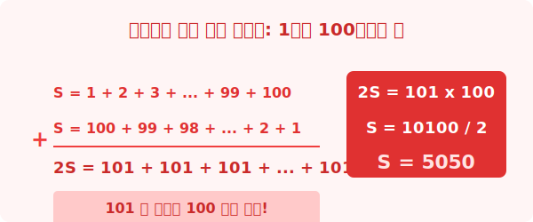

# 5. 수열의 합 (Sum of Sequence)

## [도입부] 학습 목표 (Learning Objectives)
- '수학의 왕자' 가우스가 초등학생 시절 1부터 100까지 더한 방법을 통해 등차수열의 합 원리를 배웁니다.
- 첫째항과 마지막 항만 알면 전체 합을 순식간에 구하는 공식을 이해합니다.
- 복잡한 반복 덧셈 과정($S_n$)을 파이썬(Python) 내장 함수 `sum()`으로 단 한 줄에 해결하는 방법을 배웁니다.

---

## 1. 노가다 덧셈을 피하는 획기적인 발상

어떤 학교 선생님이 학생들에게 쉬는 시간을 뺏으려고 아주 귀찮은 문제를 냈습니다. 
"여러분, 1부터 100까지 전부 다 더해보세요!"
학생들이 연필을 쥐고 1+2=3, 3+3=6, 6+4=10... 하면서 식은땀을 흘리고 있을 때, 뒷자리에 앉은 한 꼬마가 단 3초만에 정답을 외쳤습니다. 

"5050 입니다!" 

이 꼬마가 바로 역사상 최고의 수학자로 불리는 초등학생 시절의 **가우스(Gauss)**였습니다. 가우스는 어떻게 100번의 덧셈을 머릿속에서 3초만에 끝낸 걸까요?



가우스는 순서대로 더하는 멍청한 짓을 하지 않았습니다. 
대신 1부터 100까지 쓰여진 숫자들을 완전히 **거꾸로 100부터 1까지 뒤집어서 아래에 한 줄 더 쓴 다음, 위아래 줄을 동시에 더해버렸습니다.**
- 첫 번째 칸: $1 + 100 = 101$
- 두 번째 칸: $2 + 99 = 101$
- 마지막 칸: $100 + 1 = 101$

모든 결과가 $101$로 똑같아졌습니다! 이런 $101$ 묶음이 총 100개 있으므로 $101 \times 100 = 10100$.
하지만 우리는 두 세트를 합쳤으므로, 마지막에 반으로 나누어주면($/2$) 정답인 $5050$이 나옵니다. 

<br>

## 2. 등차수열의 합($S_n$) 공식 유도

이 천재적인 일화는 사실 완벽한 '등차수열의 합의 원리' 그 자체입니다.
수열의 첫째항부터 $n$항까지의 합(Sum)을 기호로 **$S_n$**이라고 부릅니다. 
방금 가우스가 했던 방식을 문자로 그대로 번역해 볼까요?

- 합하려는 수열의 첫째항을 $a$ 
- 마지막 문자를 $l$ (Last)
- 전체 숫자의 개수를 $n$개라고 합시다.

가우스처럼 맨 앞의 숫자($a$)와 맨 뒤의 숫자($l$)를 더한 세트 묶음($a+l$)이 총 항의 개수(n)만큼 만들어집니다. 그것을 2로 나누면 식은 다음과 같이 탄생합니다.

**$$S_n = \frac{n(a+l)}{2}$$**

(한국말로는: **항의 개수 $\times$ (맨 앞 $+$ 맨 뒤) / 2**)
만약 마지막 항($l$)을 모르고 공차($d$)만 안다면, $l = a+(n-1)d$ 를 대입해서 다음과 같은 두 번째 공식도 생겨납니다.
**$$S_n = \frac{n\{2a+(n-1)d\}}{2}$$**

첫째항과 맨 끝항만 알면 중간 숫자들은 쳐다볼 필요도 없이 합을 구할 수 있습니다.

---

## 3. 💻 파이썬(Python)으로 더 빠르고 우아하게 덧셈하기

수학에서는 가우스의 천재성에 의존했지만, 프로그래머에게는 파이썬이라는 더 강력한 요술봉이 있습니다. 파이썬의 `sum()` 내장 함수와 파이프라인(리스트)의 결합은 복잡한 공식도 불필요하게 만듭니다.

### 🐍 파이썬 예제: 1부터 100까지의 합 단축기

```python
# 일반 학생들의 노가다 덧셈 (반복문 사용)
total = 0
for i in range(1, 101):
    total = total + i
print(f"반복문으로 구한 답: {total}")

# 파이썬 고수의 방식: sum() 파워!
# (range(1, 101)은 1부터 100까지의 숫자 리스트를 의미합니다)
gauss_answer = sum(range(1, 101))
print(f"가우스처럼 영리하게 구한 답: {gauss_answer}")
```

단 한 줄의 명령어 `sum(range(1, 101))` 만으로 파이썬은 내부적으로 0.0001초만에 100개의 배열을 생성하고 더해버립니다. `sum()` 함수나 배열(Array) 처리는 현대 데이터 과학 프로그램에서 수억 개의 데이터를 단번에 합산할 때도 동일한 논리로 작동합니다.

---

## [결론] 학습 정리 (Summary)

1. **가우스의 통찰력**: 숫자를 뒤집어 더함으로써 모든 항의 합을 동일하게 만들어버리는 아이디어가 곧 합 공식의 기원입니다.
2. **등차수열의 합 $S_n$**: 첫째항($a$)과 마지막 항($l$)을 알 때, **$S_n = \frac{n(a+l)}{2}$** 라는 공식으로 전체 합을 한 방에 처리합니다.
3. **파이썬의 배열 처리력**: 데이터(수열)가 파이썬의 리스트나 `range` 객체로 담겨있다면, `sum()` 함수 하나로 수학 공식 이상의 압도적인 속도와 편리함을 보여줍니다.
