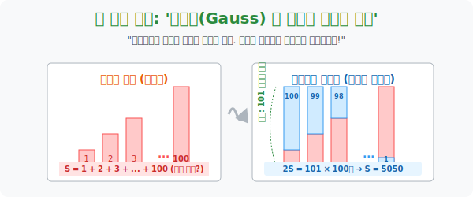

# 1. 10살 수학 천재의 치트키: '등차수열의 합 (Gauss)'

## [도입부] 학습 목표 (Learning Objectives)
- 일정한 간격(공차 $d$) 으로 커지는 등차수열의 합을 1, 2, 3, 4 미련하게 더하는 막노동에서 벗어나, 위대한 수학자 **가우스(Gauss)** 가 10살 때 발명한 '거꾸로 뒤집어 복사 붙여넣기(Ctrl+C, Ctrl+V)' 마법을 체화합니다.
- 불규칙한 계단 블록(수열) 을 완벽한 **직사각형 면적** 구조로 찍어내어 반으로 쪼개는 기하학적 렌더링 과정을 통해 "처음 항($a$)과 마지막 항($l$)의 조화" 수식을 도출합니다.
- 파이썬(Python)의 리스트 뒤집기 연산(`[::-1]`) 과 원소별 병렬 덧셈(`zip`) 을 활용해 가우스의 아이디어를 컴퓨터 공학적 배열 메모리 해킹 기술로 부활시켜 봅니다.

---

## 1. 노가다 교사 vs 10살짜리 꼬마

1780년대 독일의 한 초등학교. 게으른 수학 교사가 아이들을 조용히 시키기 위해 엄청난 막노동 문제를 하나 던져줍니다.
> "얘들아, 1부터 100까지 숫자를 전부 더해봐라! ($1+2+3+\dots+100$)"

선생님은 아이들이 꼬박 한 시간 동안 끙끙거릴 줄 알았습니다. 하지만 불과 1분 만에 10살짜리 꼬마 **카를 프리드리히 가우스(Carl Friedrich Gauss)** 가 정답인 '5050' 을 칠판에 적어냅니다. 
가우스는 1부터 무식하게 더하지 않고, 눈앞의 숫자 블록들을 **반으로 갈라 거꾸로 접어버리는 기하학적 렌더링**을 머릿속에서 돌린 것입니다.

이것이 모든 등차수열(Arithmetic Sequence) 합 공식의 절대적인 기반 근육입니다.

<br>

## 2. 블록 접고 붙이기: 완벽한 직사각형 만들기

가우스의 해킹(Hacking) 프로세스를 낱낱이 뜯어봅시다. 우리가 구해야 할 우주 쓰레기 뭉치를 $S$ 라고 부릅시다.
$$ S = 1 + 2 + 3 + \dots + 98 + 99 + 100 $$

**[Step 1. 복제(Clone) 후 리버스(Reverse)]**
가우스는 이 $S$ 배열을 그대로 복사해서, 순서만 반대로 뒤집은 똑같은 배열을 밑에 깔아버립니다.
$$ S = 100 + 99 + 98 + \dots + 3 + 2 + 1 $$

**[Step 2. 멀티스레드 병렬 합체(Zip sum)]**
이제 위아래 블록을 1열부터 100열까지 수직선상으로 동시에 더합니다. 마법이 일어납니다!
- 1열: $1 + 100 = \mathbf{101}$
- 2열: $2 + 99 = \mathbf{101}$
- 3열: $3 + 98 = \mathbf{101}$
- $\dots$
- 100열: $100 + 1 = \mathbf{101}$

울퉁불퉁하던 1부터 100까지의 계단이 찌그러짐 없는 **완벽한 높이 '101' 짜리 평평한 직사각형 기둥들 100개**로 융합되었습니다!
즉, (위의 $S$ + 아래의 $S$) $= 2S$ 의 총합이 **$101 \times 100$ 개 $= 10100$** 이 됩니다.

**[Step 3. 반띵 (절반 치기)]**
우리가 구하려는 건 $2S$ (복사본 포함) 가 아니라 원래 $S$ 하나이므로, 마지막에 $2$로 나눕니다.
$$ S = \frac{101 \times 100}{2} = 5050 $$

<div align="center">
  
</div>

> **[등차수열의 합 $S_n$ 공식]**
> 위 논리를 문자로 쓰면: 항의 개수 $n$, 첫 항 $a$, 끝 항 $l$ 일 때
> **$S_n = \frac{n(a + l)}{2}$**
> (초등학생용 번역: "처음 놈이랑 끝 놈 더해서 일자 기둥을 만든 다음, 개수만큼 곱하고 피자 반 갈라라!")

---

## 3. 💻 파이썬(Python) 병렬 배열 뒤집기 엔진

데이터 분석 라이브러리인 넘파이(NumPy)나 C언어 배열에서 For 루프를 100번 돌리는 것은 성능 낭비입니다. 가우스의 기법처럼 배열 통각을 리버스(Reverse) 한 뒤 통째로 더하는 벡터(Vector) 연산을 코딩해 봅니다.

### 🐍 파이썬 예제: 가우스의 복사+리버스 합 연산 (Vectorized)

```python
print("--- 🧠 코딩하는 꼬마 가우스: 배열 뒤집고 찍어내기 연산 ---")

# 1. 1부터 10까지의 숫자 계단 리스트 (등차수열)
original_sequence = [1, 2, 3, 4, 5, 6, 7, 8, 9, 10]
n = len(original_sequence)

# 2. [가우스의 해킹] 배열을 통째로 거꾸로 뒤집은 복사본을 만든다 (슬라이싱 [::-1])
reversed_sequence = original_sequence[::-1]

print(f" [원본 S 배열] : {original_sequence}")
print(f" [뒤집은 S 복사] : {reversed_sequence}")
print("-" * 50)

# 3. 위아래로 마주 보는 숫자들을 묶어서 더한다 (zip 병렬 처리)
# 1+10, 2+9, 3+8 ... 
column_sums = []
for top, bottom in zip(original_sequence, reversed_sequence):
    column_sums.append(top + bottom)

print(f" 🧱 [병렬 조립 완료] 모든 기둥의 높이가 완벽히 똑같아졌습니다!")
print(f" -> 직사각형 상단: {column_sums}")

# 4. 최종 계산: (똑같은 기둥 높이 11) * (10개) / 2
column_height = column_sums[0] # 아무 기둥이든 높이는 다 11로 동일
total_2S = column_height * n
final_S = total_2S // 2

print("-" * 50)
print(f" 🎯 2배 부풀려진 우주의 넓이는 {total_2S} 입니다. 절반으로 가릅니다.")
print(f" 🏁 가우스 시스템이 내놓은 최종 결괏값: {final_S}")

# 결과창:
# --- 🧠 코딩하는 꼬마 가우스: 배열 뒤집고 찍어내기 연산 ---
#  [원본 S 배열] : [1, 2, 3, 4, 5, 6, 7, 8, 9, 10]
#  [뒤집은 S 복사] : [10, 9, 8, 7, 6, 5, 4, 3, 2, 1]
# --------------------------------------------------
#  🧱 [병렬 조립 완료] 모든 기둥의 높이가 완벽히 똑같아졌습니다!
#  -> 직사각형 상단: [11, 11, 11, 11, 11, 11, 11, 11, 11, 11]
# --------------------------------------------------
#  🎯 2배 부풀려진 우주의 넓이는 110 입니다. 절반으로 가릅니다.
#  🏁 가우스 시스템이 내놓은 최종 결괏값: 55
```

이 압도적인 선형 대수학적 배열 처리(Broadcasting) 방식은, for 루프로 10억 개의 숫자를 하나하나 도는 무식한 코드보다 속도를 수백 배 이상 끌어올리는 GPU(그래픽 카드) 연산의 근간입니다.

---

## [결론] 학습 정리 (Summary)

1. **가우스의 리버스 해킹**: 등차수열의 합 문제를 만났을 때, 원본 수열 밑에 원본을 **거꾸로 뒤집어(Descending)** 배치한 뒤 수직으로 더해버리는 발상의 전환이 핵심입니다.
2. **높이가 변하지 않는 직사각형**: 계속 $d$ 만큼 커지는 수와 계속 $d$ 만큼 작아지는 수를 더했기 때문에, 언제나 $(a+l)$ 이라는 일정한 높이의 평평한 블록 빌딩이 세워집니다.
3. 데이터 구조론에서 복잡한 누적 합(Prefix Sum) 을 피하고 단 한 번의 곱셈식 $\frac{n(a+l)}{2}$ 로 $O(1)$ 상수 시간에 정답을 통과시켜 버리는 '등차수열 공식' 은 수학 역사상 가장 아름다운 치트키입니다.
