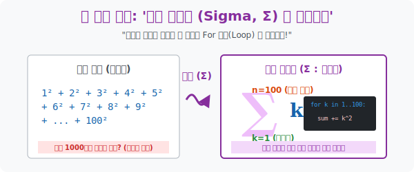

# 3. 우주 최고의 For 루프 압축기: '시그마(Σ) 와 거듭제곱'

## [도입부] 학습 목표 (Learning Objectives)
- 칠판을 꽉 채우는 더럽고 긴 덧셈식 나열($1+2+3 \dots$) 이라는 원시적인 표기를 버리고, 규칙성(일반항 $a_k$) 과 반복 인덱스($k=1 \dots n$) 를 한 줄로 묶어버리는 궁극의 압축 기호 **'시그마($\Sigma$)'** 의 문법을 해독합니다.
- 시그마가 단순한 더하기 기호가 아니라, 컴퓨터 프로그래밍의 **'For Loop(반복문)' 와 완전히 동일한 구조**임을 깨닫고 뼛속까지 이해합니다.
- 파이썬(Python)의 `sum([k**2 for k in range()])` 리스트 컴프리헨션을 이용해 자연수의 거듭제곱 합($\Sigma k, \Sigma k^2, \Sigma k^3$) 이라는 사기적인 거대 공식들을 계산하는 알고리즘을 코딩해 봅니다.

---

## 1. 노가다 나열을 끝내다: Σ (Sigma) 의 탄생

만약 "1부터 100까지 홀수들만 각자 우주로 쏘아 올린 뒤, 그 결과를 다 더하세요!" 라고 하면, 우리는 이렇게 씁니다.
$1 + 3 + 5 + 7 + 9 + 11 + \dots$ 칠판이 찢어집니다. 
우리의 수열 세계에서는 각 항의 규칙을 찾아내는 '일반항(Generator)' 을 만드는 데 몰두했습니다. 이 홀수는 항상 $2k - 1$ 이라는 공장 엔진에서 뿜어져 나옵니다.
수학자들은 덧셈(Sum) 의 그리스어 머리글자 **$\Sigma$ (대문자 시그마)** 를 가져와서, 프로그래밍 함수처럼 포맷을 개조했습니다.

$$ \sum_{k=1}^{50} (2k - 1) $$
> **[시그마 기어의 3단 구조 해석]**
> 1. 우측 몸통 **$(2k - 1)$**: 반복문(For Loop) 안에 집어넣을 "실행 코드 (일반항)"
> 2. 하단 부스터 **$k=1$**: "이 스위치를 $k=1$ 일 때 코드를 돌려서 1개를 뽑아내라!" (시작 조건)
> 3. 상단 뚜껑 **$50$**: "스위치를 1씩 톱니바퀴 돌리며 $k=50$ 이 될 때까지 실행하고 모두 더하라(+)."

즉 시그마( $\Sigma$ ) 는 그냥 그 자체로 컴퓨터 공학의 `For` 루프가 종이 위에 인쇄된 것입니다. 

<div align="center">
  
</div>

<br>

## 2. 거듭제곱의 폭발: $k, k^2, k^3$ 공식 삼형제

시그마가 강력한 이유는 단지 '멋있게 줄여 쓰기' 뿐만이 아닙니다.
이 시그마 안에 특정한 마법의 덩어리($k$ 의 거듭제곱) 들이 들어가면, 1부터 $n$까지 일일이 For 문을 돌리지 않고도 **단 1초 만에 결과를 뽑아내는 상수 시간 $O(1)$ 최종 계산기 공식**으로 변신합니다!

1. **[1차원 선]** $\sum_{k=1}^{n} k = 1 + 2 + 3 + \dots + n$
   - 결과: $\frac{n(n+1)}{2}$ (가우스가 발견한 그 평범한 등차수열!)
2. **[2차원 면적]** $\sum_{k=1}^{n} k^2 = 1^2 + 2^2 + 3^2 + \dots + n^2$
   - 초급자 함정: 어? 이걸 전체 거듭제곱 해서 $(\frac{n(n+1)}{2})^2$ 하면 되나? **(절대 아님!!)**
   - 결과: **$\frac{n(n+1)(2n+1)}{6}$** 
   - 이 신비롭고 복잡한 공식은 나중에 적분(Integral) 을 배울 때 3차원 피라미드의 부피를 쪼개어 구하는 엄청난 뼈대가 됩니다.
3. **[3차원 입체]** $\sum_{k=1}^{n} k^3 = 1^3 + 2^3 + 3^3 + \dots + n^3$
   - 2차원 공식보다 더 미친듯이 복잡할까요? 아닙니다, 수학의 기적입니다!
   - 1차원 공식을 그냥 통째로 제곱하면 끝납니다!
   - 결과: **$\left[ \frac{n(n+1)}{2} \right]^2$**

---

## 3. 💻 파이썬(Python)의 수학적 접점: 리스트 형과 시그마

파이썬이 현대 AI 시대의 언어로 선택받은 이유는 리스트 선언 방식이 이 수학의 집합 조건제시법(문법) 및 시그마($\Sigma$) 와 가장 똑같이 생겼기 때문입니다.

### 🐍 파이썬 예제: 시그마(Sigma) 반복 팩토리 시뮬레이터 

```python
print("--- ⚙️ Sigma 엔진: 자연수의 거듭제곱 3가지 모드 출력 ---")

n = 10  # 1부터 10까지 돌려봅니다!

# 1. 1차원 선의 시그마 합 (Sigma k)
# 수학: Σ(k=1 to 10) k
sum_k = sum([k for k in range(1, n+1)])
# O(1) 공식 검증
formula_k = (n * (n + 1)) // 2

# 2. 2차원 제곱의 합 (Sigma k^2)
# 수학: Σ(k=1 to 10) k^2
sum_k_sq = sum([k**2 for k in range(1, n+1)])
# O(1) 공식 검증 ( n(n+1)(2n+1) / 6 )
formula_k_sq = (n * (n + 1) * (2*n + 1)) // 6

# 3. 3차원 세제곱의 합 (Sigma k^3)
# 수학: Σ(k=1 to 10) k^3
sum_k_cub = sum([k**3 for k in range(1, n+1)])
# O(1) 공식 검증 ( [n(n+1)/2]^2 )
formula_k_cub = ((n * (n + 1)) // 2) ** 2

print(f" [모드 1] Σ k   (1~10): 루프합({sum_k}) == 시그마공식({formula_k})")
print(f" [모드 2] Σ k² (1²~10²): 루프합({sum_k_sq}) == 시그마공식({formula_k_sq})")
print(f" [모드 3] Σ k³ (1³~10³): 루프합({sum_k_cub}) == 시그마공식({formula_k_cub})")

# 결과창:
# --- ⚙️ Sigma 엔진: 자연수의 거듭제곱 3가지 모드 출력 ---
#  [모드 1] Σ k   (1~10): 루프합(55) == 시그마공식(55)
#  [모드 2] Σ k² (1²~10²): 루프합(385) == 시그마공식(385)
#  [모드 3] Σ k³ (1³~10³): 루프합(3025) == 시그마공식(3025)
```

1만 개의 데이터를 다 더하라고 해도, 프로그래머는 for 루프를 1만 번 도는($O(N)$) O(N) 최악의 코드를 짜지 않습니다. 머릿속의 시그마(Sigma) 마법으로 수식을 팩토리얼처럼 치환해 컴퓨터가 $O(1)$(덧셈 세팅 1번) 만에 끝내도록 코드를 짭니다. 이것이 알고리즘 최적화입니다!

---

## [결론] 학습 정리 (Summary)

1. **시그마의 정체 (For 루프)**: $\Sigma$ 는 단순히 덧셈 기호가 아니라, 어떤 식($a_k$) 에 $1, 2, 3 \dots$ 을 대입하는 기어박스를 내부에 탑재한 위대한 반복 압축문(Loop Engine) 입니다.
2. **거듭제곱($k^2$) 의 사기성 공식**: $n$차항 거듭제곱들을 무한히 더하는 괴로움을 $\frac{n(n+1)(2n+1)}{6}$ 이라는 단 하나의 종착점 공식으로 변환해 적분의 뼈대를 세웠습니다.
3. 파이썬의 리스트 압축 기법 `sum([func(k) for k in range(N)])` 은 이 $\Sigma$ 와 완벽하게 문법이 동일하며, 현대 AI 코딩에서 행렬 합(Matrix Sum) 을 연산할 때 수만 줄의 코드를 한 줄로 줄이는 역할을 합니다.
