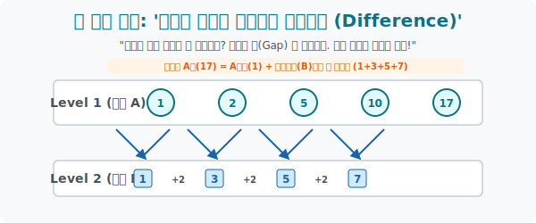

# 4. 차원의 계단을 오르다: '계차수열과 일반항 유도'

## [도입부] 학습 목표 (Learning Objectives)
- $1, 2, 5, 10, 17 \dots$ 처럼 언뜻 보면 덧셈의 폭이 엉망진창이어서 규칙을 잃어버린 수열들을 파훼하기 위해 점과 점 사이의 간극(Gap), 즉 **차이(Difference) 를 깎아내어 새로운 지하(Sub) 수열**을 캐내는 계차수열 기법을 마스터합니다.
- 꼭대기(Level 1) 우주의 항($a_n$) 을 구하기 위해서는, 지하 1층(Level 2) 에 존재하는 징검다리의 갭들($b_k$) 을 처음부터 끝까지 누적해서 쌓아 올려야 한다는 **상승-누적($\Sigma$) 원리**를 시각적으로 이해합니다.
- 파이썬(Python)의 `np.diff()` 같은 함수가 이산 데이터의 기울기(미분) 를 구하는 방식이 바로 이 계차수열 구조임을 로직으로 재현해 봅니다.

---

## 1. 윗물이 더러우면? 아랫물을 보아라!

지금까지는 친절한 등차수열(+2, +2, +2) 이나 등비수열($\times 3, \times 3, \times 3$) 이 나왔습니다. 그래서 일반항을 딱딱 맞출 수 있었죠. 그런데 갑자기 이런 놈이 등장합니다.
$A = 1, 2, 5, 10, 17 \dots$
이 배열은 등차도 아니고(간격이 제멋대로) 등비도 아닙니다(배수가 다 다름). 이럴 때는 절망하지 말고 **'숫자와 숫자 사이의 차이'에 집중**하여 그 밑에 다른 차원의 수열 바닥(Level 2) 을 하나 더 파냅니다.

**[Level 1: 원래 수열 $A_n$]**
1 ➔ 2 ➔ 5 ➔ 10 ➔ 17
  $+1$  $+3$  $+5$   $+7$  **(어라, 갭 덩어리들이...?!)**

수학자들은 윗물 식구들 사이에 숨죽이고 박혀있는 차이(Gap) 들의 덩어리, 저 $+1, +3, +5, +7$ 들을 밑으로 끄집어 내려 강제로 새로운 수열 $B$ 로 렌더링합니다.
**[Level 2: 차이로 이뤄진 계차수열 $B_n$]**
$1, 3, 5, 7 \dots$
맙소사! 지하 1층인 수열 $B$ 는 첫 항 $1$ 이고 공차가 $2$ 인 **완벽한 '등차수열'** 이었습니다. 
이처럼 본체($A$) 가 규칙이 없을 때, 그 **계단과 계단의 차이(계차, Difference) 들끼리 이뤄진 새끼 수열**을 우리는 **'계차수열'** 이라고 부릅니다.

<br>

## 2. 사다리 타고 위로 올라가기 (상승 마법)

이제 우리의 임무는 이 지하 세계의 아름다운 규칙($B$) 을 빨아들여, 지상 세계($A$) 의 100번째 항($a_{100}$) 이 대체 뭔지 맞춰내는 것입니다.

규칙을 가만히 보세요. 
4번째 지상 항 **$10$ ($a_4$)** 이 어떻게 만들어졌습니까?
어느 행성에서 뚝 떨어진 게 아니라, **최초의 지상 항 $1$ ($a_1$) 에다가, 징검다리 갭 벽돌인 $1 + 3 + 5$ ($b_1 + b_2 + b_3$) 를 3개 연달아 쌓아 올려서 도달한 높이**입니다!

즉, "계차수열(B) 를 이용해서 원본 수열(A) 의 $n$번째를 찾고 싶다?" 
> **$a_n = (\text{제일 처음 맨땅 } a_1) + (\text{1번째 징검다리부터 } (n-1)\text{ 번째 징검다리까지 다 합치기 } \Sigma B)$**
> 
> 수학식 변형: **$$ a_n = a_1 + \sum_{k=1}^{n-1} b_k $$**

명심하십시오! 징검다리는 항상 도착점보다 **1개 적습니다.** (5번째 항으로 가려면, 점프는 4번만 하면 됨). 
그래서 시그마의 끝 꼬리표가 $n$ 이 아니라 항상 **$n-1$** 임을 놓치면 치명적인 버그가 생깁니다.

<div align="center">
  
</div>

---

## 3. 💻 파이썬(Python)의 이산 미분(Discrete Derivative `diff`)

수열의 항들의 '차이(계차)' 를 구하는 것은 곧 선과 선 사이의 기울기 폭을 구하는 것이며, 이것이 훗날 **미적분(Calculus) 에서 미분 연산자**의 조상님이 됩니다. 넘파이 배열에서 이 계차들을 손쉽게 깎아내는 로직 패키지를 짜봅니다.

### 🐍 파이썬 예제: 수열의 차분(Difference) 구조 분석

```python
import numpy as np

print("--- ⛏️ 차원 굴착기: 원본 수열에서 계차수열(Level 2) 추출하기 ---")

# 1. 원본 불규칙 수열 (Level 1 우주)
series_A = [1, 2, 5, 10, 17, 26, 37]
print(f" [Level 1] 원본 수열 (a_n): {series_A}")

# 파이썬 Numpy의 diff() 함수는 '앞의 놈' 에서 '뒤의 놈' 을 뺀 
# 계차(Difference) 들만 모아 새로운 차원의 배열을 찍어냅니다!
series_B = np.diff(series_A)
print(f" [Level 2] 계차 수열 (b_n): {list(series_B)}")
print("-" * 50)

# 이제 계차수열 B(1, 3, 5, 7...) 의 공장이 2*k - 1 (홀수 제조기) 라는 걸 우리가 눈으로 깠습니다!
# 그럼, 공장을 돌려서 원본 수열의 50번째 거대한 스탯(A_50) 을 예측해 볼까요?

n_target = 50

# a_50 = a_1 (초깃값) + 계차들(B) 을 49번(n-1) 점프하며 누적시킨 합(Sigma)
base_a1 = series_A[0] # 1

# B의 등차수열 합: 시그마(1~49) (2k - 1)
jump_sum = sum([(2*k - 1) for k in range(1, n_target)]) 

# 50번째 요소 최종 도달 높이
A_50 = base_a1 + jump_sum

print(f" 🎯 거대 예측 발동! (n = {n_target}) 번째 원본 수열의 우주 값은??")
print(f"    계산 코어: 초깃값({base_a1}) + 49번 징검다리의 뼈대누적합({jump_sum})")
print(f" 🏁 예측된 A_50 성벽 높이 = [{A_50}]")

# 결과창:
# --- ⛏️ 차원 굴착기: 원본 수열에서 계차수열(Level 2) 추출하기 ---
#  [Level 1] 원본 수열 (a_n): [1, 2, 5, 10, 17, 26, 37]
#  [Level 2] 계차 수열 (b_n): [1, 3, 5, 7, 9, 11]
# --------------------------------------------------
#  🎯 거대 예측 발동! (n = 50) 번째 원본 수열의 우주 값은??
#     계산 코어: 초깃값(1) + 49번 징검다리의 뼈대누적합(2401)
#  🏁 예측된 A_50 성벽 높이 = [2402]
```

이 구조는 주식 데이터 그래프를 분해할 때, 그냥 주가 가격 배열($A$) 이 너무 불규칙해 변동폭을 보지 못하면 '어제와 오늘의 주가 차이(수익률, $B$ 계차 배열)' 로 도면을 내려서 트렌드를 분석하는 데이터 사이언스와 문법이 완벽하게 똑같습니다.

---

## [결론] 학습 정리 (Summary)

1. **차원 내리기 (Difference)**: 도무지 종잡을 수 없는 수열이 나타났을 때는, 점과 점 사이의 '차이(갭)' 들만을 도려내어 한 칸 밑으로 계단 구조를 만들어 새로운 수열 $B$ (계차수열) 를 탄생시킵니다.
2. **사다리 타기와 시그마 $\Sigma$**: 아래차원에서 발견한 예쁜 룰($B$ 의 일반항) 을 시그마에 넣고 다 더하게 되면, 위 계단(위 차원의 $A$) 으로 성큼성큼 올라가는 거대한 계단의 누적 높이를 도출할 수 있습니다.
3. **$(n-1)$ 함정**: "10층으로 가려면 사다리 계단을 9번만 타면 된다" 라는 물리적 공간 법칙 때문에, 계차수열 징검다리 누적 시그마 $\Sigma$ 는 반드시 $n$ 이 아닌 $n-1$ 전까지만 터뜨립니다.
